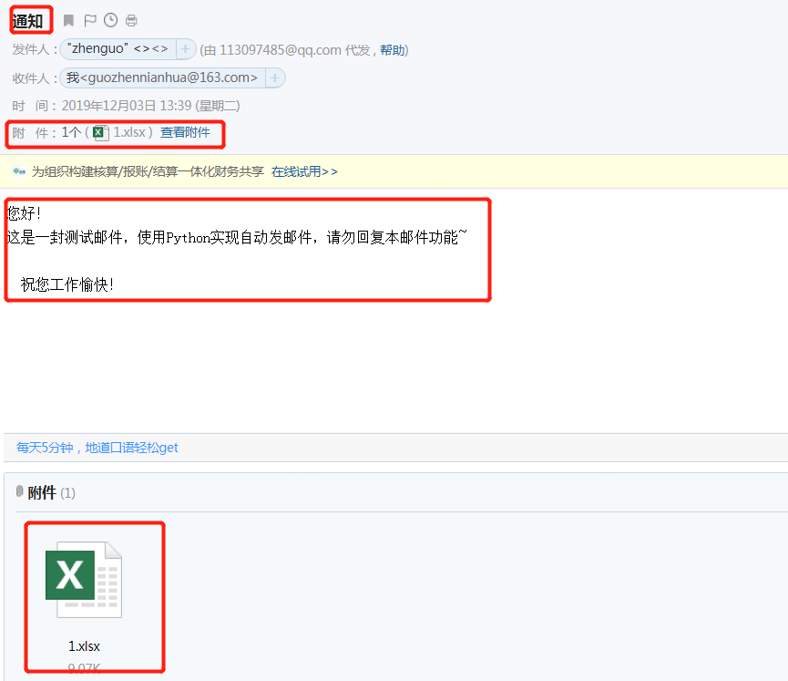

### Python 小例子

告别枯燥，60秒学会一个Python小例子。Python基础、Web开发、数据科学、机器学习的精简小例子都在这里。

> 此库会一直每天更新一个小例子，欢迎您的 star.

### 今日更新例子

1 [计算器](./src/calculator2.py)


### 例子完整列表

[查看请点击此处](./md/README.md)

### 部分小例子

#### 一、基本操作

1  环境搭建基本概念
pycharm，python解释器，conda安装，pip安装。详情点击：[Python新手环境搭建时容易混淆的概念](Python新手环境搭建时容易混淆的概念.md)

2 修改为国内镜像 
[conda国内镜像修改(最新版)](conda国内镜像修改(最新版).md)

3  链式比较

```python
i = 3
print(1 < i < 3)  # False
print(1 < i <= 3)  # True
```
4  不用else和if实现计算器

```python
from operator import *

def calculator(a, b, k):
    return {
        '+': add,
        '-': sub,
        '*': mul,
        '/': truediv,
        '**': pow
    }[k](a, b)

calculator(1, 2, '+')  # 3
calculator(3, 4, '**')  # 81
```
5  函数链
```python
from operator import (add, sub)

def add_or_sub(a, b, oper):
    return (add if oper == '+' else sub)(a, b)

add_or_sub(1, 2, '-')  # -1
```
6  求字符串的字节长度
```python
def str_byte_len(mystr):
    return (len(mystr.encode('utf-8')))

str_byte_len('i love python')  # 13(个字节)
str_byte_len('字符')  # 6(个字节)
```
7  寻找第n次出现位置
```python
def search_n(s, c, n):
    size = 0
    for i, x in enumerate(s):
        if x == c:
            size += 1
        if size == n:
            return i
    return -1

print(search_n("fdasadfadf", "a", 3))# 结果为7，正确
print(search_n("fdasadfadf", "a", 30))# 结果为-1，正确
```
8  去掉最高最低求平均
```python
def score_mean(lst):
    lst.sort()
    lst2=lst[1:(len(lst)-1)]
    return round((sum(lst2)/len(lst2)),2)

score_mean([9.1, 9.0,8.1, 9.7, 19,8.2, 8.6,9.8]) # 9.07
```
9  交换元素
```python
def swap(a, b):
    return b, a

swap(1, 0)  # (0,1)
```

#### 二、基础算法

1  二分搜索

```python
def binarySearch(arr, left, right, x):
    while left <= right:
        mid = int(left + (right - left) / 2); # 找到中间位置。求中点写成(left+right)/2更容易溢出，所以不建议这样写

        # 检查x是否出现在位置mid
        if arr[mid] == x:
            print('found %d 在索引位置%d 处' %(x,mid))
            return mid

            # 假如x更大，则不可能出现在左半部分
        elif arr[mid] < x:
            left = mid + 1 #搜索区间变为[mid+1,right]
            print('区间缩小为[%d,%d]' %(mid+1,right))

        elif x<arr[mid]:
            right = mid - 1 #搜索区间变为[left,mid-1]
            print('区间缩小为[%d,%d]' %(left,mid-1))

    return -1
```


2   距离矩阵
```python
x,y = mgrid[0:5,0:5]
list(map(lambda xe,ye: [(ex,ey) for ex, ey in zip(xe, ye)], x,y))
[[(0, 0), (0, 1), (0, 2), (0, 3), (0, 4)],
 [(1, 0), (1, 1), (1, 2), (1, 3), (1, 4)],
 [(2, 0), (2, 1), (2, 2), (2, 3), (2, 4)],
 [(3, 0), (3, 1), (3, 2), (3, 3), (3, 4)],
 [(4, 0), (4, 1), (4, 2), (4, 3), (4, 4)]]
```

#### 三、列表

1 打印乘法表
```python
for i in range(1,10):
    for j in range(1,i+1):
        print('{0}*{1}={2}'.format(j,i,j*i),end="\t")
    print()
```
结果：
```markdown
1*1=1
1*2=2   2*2=4
1*3=3   2*3=6   3*3=9
1*4=4   2*4=8   3*4=12  4*4=16
1*5=5   2*5=10  3*5=15  4*5=20  5*5=25
1*6=6   2*6=12  3*6=18  4*6=24  5*6=30  6*6=36
1*7=7   2*7=14  3*7=21  4*7=28  5*7=35  6*7=42  7*7=49
1*8=8   2*8=16  3*8=24  4*8=32  5*8=40  6*8=48  7*8=56  8*8=64
1*9=9   2*9=18  3*9=27  4*9=36  5*9=45  6*9=54  7*9=63  8*9=72  9*9=81
```
2 嵌套数组完全展开
```python
from collections.abc import *

def flatten(input_arr, output_arr=None):
    if output_arr is None:
        output_arr = []
    for ele in input_arr:
        if isinstance(ele, Iterable): # 判断ele是否可迭代
            flatten(ele, output_arr)  # 尾数递归
        else:
            output_arr.append(ele)    # 产生结果
    return output_arr

flatten([[1,2,3],[4,5]], [6,7]) # [6, 7, 1, 2, 3, 4, 5]
```
3  将list等分为子组
```python
from math import ceil

def divide(lst, size):
    if size <= 0:
        return [lst]
    return [lst[i * size:(i+1)*size] for i in range(0, ceil(len(lst) / size))]

r = divide([1, 3, 5, 7, 9], 2) # [[1, 3], [5, 7], [9]]
```
4  生成fibonacci序列前n项
```python
def fibonacci(n):
    if n <= 1:
        return [1]
    fib = [1, 1]
    while len(fib) < n:
        fib.append(fib[len(fib) - 1] + fib[len(fib) - 2])
    return fib

fibonacci(5)  # [1, 1, 2, 3, 5]
```
5   过滤掉各种空值
```python
def filter_false(lst):
    return list(filter(bool, lst))

filter_false([None, 0, False, '', [], 'ok', [1, 2]])# ['ok', [1, 2]]
```
6   返回列表头元素
```python
def head(lst):
    return lst[0] if len(lst) > 0 else None

head([])  # None
head([3, 4, 1])  # 3
```
7   返回列表尾元素
```python
def tail(lst):
    return lst[-1] if len(lst) > 0 else None
    
print(tail([]))  # None
print(tail([3, 4, 1]))  # 1
```
8   对象转换为可迭代类型
```python
from collections.abc import Iterable

def cast_iterable(val):
    return val if isinstance(val, Iterable) else [val]

cast_iterable('foo')# foo
cast_iterable(12)# [12]
cast_iterable({'foo': 12})# {'foo': 12}
```
9  求更长列表
```python
def max_length(*lst):
    return max(*lst, key=lambda v: len(v))

r = max_length([1, 2, 3], [4, 5, 6, 7], [8])# [4, 5, 6, 7]
```
10  出现最多元素
```python
def max_frequency(lst):
    return max(lst, default='列表为空', key=lambda v: lst.count(v))

lst = [1, 3, 3, 2, 1, 1, 2]
max_frequency(lst) # 1 
```
11  求多个列表的最大值
```python
def max_lists(*lst):
    return max(max(*lst, key=lambda v: max(v)))

max_lists([1, 2, 3], [6, 7, 8], [4, 5]) # 8
```
12  求多个列表的最小值
```python
def min_lists(*lst):
    return min(min(*lst, key=lambda v: max(v)))

min_lists([1, 2, 3], [6, 7, 8], [4, 5]) # 1
```
13  检查list是否有重复元素
```python
def has_duplicates(lst):
    return len(lst) == len(set(lst))

x = [1, 1, 2, 2, 3, 2, 3, 4, 5, 6]
y = [1, 2, 3, 4, 5]
has_duplicates(x)  # False
has_duplicates(y)  # True
```
14  求列表中所有重复元素
```python
from collections import Counter

def find_all_duplicates(lst):
    c = Counter(lst)
    return list(filter(lambda k: c[k] > 1, c))

find_all_duplicates([1, 2, 2, 3, 3, 3])  # [2,3]
```
15   列表反转
```python
def reverse(lst):
    return lst[::-1]

reverse([1, -2, 3, 4, 1, 2])# [2, 1, 4, 3, -2, 1]
```
16   浮点数等差数列
```python
def rang(start, stop, n):
    start,stop,n = float('%.2f' % start), float('%.2f' % stop),int('%.d' % n)
    step = (stop-start)/n
    lst = [start]
    while n > 0:
        start,n = start+step,n-1
        lst.append(round((start), 2))
    return lst

rang(1, 8, 10) # [1.0, 1.7, 2.4, 3.1, 3.8, 4.5, 5.2, 5.9, 6.6, 7.3, 8.0]
```
17 列表按条件分组

```python
#对列表按条件分组
def bif_by(lst, Fn):
    return [ [x for x in lst if Fn(x)],[x for x in lst if not Fn(x)]]

records = [25,89,31,34] 
bif_by(records, lambda x: x<80) # [[25, 31, 34], [89]]
```

#### 四、字典

1  字典值最大的键值对列表
```python
def max_pairs(dic):
    if len(dic) == 0:
        return dic
    max_val = max(map(lambda v: v[1], dic.items()))
    return [item for item in dic.items() if item[1] == max_val]

max_pairs({'a': -10, 'b': 5, 'c': 3, 'd': 5})# [('b', 5), ('d', 5)]
```
2  字典值最小的键值对列表
```python
def min_pairs(dic):
    if len(dic) == 0:
        return []
    min_val = min(map(lambda v: v[1], dic.items()))
    return [item for item in dic.items() if item[1] == min_val]


min_pairs({}) # []

r = min_pairs({'a': -10, 'b': 5, 'c': 3, 'd': 5})
print(r)  # [('b', 5), ('d', 5)]
```
3 合并两个字典
```python
def merge_dict2(dic1, dic2):
    return {**dic1, **dic2}  # python3.5后支持的一行代码实现合并字典

merge_dict({'a': 1, 'b': 2}, {'c': 3})  # {'a': 1, 'b': 2, 'c': 3}
```
4 求字典前n个最大值
```python
from heapq import nlargest

# 返回字典d前n个最大值对应的键
def topn_dict(d, n):
    return nlargest(n, d, key=lambda k: d[k])

topn_dict({'a': 10, 'b': 8, 'c': 9, 'd': 10}, 3)  # ['a', 'd', 'c']
```
5 求最小键值对
```python
d={'a':-10,'b':5, 'c':3,'d':5}
min(d.items(),key=lambda x:x[1]) #('a', -10)
```

#### 五、集合

1 互为变位词

```python
from collections import Counter
# 检查两个字符串是否 相同字母异序词，简称：互为变位词
def anagram(str1, str2):
    return Counter(str1) == Counter(str2)

anagram('eleven+two', 'twelve+one')  # True 这是一对神奇的变位词
anagram('eleven', 'twelve')  # False
```

#### 六、文件操作

1 [批量修改后缀名](./md/批量修改后缀名.md)

2 [返回两个文件的不同行的编号](./md/返回两个文件的不同行的编号.md)

3 查找指定文件格式文件

```python
import os

def find_file(work_dir,extension='jpg'):
    lst = []
    for filename in os.listdir(work_dir):
        print(filename)
        splits = os.path.splitext(filename)
        ext = splits[1] # 拿到扩展名
        if ext == '.'+extension:
            lst.append(filename)
    return lst

find_file('.','md') # 返回所有目录下的md文件
```

#### 七、正则和爬虫

1 [判断密码是否合法](./md/判断密码是否合法.md)

2 [爬取天气数据并解析温度值](./md/爬取天气数据并解析温度值.md)

3 批量转化驼峰格式

```python
import re
def camel(s):
    s = re.sub(r"(\s|_|-)+", " ", s).title().replace(" ", "")
    return s[0].lower() + s[1:]

# 批量转化
def batch_camel(slist):
    return [camel(s) for s in slist]

batch_camel(['student_id', 'student\tname', 'student-add']) #['studentId', 'studentName', 'studentAdd']

```
#### 八、绘图

1 [turtle绘制奥运五环图](./md/turtle绘制奥运五环图.md)
结果：


 


2 [turtle绘制漫天雪花](./md/turtle绘制漫天雪花.md)
结果：


3 [4种不同颜色的色块，它们的颜色真的不同吗？](./md/4种不同颜色的色块，它们的颜色真的不同吗？.md)


4 [词频云图](./md/词频云图.md)

```python
import hashlib
import pandas as pd
from wordcloud import WordCloud
geo_data=pd.read_excel(r"../data/geo_data.xlsx")
words = ','.join(x for x in geo_data['city'] if x != []) #筛选出非空列表值
wc = WordCloud(
    background_color="green", #背景颜色"green"绿色
    max_words=100, #显示最大词数
    font_path='./fonts/simhei.ttf', #显示中文
    min_font_size=5,
    max_font_size=100,
    width=500  #图幅宽度
    )
x = wc.generate(words)
x.to_file('../data/geo_data.png')
```


#### 八、生成器

1 求斐波那契数列前n项(生成器版)
```python
def fibonacci(n):
    a, b = 1, 1
    for _ in range(n):
        yield a
        a, b = b, a + b

list(fibonacci(5))  # [1, 1, 2, 3, 5]
```
2 将list等分为子组(生成器版)
```python
from math import ceil

def divide_iter(lst, n):
    if n <= 0:
        yield lst
        return
    i, div = 0, ceil(len(lst) / n)
    while i < n:
        yield lst[i * div: (i + 1) * div]
        i += 1

list(divide_iter([1, 2, 3, 4, 5], 0))  # [[1, 2, 3, 4, 5]]
list(divide_iter([1, 2, 3, 4, 5], 2))  # [[1, 2, 3], [4, 5]]
```
3  多层列表展完全单层(生成器版)
```python
#多层列表展开成单层列表
a=[1,2,[3,4,[5,6],7],8,["python",6],9]
def function(lst):
    for i in lst:
        if type(i)==list:
            yield from function(i)
        else:
            yield i
print(list(function(a))) # [1, 2, 3, 4, 5, 6, 7, 8, 'python', 6, 9]
```

#### 九、keras

1 Keras入门例子

```python
import numpy as np
from keras.models import Sequential
from keras.layers import Dense

data = np.random.random((1000, 1000))
labels = np.random.randint(2, size=(1000, 1))
model = Sequential()
model.add(Dense(32,
                activation='relu',
                input_dim=100))
model.add(Dense(1, activation='sigmoid'))
model.compile(optimize='rmsprop', loss='binary_crossentropy',
              metrics=['accuracy'])
model.fit(data, labels, epochs=10, batch_size=32)
predictions = model.predict(data)
```

#### 十、邮件

1 20行代码实现Python自动群发邮件

```python
import smtplib
from email import (header)
from email.mime import (text, application, multipart)
import time

def sender_mail():
    smt_p = smtplib.SMTP()
    smt_p.connect(host='smtp.qq.com', port=25)
    sender, password = '113097485@qq.com', "**************"
    smt_p.login(sender, password)
    receiver_addresses, count_num = [
        'guozhennianhua@163.com', 'xiaoxiazi99@163.com'], 1
    for email_address in receiver_addresses:
        try:
            msg = multipart.MIMEMultipart()
            msg['From'] = "zhenguo"
            msg['To'] = email_address
            msg['subject'] = header.Header('这是邮件主题通知', 'utf-8')
            msg.attach(text.MIMEText(
                '这是一封测试邮件，请勿回复本邮件~', 'plain', 'utf-8'))
            smt_p.sendmail(sender, email_address, msg.as_string())
            time.sleep(10)
            print('第%d次发送给%s' % (count_num, email_address))
            count_num = count_num + 1
        except Exception as e:
            print('第%d次给%s发送邮件异常' % (count_num, email_address))
            continue
    smt_p.quit()
    
sender_mail()
```
发送到`guozhennianhua@163.com`邮件截图：



邮件带有附件，请见另一个小例子：[Python群发带附件的邮件](./md/自动群发邮件.md)


#### 十一、Pandas

1 列分割
```python
import pandas as pd
import os

file_folder = '此处输入待处理的文件夹位置'
files = os.listdir(file_folder)
for file in files:
    file_loc = file_folder + '/' + file
    raw_data = pd.read_csv(file_loc,header = None)
    new_data = raw_data.iloc[:,0].str.split(';',expand = True)
    new_data_loc = '处理完毕后的数据存储位置'+ '/' + file
    new_data.to_csv(new_data_loc,index=None, header= None)
```

2 xlsx文件合并为一个
```python
#将文件夹中xlsx文件合并到一个excel文件中
import xlrd
import os
import pandas as pd
import glob 
from numpy import *
import  pandas as pd
location = 'C:/Users/CQ375/Desktop/ex'
fileList = []
n=0
for fileName in os.walk(location):
    for table in fileName[2]:
        path = fileName[0] + '/' + table 
        Li=pd.read_excel(path,header=0)
        n = n+1 
        fileList.append(Li)
        print('第' + str(n) + '个表格已合并')
print("在该目录下有%d个xlsx文件"%len(fileList))
data_result = pd.concat(fileList,ignore_index=True)
data_result.to_excel('C:/Users/CQ375/Desktop/ex/test.xlsx',index=0)
```
#### 十二、Matplotlib图

1 热力图

```python
# 导入库
import seaborn as sns
import pandas as pd
import numpy as np
import matplotlib.pyplot as plt

# 生成数据集
data = np.random.random((6,6))
np.fill_diagonal(data,np.ones(6))
features = ["prop1","prop2","prop3","prop4","prop5", "prop6"]
data = pd.DataFrame(data, index = features, columns=features)
print(data)
# 绘制热力图
heatmap_plot = sns.heatmap(data, center=0, cmap='gist_rainbow')
plt.show()
```


[更多小例子，请点击此处](./md/README.md)

### 欢迎贡献

比如github账号为`lhxon`的小伙伴，star 和 fork此库后，按照如下步骤提交到此库：

```markdown
1. git clone https://github.com/lhxon/python-small-examples
2. git add . 
3. git commit -m "xiugai"
4. git push
5. 界面点击：pull requests，根据操作即可。如遇问题，欢迎联系我。
```

[./src/calculator2.py]: 