告别枯燥，60秒学会一个小例子，系统学习Python，从入门到大师。**Python之路**已有`200`个例子：

感受Python之美 | 一、Python基础 |二、Python字符串和正则|三、Python文件和日期|四、Python三大利器|五、Python绘图|六、Python之坑|七、Python第三方包|八、机器学习和深度学必知算法|九、Python实战|十、Pandas数据分析案例实战


> 目前，正在编写第十一章：一步一步掌握Flask web 开发


已发[《我的Python之路V1.3.pdf》](https://github.com/jackzhenguo/python-small-examples/releases/tag/V1.3)最新版本`V1.3包括`9个章节：`Python基础`，`Python字符串和正则`，`Python文件和日期`，`Python多线程`, `Python三大利器`，`Python画图` ,`Python之坑`,`基础算法小例子`，`Python实战`，目前超过`200个`小例子。


欢迎直接在线阅读和学习：https://python-small-examples.readthedocs.io/en/latest/


### 感受Python之美

#### 1 简洁之美

通过一行代码，体会Python语言简洁之美

1) 一行代码交换`a`,`b`：

```python
a, b = b, a
```

2) 一行代码反转列表

```python
[1,2,3][::-1] # [3,2,1]
```

3) 一行代码合并两个字典

```python
{**{'a':1,'b':2}, **{'c':3}} # {'a': 1, 'b': 2, 'c': 3}

```
4)  一行代码列表去重

```python
set([1,2,2,3,3,3]) # {1, 2, 3}
```

5) 一行代码求多个列表中的最大值

```python
max(max([ [1,2,3], [5,1], [4] ], key=lambda v: max(v))) # 5
```

6) 一行代码生成逆序序列

```python
list(range(10,-1,-1)) # [10, 9, 8, 7, 6, 5, 4, 3, 2, 1, 0]
```

#### 2 Python绘图

Python绘图方便、漂亮，画图神器pyecharts几行代码就能绘制出热力图：


炫酷的水球图：


经常使用的词云图：


#### 3 Python动画

仅适用Python的常用绘图库：Matplotlib，就能制作出动画，辅助算法新手入门基本的排序算法。如下为一个随机序列，使用`快速排序算法`，由小到大排序的过程动画展示：


归并排序动画展示：

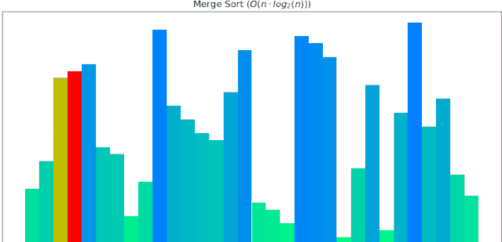

使用turtule绘制的漫天雪花：


timeline时间轮播图：

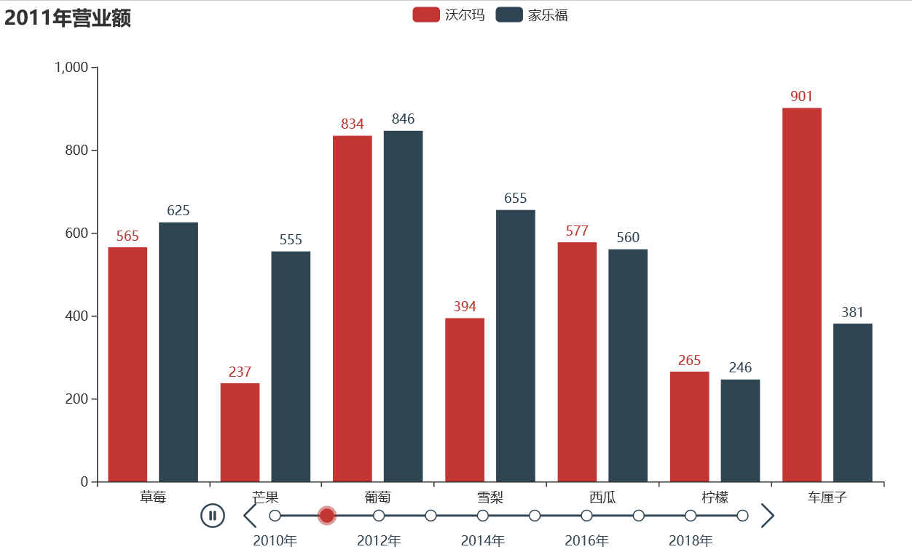

#### 4 Python数据分析

Python非常适合做数值计算、数据分析，一行代码完成数据透视：

```python
pd.pivot_table(df, index=['Manager', 'Rep'], values=['Price'], aggfunc=np.sum)
```

#### 5 Python机器学习

Python机器学习库`Sklearn`功能强大，接口易用，包括数据预处理模块、回归、分类、聚类、降维等。一行代码创建一个KMeans聚类模型：

```python
from sklearn.cluster import KMeans
KMeans( n_clusters=3 )
```

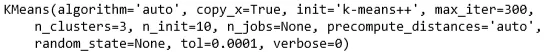

#### 6 Python-GUI

PyQt设计器开发GUI，能够迅速通过拖动组建搭建出来，使用方便。如下为使用PyQt，定制的一个专属自己的小而美的计算器。

除此之外，使用Python的Flask框架搭建Web框架，也非常方便。

总之，在这个`Python小例子`，你都能学到关于使用Python干活的方方面面的有趣的小例子，欢迎关注。

### 一、Python基础

`Python基础`主要总结Python常用内置函数；Python独有的语法特性、关键词`nonlocal`, ` global`等；内置数据结构包括：列表(list),  字典(dict),  集合(set),  元组(tuple) 以及相关的高级模块`collections`中的`Counter`,  `namedtuple`, `defaultdict`，`heapq`模块。目前共有`86`个小例子。

#### 1 求绝对值

绝对值或复数的模

```python
In [1]: abs(-6)
Out[1]: 6
```

#### 2 元素都为真

接受一个迭代器，如果迭代器的`所有元素`都为真，那么返回`True`，否则返回`False`

```python
In [2]: all([1,0,3,6])
Out[2]: False

In [3]: all([1,2,3])
Out[3]: True
```

#### 3 元素至少一个为真　

接受一个迭代器，如果迭代器里`至少有一个`元素为真，那么返回`True`，否则返回`False`

```python
In [4]: any([0,0,0,[]])
Out[4]: False

In [5]: any([0,0,1])
Out[5]: True
```

#### 4 ascii展示对象　　

调用对象的__repr__() 方法，获得该方法的返回值，如下例子返回值为字符串

```python
In [1]: class Student():
   ...:     def __init__(self,id,name):
   ...:         self.id = id
   ...:         self.name = name
   ...:     def __repr__(self):
   ...:         return 'id = '+self.id +', name = '+self.name
   ...: 
   ...: 

In [2]: xiaoming = Student(id='001',name='xiaoming')

In [3]: print(xiaoming)
id = 001, name = xiaoming

In [4]: ascii(xiaoming)
Out[4]: 'id = 001, name = xiaoming'
```

#### 5  十转二

将`十进制`转换为`二进制`

```python
In [1]: bin(10)
Out[1]: '0b1010'
```

#### 6 十转八

将`十进制`转换为`八进制`

```python
In [1]: oct(9)
Out[1]: '0o11'
```

#### 7 十转十六

将`十进制`转换为`十六进制`

```python
In [1]: hex(15)
Out[1]: '0xf'
```

#### 8 判断是真是假　　

测试一个对象是True, 还是False.

```python
In [1]: bool([0,0,0])
Out[1]: True

In [2]: bool([])
Out[2]: False

In [3]: bool([1,0,1])
Out[3]: True
```

#### 9  字符串转字节　　

将一个`字符串`转换成`字节`类型

```python
In [1]: s = "apple"

In [2]: bytes(s,encoding='utf-8')
Out[2]: b'apple'
```

#### 10 转为字符串　　

将`字符类型`、`数值类型`等转换为`字符串`类型

```python
In [1]: i = 100

In [2]: str(i)
Out[2]: '100'
```

#### 11 是否可调用　　

判断对象是否可被调用，能被调用的对象就是一个`callable` 对象，比如函数 `str`, `int` 等都是可被调用的，但是例子**4** 中`xiaoming`实例是不可被调用的：

```python
In [1]: callable(str)
Out[1]: True

In [2]: callable(int)
Out[2]: True

In [3]: xiaoming
Out[3]: id = 001, name = xiaoming

In [4]: callable(xiaoming)
Out[4]: False
```
如果想让`xiaoming`能被调用 xiaoming(), 需要重写`Student`类的`__call__`方法：

```python
In [1]: class Student():
    ...:     def __init__(self,id,name):
    ...:         self.id = id
    ...:         self.name = name
    ...:     def __repr__(self):
    ...:         return 'id = '+self.id +', name = '+self.name
    ...:     def __call__(self):
    ...:         print('I can be called')
    ...:         print(f'my name is {self.name}')
    ...: 
    ...: 

In [2]: t = Student('001','xiaoming')

In [3]: t()
I can be called
my name is xiaoming

```

#### 12 十转ASCII

查看十进制整数对应的`ASCII字符`

```python
In [1]: chr(65)
Out[1]: 'A'
```

#### 13 ASCII转十

查看某个`ASCII字符`对应的十进制数

```python
In [1]: ord('A')
Out[1]: 65
```

#### 14 类方法　

`classmethod` 装饰器对应的函数不需要实例化，不需要 `self `参数，但第一个参数需要是表示自身类的 cls 参数，可以来调用类的属性，类的方法，实例化对象等。

```python
In [1]: class Student():
    ...:     def __init__(self,id,name):
    ...:         self.id = id
    ...:         self.name = name
    ...:     def __repr__(self):
    ...:         return 'id = '+self.id +', name = '+self.name
    ...:     @classmethod
    ...:     def f(cls):
    ...:         print(cls)
```

#### 15 执行字符串表示的代码

将字符串编译成python能识别或可执行的代码，也可以将文字读成字符串再编译。

```python
In [1]: s  = "print('helloworld')"
    
In [2]: r = compile(s,"<string>", "exec")
    
In [3]: r
Out[3]: <code object <module> at 0x0000000005DE75D0, file "<string>", line 1>
    
In [4]: exec(r)
helloworld
```

#### 16  创建复数

创建一个复数

```python
In [1]: complex(1,2)
Out[1]: (1+2j)
```

#### 17 动态删除属性　　

删除对象的属性

```python
In [1]: delattr(xiaoming,'id')

In [2]: hasattr(xiaoming,'id')
Out[2]: False
```

#### 18 转为字典　　

创建数据字典

```python
In [1]: dict()
Out[1]: {}

In [2]: dict(a='a',b='b')
Out[2]: {'a': 'a', 'b': 'b'}

In [3]: dict(zip(['a','b'],[1,2]))
Out[3]: {'a': 1, 'b': 2}

In [4]: dict([('a',1),('b',2)])
Out[4]: {'a': 1, 'b': 2}
```

#### 19 一键查看对象所有方法　

不带参数时返回`当前范围`内的变量、方法和定义的类型列表；带参数时返回`参数`的属性，方法列表。

```python
In [96]: dir(xiaoming)
Out[96]:
['__class__',
 '__delattr__',
 '__dict__',
 '__dir__',
 '__doc__',
 '__eq__',
 '__format__',
 '__ge__',
 '__getattribute__',
 '__gt__',
 '__hash__',
 '__init__',
 '__init_subclass__',
 '__le__',
 '__lt__',
 '__module__',
 '__ne__',
 '__new__',
 '__reduce__',
 '__reduce_ex__',
 '__repr__',
 '__setattr__',
 '__sizeof__',
 '__str__',
 '__subclasshook__',
 '__weakref__',
 
 'name']
```

#### 20 取商和余数　　

分别取商和余数

```python
In [1]: divmod(10,3)
Out[1]: (3, 1)
```

#### 21 枚举对象　　

返回一个可以枚举的对象，该对象的next()方法将返回一个元组。

```python
In [1]: s = ["a","b","c"]
    ...: for i ,v in enumerate(s,1):
    ...:     print(i,v)
    ...:
1 a
2 b
3 c
```

#### 22 计算表达式

将字符串str 当成有效的表达式来求值并返回计算结果取出字符串中内容

```python
In [1]: s = "1 + 3 +5"
    ...: eval(s)
    ...:
Out[1]: 9
```

#### 23 查看变量所占字节数

```python
In [1]: import sys

In [2]: a = {'a':1,'b':2.0}

In [3]: sys.getsizeof(a) # 占用240个字节
Out[3]: 240
```

#### 24 过滤器　　

在函数中设定过滤条件，迭代元素，保留返回值为`True`的元素：

```python
In [1]: fil = filter(lambda x: x>10,[1,11,2,45,7,6,13])

In [2]: list(fil)
Out[2]: [11, 45, 13]
```

#### 25 转为浮点类型　

将一个整数或数值型字符串转换为浮点数

```python
In [1]: float(3)
Out[1]: 3.0
```
如果不能转化为浮点数，则会报`ValueError`:
```python
In [2]: float('a')
ValueError                                Traceback (most recent call last)
<ipython-input-11-99859da4e72c> in <module>()
----> 1 float('a')

ValueError: could not convert string to float: 'a'

```

#### 26 字符串格式化　

格式化输出字符串，format(value, format_spec)实质上是调用了value的__format__(format_spec)方法。

```
In [104]: print("i am {0},age{1}".format("tom",18))
i am tom,age18
```

| 3.1415926  | {:.2f}  | 3.14      | 保留小数点后两位             |
| ---------- | ------- | --------- | ---------------------------- |
| 3.1415926  | {:+.2f} | +3.14     | 带符号保留小数点后两位       |
| -1         | {:+.2f} | -1.00     | 带符号保留小数点后两位       |
| 2.71828    | {:.0f}  | 3         | 不带小数                     |
| 5          | {:0>2d} | 05        | 数字补零 (填充左边, 宽度为2) |
| 5          | {:x<4d} | 5xxx      | 数字补x (填充右边, 宽度为4)  |
| 10         | {:x<4d} | 10xx      | 数字补x (填充右边, 宽度为4)  |
| 1000000    | {:,}    | 1,000,000 | 以逗号分隔的数字格式         |
| 0.25       | {:.2%}  | 25.00%    | 百分比格式                   |
| 1000000000 | {:.2e}  | 1.00e+09  | 指数记法                     |
| 18         | {:>10d} | ' 18'     | 右对齐 (默认, 宽度为10)      |
| 18         | {:<10d} | '18 '     | 左对齐 (宽度为10)            |
| 18         | {:^10d} | ' 18 '    | 中间对齐 (宽度为10)          |

#### 27 冻结集合　　

创建一个不可修改的集合。

```python
In [1]: frozenset([1,1,3,2,3])
Out[1]: frozenset({1, 2, 3})
```
因为不可修改，所以没有像`set`那样的`add`和`pop`方法

#### 28 动态获取对象属性　

获取对象的属性

```python
In [1]: class Student():
   ...:     def __init__(self,id,name):
   ...:         self.id = id
   ...:         self.name = name
   ...:     def __repr__(self):
   ...:         return 'id = '+self.id +', name = '+self.name

In [2]: xiaoming = Student(id='001',name='xiaoming')
In [3]: getattr(xiaoming,'name') # 获取xiaoming这个实例的name属性值
Out[3]: 'xiaoming'
```

#### 29 对象是否有这个属性

```python
In [1]: class Student():
   ...:     def __init__(self,id,name):
   ...:         self.id = id
   ...:         self.name = name
   ...:     def __repr__(self):
   ...:         return 'id = '+self.id +', name = '+self.name

In [2]: xiaoming = Student(id='001',name='xiaoming')
In [3]: hasattr(xiaoming,'name')
Out[3]: True

In [4]: hasattr(xiaoming,'address')
Out[4]: False
```

#### 30 返回对象的哈希值　　

返回对象的哈希值，值得注意的是自定义的实例都是可哈希的，`list`, `dict`, `set`等可变对象都是不可哈希的(unhashable)

  ```python
In [1]: hash(xiaoming)
Out[1]: 6139638

In [2]: hash([1,2,3])
TypeError                                 Traceback (most recent call last)
<ipython-input-32-fb5b1b1d9906> in <module>()
----> 1 hash([1,2,3])

TypeError: unhashable type: 'list'
  ```

#### 31  一键帮助　

返回对象的帮助文档

```python
In [1]: help(xiaoming)
Help on Student in module __main__ object:

class Student(builtins.object)
 |  Methods defined here:
 |
 |  __init__(self, id, name)
 |
 |  __repr__(self)
 |
 |  Data descriptors defined here:
 |
 |  __dict__
 |      dictionary for instance variables (if defined)
 |
 |  __weakref__
 |      list of weak references to the object (if defined)
```

#### 32 对象门牌号　

返回对象的内存地址

```python
In [1]: id(xiaoming)
Out[1]: 98234208
```

#### 33 获取用户输入　

获取用户输入内容

```python
In [1]: input()
aa
Out[1]: 'aa'
```

#### 34  转为整型　　

int(x, base =10) , x可能为字符串或数值，将x 转换为一个普通整数。如果参数是字符串，那么它可能包含符号和小数点。如果超出了普通整数的表示范围，一个长整数被返回。  

```python
In [1]: int('12',16)
Out[1]: 18
```

#### 35 isinstance

判断*object*是否为类*classinfo*的实例，是返回true

```python
In [1]: class Student():
   ...:     def __init__(self,id,name):
   ...:         self.id = id
   ...:         self.name = name
   ...:     def __repr__(self):
   ...:         return 'id = '+self.id +', name = '+self.name

In [2]: xiaoming = Student(id='001',name='xiaoming')

In [3]: isinstance(xiaoming,Student)
Out[3]: True
```

#### 36 父子关系鉴定

```python
In [1]: class undergraduate(Student):
    ...:     def studyClass(self):
    ...:         pass
    ...:     def attendActivity(self):
    ...:         pass

In [2]: issubclass(undergraduate,Student)
Out[2]: True

In [3]: issubclass(object,Student)
Out[3]: False

In [4]: issubclass(Student,object)
Out[4]: True
```

如果class是classinfo元组中某个元素的子类，也会返回True

```python
In [1]: issubclass(int,(int,float))
Out[1]: True
```

#### 37 创建迭代器类型

使用`iter(obj, sentinel)`, 返回一个可迭代对象, sentinel可省略(一旦迭代到此元素，立即终止)

```python
In [1]: lst = [1,3,5]

In [2]: for i in iter(lst):
    ...:     print(i)
    ...:
1
3
5
```

```python
In [1]: class TestIter(object):
    ...:     def __init__(self):
    ...:         self.l=[1,3,2,3,4,5]
    ...:         self.i=iter(self.l)
    ...:     def __call__(self):  #定义了__call__方法的类的实例是可调用的
    ...:         item = next(self.i)
    ...:         print ("__call__ is called,fowhich would return",item)
    ...:         return item
    ...:     def __iter__(self): #支持迭代协议(即定义有__iter__()函数)
    ...:         print ("__iter__ is called!!")
    ...:         return iter(self.l)
In [2]: t = TestIter()
In [3]: t() # 因为实现了__call__，所以t实例能被调用
__call__ is called,which would return 1
Out[3]: 1

In [4]: for e in TestIter(): # 因为实现了__iter__方法，所以t能被迭代
    ...:     print(e)
    ...: 
__iter__ is called!!
1
3
2
3
4
5
```

#### 38 所有对象之根

object 是所有类的基类

```python
In [1]: o = object()

In [2]: type(o)
Out[2]: object
```

#### 39 打开文件

返回文件对象

```python
In [1]: fo = open('D:/a.txt',mode='r', encoding='utf-8')

In [2]: fo.read()
Out[2]: '\ufefflife is not so long,\nI use Python to play.'
```

mode取值表：

| 字符  | 意义                             |
| :---- | :------------------------------- |
| `'r'` | 读取（默认）                     |
| `'w'` | 写入，并先截断文件               |
| `'x'` | 排它性创建，如果文件已存在则失败 |
| `'a'` | 写入，如果文件存在则在末尾追加   |
| `'b'` | 二进制模式                       |
| `'t'` | 文本模式（默认）                 |
| `'+'` | 打开用于更新（读取与写入）       |

#### 40 次幂

base为底的exp次幂，如果mod给出，取余

```python
In [1]: pow(3, 2, 4)
Out[1]: 1
```

#### 41 打印

```python
In [5]: lst = [1,3,5]

In [6]: print(lst)
[1, 3, 5]

In [7]: print(f'lst: {lst}')
lst: [1, 3, 5]

In [8]: print('lst:{}'.format(lst))
lst:[1, 3, 5]

In [9]: print('lst:',lst)
lst: [1, 3, 5]
```


#### 42  创建属性的两种方式

返回 property 属性，典型的用法：

```python
class C:
    def __init__(self):
        self._x = None

    def getx(self):
        return self._x

    def setx(self, value):
        self._x = value

    def delx(self):
        del self._x
    # 使用property类创建 property 属性
    x = property(getx, setx, delx, "I'm the 'x' property.")
```

使用python装饰器，实现与上完全一样的效果代码：

```python
class C:
    def __init__(self):
        self._x = None

    @property
    def x(self):
        return self._x

    @x.setter
    def x(self, value):
        self._x = value

    @x.deleter
    def x(self):
        del self._x
```

#### 43 创建range序列

1) range(stop)
2) range(start, stop[,step])

生成一个不可变序列：

```python
In [1]: range(11)
Out[1]: range(0, 11)

In [2]: range(0,11,1)
Out[2]: range(0, 11)
```

#### 44 反向迭代器

```python
In [1]: rev = reversed([1,4,2,3,1])

In [2]: for i in rev:
     ...:     print(i)
     ...:
1
3
2
4
1
```

#### 45 四舍五入

四舍五入，`ndigits`代表小数点后保留几位：

```python
In [11]: round(10.0222222, 3)
Out[11]: 10.022

In [12]: round(10.05,1)
Out[12]: 10.1
```

#### 46 转为集合类型

返回一个set对象，集合内不允许有重复元素：

```python
In [159]: a = [1,4,2,3,1]

In [160]: set(a)
Out[160]: {1, 2, 3, 4}
```

#### 47 转为切片对象

*class* slice(*start*, *stop*[, *step*])

返回一个表示由 range(start, stop, step) 所指定索引集的 slice对象，它让代码可读性、可维护性变好。

```python
In [1]: a = [1,4,2,3,1]

In [2]: my_slice_meaning = slice(0,5,2)

In [3]: a[my_slice_meaning]
Out[3]: [1, 2, 1]
```

#### 48 拿来就用的排序函数

排序：

```python
In [1]: a = [1,4,2,3,1]

In [2]: sorted(a,reverse=True)
Out[2]: [4, 3, 2, 1, 1]

In [3]: a = [{'name':'xiaoming','age':18,'gender':'male'},{'name':'
     ...: xiaohong','age':20,'gender':'female'}]
In [4]: sorted(a,key=lambda x: x['age'],reverse=False)
Out[4]:
[{'name': 'xiaoming', 'age': 18, 'gender': 'male'},
 {'name': 'xiaohong', 'age': 20, 'gender': 'female'}]
```

####49 求和函数

求和：

```python
In [181]: a = [1,4,2,3,1]

In [182]: sum(a)
Out[182]: 11

In [185]: sum(a,10) #求和的初始值为10
Out[185]: 21
```

#### 50 转元组

 `tuple()` 将对象转为一个不可变的序列类型

 ```python
 In [16]: i_am_list = [1,3,5]
 In [17]: i_am_tuple = tuple(i_am_list)
 In [18]: i_am_tuple
 Out[18]: (1, 3, 5)
 ```

#### 51 查看对象类型

*class* `type`(*name*, *bases*, *dict*)

传入一个参数时，返回 *object* 的类型：

```python
In [1]: class Student():
   ...:     def __init__(self,id,name):
   ...:         self.id = id
   ...:         self.name = name
   ...:     def __repr__(self):
   ...:         return 'id = '+self.id +', name = '+self.name
   ...: 
   ...: 

In [2]: xiaoming = Student(id='001',name='xiaoming')
In [3]: type(xiaoming)
Out[3]: __main__.Student

In [4]: type(tuple())
Out[4]: tuple
```

#### 52 聚合迭代器

创建一个聚合了来自每个可迭代对象中的元素的迭代器：

```python
In [1]: x = [3,2,1]
In [2]: y = [4,5,6]
In [3]: list(zip(y,x))
Out[3]: [(4, 3), (5, 2), (6, 1)]

In [4]: a = range(5)
In [5]: b = list('abcde')
In [6]: b
Out[6]: ['a', 'b', 'c', 'd', 'e']
In [7]: [str(y) + str(x) for x,y in zip(a,b)]
Out[7]: ['a0', 'b1', 'c2', 'd3', 'e4']
```

#### 53 nonlocal用于内嵌函数中

关键词`nonlocal`常用于函数嵌套中，声明变量`i`为非局部变量；
如果不声明，`i+=1`表明`i`为函数`wrapper`内的局部变量，因为在`i+=1`引用(reference)时,i未被声明，所以会报`unreferenced variable`的错误。
```python
def excepter(f):
    i = 0
    t1 = time.time()
    def wrapper(): 
        try:
            f()
        except Exception as e:
            nonlocal i
            i += 1
            print(f'{e.args[0]}: {i}')
            t2 = time.time()
            if i == n:
                print(f'spending time:{round(t2-t1,2)}')
    return wrapper
```

#### 54 global 声明全局变量
先回答为什么要有`global`，一个变量被多个函数引用，想让全局变量被所有函数共享。有的伙伴可能会想这还不简单，这样写：
```python
i = 5
def f():
    print(i)

def g():
    print(i)
    pass

f()
g()

```
f和g两个函数都能共享变量`i`，程序没有报错，所以他们依然不明白为什么要用`global`.

但是，如果我想要有个函数对`i`递增，这样：
```python
def h():
    i += 1

h()
```
此时执行程序，bang, 出错了！ 抛出异常：`UnboundLocalError`，原来编译器在解释`i+=1`时会把`i`解析为函数`h()`内的局部变量，很显然在此函数内，编译器找不到对变量`i`的定义，所以会报错。

`global`就是为解决此问题而被提出，在函数h内，显示地告诉编译器`i`为全局变量，然后编译器会在函数外面寻找`i`的定义，执行完`i+=1`后，`i`还为全局变量，值加1：
```python
i = 0
def h():
    global i
    i += 1

h()
print(i)
```

#### 55 链式比较

```python
i = 3
print(1 < i < 3)  # False
print(1 < i <= 3)  # True
```


#### 56 不用else和if实现计算器

```python
from operator import *


def calculator(a, b, k):
    return {
        '+': add,
        '-': sub,
        '*': mul,
        '/': truediv,
        '**': pow
    }[k](a, b)


calculator(1, 2, '+')  # 3
calculator(3, 4, '**')  # 81
```

#### 57 链式操作

```python
from operator import (add, sub)


def add_or_sub(a, b, oper):
    return (add if oper == '+' else sub)(a, b)


add_or_sub(1, 2, '-')  # -1
```

#### 58 交换两元素

```python
def swap(a, b):
    return b, a


print(swap(1, 0))  # (0,1)
```

#### 59 去最求平均

```python
def score_mean(lst):
    lst.sort()
    lst2=lst[1:(len(lst)-1)]
    return round((sum(lst2)/len(lst2)),1)

lst=[9.1, 9.0,8.1, 9.7, 19,8.2, 8.6,9.8]
score_mean(lst) # 9.1
```

#### 60 打印99乘法表

打印出如下格式的乘法表

```python
1*1=1
1*2=2   2*2=4
1*3=3   2*3=6   3*3=9
1*4=4   2*4=8   3*4=12  4*4=16
1*5=5   2*5=10  3*5=15  4*5=20  5*5=25
1*6=6   2*6=12  3*6=18  4*6=24  5*6=30  6*6=36
1*7=7   2*7=14  3*7=21  4*7=28  5*7=35  6*7=42  7*7=49
1*8=8   2*8=16  3*8=24  4*8=32  5*8=40  6*8=48  7*8=56  8*8=64
1*9=9   2*9=18  3*9=27  4*9=36  5*9=45  6*9=54  7*9=63  8*9=72  9*9=81
```

一共有10 行，第`i`行的第`j`列等于：`j*i`，

其中,

 `i`取值范围：`1<=i<=9`

 `j`取值范围：`1<=j<=i`

根据`例子分析`的语言描述，转化为如下代码：

```python
for i in range(1,10):
    ...:     for j in range(1,i+1):
    ...:         print('%d*%d=%d'%(j,i,j*i),end="\t")
    ...:     print()
```

#### 61 全展开

对于如下数组：

```
[[[1,2,3],[4,5]]]
```

如何完全展开成一维的。这个小例子实现的`flatten`是递归版，两个参数分别表示带展开的数组，输出数组。

```python
from collections.abc import *

def flatten(lst, out_lst=None):
    if out_lst is None:
        out_lst = []
    for i in lst:
        if isinstance(i, Iterable): # 判断i是否可迭代
            flatten(i, out_lst)  # 尾数递归
        else:
            out_lst.append(i)    # 产生结果
    return out_lst
```

调用`flatten`:

```python
print(flatten([[1,2,3],[4,5]]))
print(flatten([[1,2,3],[4,5]], [6,7]))
print(flatten([[[1,2,3],[4,5,6]]]))
# 结果：
[1, 2, 3, 4, 5]
[6, 7, 1, 2, 3, 4, 5]
[1, 2, 3, 4, 5, 6]
```

numpy里的`flatten`与上面的函数实现有些微妙的不同：

```python
import numpy
b = numpy.array([[1,2,3],[4,5]])
b.flatten()
array([list([1, 2, 3]), list([4, 5])], dtype=object)
```

#### 62 列表等分

```python
from math import ceil

def divide(lst, size):
    if size <= 0:
        return [lst]
    return [lst[i * size:(i+1)*size] for i in range(0, ceil(len(lst) / size))]


r = divide([1, 3, 5, 7, 9], 2)
print(r)  # [[1, 3], [5, 7], [9]]

r = divide([1, 3, 5, 7, 9], 0)
print(r)  # [[1, 3, 5, 7, 9]]

r = divide([1, 3, 5, 7, 9], -3)
print(r)  # [[1, 3, 5, 7, 9]]

```

#### 63 列表压缩

```python
def filter_false(lst):
    return list(filter(bool, lst))


r = filter_false([None, 0, False, '', [], 'ok', [1, 2]])
print(r)  # ['ok', [1, 2]]

```

#### 64 更长列表

```python
def max_length(*lst):
    return max(*lst, key=lambda v: len(v))


r = max_length([1, 2, 3], [4, 5, 6, 7], [8])
print(f'更长的列表是{r}')  # [4, 5, 6, 7]

r = max_length([1, 2, 3], [4, 5, 6, 7], [8, 9])
print(f'更长的列表是{r}')  # [4, 5, 6, 7]
```

#### 65 求众数

```python
def top1(lst):
    return max(lst, default='列表为空', key=lambda v: lst.count(v))

lst = [1, 3, 3, 2, 1, 1, 2]
r = top1(lst)
print(f'{lst}中出现次数最多的元素为:{r}')  # [1, 3, 3, 2, 1, 1, 2]中出现次数最多的元素为:1
```

#### 66 多表之最
```python 
def max_lists(*lst):
    return max(max(*lst, key=lambda v: max(v)))


r = max_lists([1, 2, 3], [6, 7, 8], [4, 5])
print(r)  # 8
```

#### 67 列表查重

```python
def has_duplicates(lst):
    return len(lst) == len(set(lst))


x = [1, 1, 2, 2, 3, 2, 3, 4, 5, 6]
y = [1, 2, 3, 4, 5]
has_duplicates(x)  # False
has_duplicates(y)  # True
```


#### 68 列表反转

```python
def reverse(lst):
    return lst[::-1]


r = reverse([1, -2, 3, 4, 1, 2])
print(r)  # [2, 1, 4, 3, -2, 1]
```

#### 69 浮点数等差数列

```python
def rang(start, stop, n):
    start,stop,n = float('%.2f' % start), float('%.2f' % stop),int('%.d' % n)
    step = (stop-start)/n
    lst = [start]
    while n > 0:
        start,n = start+step,n-1
        lst.append(round((start), 2))
    return lst

rang(1, 8, 10) # [1.0, 1.7, 2.4, 3.1, 3.8, 4.5, 5.2, 5.9, 6.6, 7.3, 8.0]
```

#### 70 按条件分组

```python
def bif_by(lst, f):
    return [ [x for x in lst if f(x)],[x for x in lst if not f(x)]]

records = [25,89,31,34] 
bif_by(records, lambda x: x<80) # [[25, 31, 34], [89]]
```


#### 71 map实现向量运算

```python
#多序列运算函数—map(function,iterabel,iterable2)
lst1=[1,2,3,4,5,6]
lst2=[3,4,5,6,3,2]
list(map(lambda x,y:x*y+1,lst1,lst2))
### [4, 9, 16, 25, 16, 13]
```

#### 72 值最大的字典

```python
def max_pairs(dic):
    if len(dic) == 0:
        return dic
    max_val = max(map(lambda v: v[1], dic.items()))
    return [item for item in dic.items() if item[1] == max_val]


r = max_pairs({'a': -10, 'b': 5, 'c': 3, 'd': 5})
print(r)  # [('b', 5), ('d', 5)]
```

#### 73 合并两个字典

```python
def merge_dict(dic1, dic2):
    return {**dic1, **dic2}  # python3.5后支持的一行代码实现合并字典

merge_dict({'a': 1, 'b': 2}, {'c': 3})  # {'a': 1, 'b': 2, 'c': 3}
```

#### 74 topn字典

```python
from heapq import nlargest

# 返回字典d前n个最大值对应的键

def topn_dict(d, n):
    return nlargest(n, d, key=lambda k: d[k])

topn_dict({'a': 10, 'b': 8, 'c': 9, 'd': 10}, 3)  # ['a', 'd', 'c']
```


#### 75 异位词

```python
from collections import Counter

# 检查两个字符串是否 相同字母异序词，简称：互为变位词

def anagram(str1, str2):
    return Counter(str1) == Counter(str2)

anagram('eleven+two', 'twelve+one')  # True 这是一对神器的变位词
anagram('eleven', 'twelve')  # False
```


#### 76 逻辑上合并字典
(1) 两种合并字典方法
这是一般的字典合并写法

```python
dic1 = {'x': 1, 'y': 2 }
dic2 = {'y': 3, 'z': 4 }
merged1 = {**dic1, **dic2} # {'x': 1, 'y': 3, 'z': 4}
```

修改merged['x']=10，dic1中的x值`不变`，`merged`是重新生成的一个`新字典`。

但是，`ChainMap`却不同，它在内部创建了一个容纳这些字典的列表。因此使用ChainMap合并字典，修改merged['x']=10后，dic1中的x值`改变`，如下所示：

```python
from collections import ChainMap
merged2 = ChainMap(dic1,dic2)
print(merged2) # ChainMap({'x': 1, 'y': 2}, {'y': 3, 'z': 4})
```

#### 77 命名元组提高可读性

```python
from collections import namedtuple
Point = namedtuple('Point', ['x', 'y', 'z'])  # 定义名字为Point的元祖，字段属性有x,y,z
lst = [Point(1.5, 2, 3.0), Point(-0.3, -1.0, 2.1), Point(1.3, 2.8, -2.5)]
print(lst[0].y - lst[1].y)
```

使用命名元组写出来的代码可读性更好，尤其处理上百上千个属性时作用更加凸显。

#### 78 样本抽样

使用`sample`抽样，如下例子从100个样本中随机抽样10个。

```python
from random import randint,sample
lst = [randint(0,50) for _ in range(100)]
print(lst[:5])# [38, 19, 11, 3, 6]
lst_sample = sample(lst,10)
print(lst_sample) # [33, 40, 35, 49, 24, 15, 48, 29, 37, 24]
```

#### 79 重洗数据集

使用`shuffle`用来重洗数据集，**值得注意`shuffle`是对lst就地(in place)洗牌，节省存储空间**

```python
from random import shuffle
lst = [randint(0,50) for _ in range(100)]
shuffle(lst)
print(lst[:5]) # [50, 3, 48, 1, 26]
```

#### 80 10个均匀分布的坐标点

random模块中的`uniform(a,b)`生成[a,b)内的一个随机数，如下生成10个均匀分布的二维坐标点

```python
from random import uniform
In [1]: [(uniform(0,10),uniform(0,10)) for _ in range(10)]
Out[1]: 
[(9.244361194237328, 7.684326645514235),
 (8.129267671737324, 9.988395854203773),
 (9.505278771040661, 2.8650440524834107),
 (3.84320100484284, 1.7687190176304601),
 (6.095385729409376, 2.377133802224657),
 (8.522913365698605, 3.2395995841267844),
 (8.827829601859406, 3.9298809217233766),
 (1.4749644859469302, 8.038753079253127),
 (9.005430657826324, 7.58011186920019),
 (8.700789540392917, 1.2217577293254112)]
```

#### 81 10个高斯分布的坐标点

random模块中的`gauss(u,sigma)`生成均值为u, 标准差为sigma的满足高斯分布的值，如下生成10个二维坐标点，样本误差(y-2*x-1)满足均值为0，标准差为1的高斯分布：

```python
from random import gauss
x = range(10)
y = [2*xi+1+gauss(0,1) for xi in x]
points = list(zip(x,y))
### 10个二维点：
[(0, -0.86789025305992),
 (1, 4.738439437453464),
 (2, 5.190278040856102),
 (3, 8.05270893133576),
 (4, 9.979481700775292),
 (5, 11.960781766216384),
 (6, 13.025427054303737),
 (7, 14.02384035204836),
 (8, 15.33755823101161),
 (9, 17.565074449028497)]
```

#### 82 chain高效串联多个容器对象

`chain`函数串联a和b，兼顾内存效率同时写法更加优雅。

```python
from itertools import chain
a = [1,3,5,0]
b = (2,4,6)

for i in chain(a,b):
  print(i)
### 结果
1
3
5
0
2
4
6
```

#### 83 操作函数对象

```python
In [31]: def f():
    ...:     print('i\'m f')
    ...:

In [32]: def g():
    ...:     print('i\'m g')
    ...:

In [33]: [f,g][1]()
i'm g
```

创建函数对象的list，根据想要调用的index，方便统一调用。

#### 84 生成逆序序列

```python
list(range(10,-1,-1)) # [10, 9, 8, 7, 6, 5, 4, 3, 2, 1, 0]
```

第三个参数为负时，表示从第一个参数开始递减，终止到第二个参数(不包括此边界)

#### 85 函数的五类参数使用例子

python五类参数：位置参数，关键字参数，默认参数，可变位置或关键字参数的使用。

```python
def f(a,*b,c=10,**d):
  print(f'a:{a},b:{b},c:{c},d:{d}')
```
*默认参数`c`不能位于可变关键字参数`d`后.*

调用f:
```python
In [10]: f(1,2,5,width=10,height=20)
a:1,b:(2, 5),c:10,d:{'width': 10, 'height': 20}
```
可变位置参数`b`实参后被解析为元组`(2,5)`;而c取得默认值10; d被解析为字典.

再次调用f:
```python
In [11]: f(a=1,c=12)
a:1,b:(),c:12,d:{}
```
a=1传入时a就是关键字参数，b,d都未传值，c被传入12，而非默认值。

注意观察参数`a`, 既可以`f(1)`,也可以`f(a=1)` 其可读性比第一种更好，建议使用f(a=1)。如果要强制使用`f(a=1)`，需要在前面添加一个**星号**:
```python
def f(*,a,*b):
  print(f'a:{a},b:{b}')
```
此时f(1)调用，将会报错：`TypeError: f() takes 0 positional arguments but 1 was given`

只能`f(a=1)`才能OK.

说明前面的`*`发挥作用，它变为只能传入关键字参数，那么如何查看这个参数的类型呢？借助python的`inspect`模块：

```python
In [22]: for name,val in signature(f).parameters.items():
    ...:     print(name,val.kind)
    ...:
a KEYWORD_ONLY
b VAR_KEYWORD
```

可看到参数`a`的类型为`KEYWORD_ONLY`，也就是仅仅为关键字参数。

但是，如果f定义为：
```python
def f(a,*b):
  print(f'a:{a},b:{b}')
```
查看参数类型：
```python
In [24]: for name,val in signature(f).parameters.items():
    ...:     print(name,val.kind)
    ...:
a POSITIONAL_OR_KEYWORD
b VAR_POSITIONAL
```
可以看到参数`a`既可以是位置参数也可是关键字参数。

#### 86  使用slice对象

生成关于蛋糕的序列cake1：

```
In [1]: cake1 = list(range(5,0,-1))

In [2]: b = cake1[1:10:2]

In [3]: b
Out[3]: [4, 2]

In [4]: cake1
Out[4]: [5, 4, 3, 2, 1]
```

再生成一个序列：

```
In [5]: from random import randint
   ...: cake2 = [randint(1,100) for _ in range(100)]
   ...: # 同样以间隔为2切前10个元素，得到切片d
   ...: d = cake2[1:10:2]
In [6]: d
Out[6]: [75, 33, 63, 93, 15]
```

你看，我们使用同一种切法，分别切开两个蛋糕cake1,cake2. 后来发现这种切法`极为经典`，又拿它去切更多的容器对象。

那么，为什么不把这种切法封装为一个对象呢？于是就有了slice对象。

定义slice对象极为简单，如把上面的切法定义成slice对象：

```
perfect_cake_slice_way = slice(1,10,2)
#去切cake1
cake1_slice = cake1[perfect_cake_slice_way] 
cake2_slice = cake2[perfect_cake_slice_way]

In [11]: cake1_slice
Out[11]: [4, 2]

In [12]: cake2_slice
Out[12]: [75, 33, 63, 93, 15]
```

与上面的结果一致。

对于逆向序列切片，`slice`对象一样可行：

```
a = [1,3,5,7,9,0,3,5,7]
a_ = a[5:1:-1]

named_slice = slice(5,1,-1)
a_slice = a[named_slice] 

In [14]: a_
Out[14]: [0, 9, 7, 5]

In [15]: a_slice
Out[15]: [0, 9, 7, 5]
```

频繁使用同一切片的操作可使用slice对象抽出来，复用的同时还能提高代码可读性。


#### 87 lambda 函数的动画演示

有些读者反映，`lambda`函数不太会用，问我能不能解释一下。

比如，下面求这个 `lambda`函数：

```python
def max_len(*lists):
    return max(*lists, key=lambda v: len(v))
```

有两点疑惑：

- 参数`v`的取值？ 
- `lambda`函数有返回值吗？如果有，返回值是多少？

调用上面函数，求出以下三个最长的列表：

```python
r = max_len([1, 2, 3], [4, 5, 6, 7], [8])
print(f'更长的列表是{r}')
```

程序完整运行过程，动画演示如下：

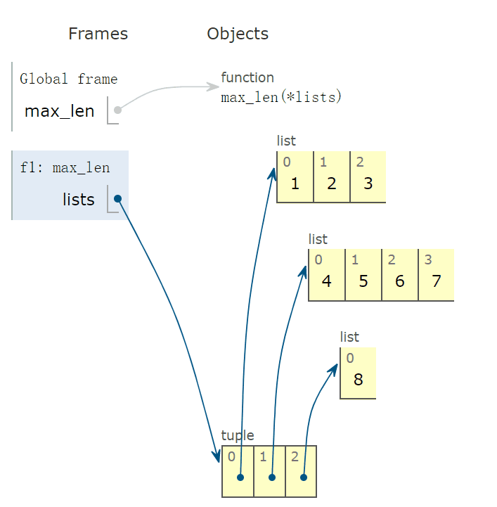


结论：
- 参数v的可能取值为`*lists`，也就是 `tuple` 的一个元素。

- `lambda`函数返回值，等于`lambda v`冒号后表达式的返回值。

#### 88 粘性之禅

7 行代码够烧脑，不信试试~~

```python
def product(*args, repeat=1):
    pools = [tuple(pool) for pool in args] * repeat
    result = [[]]
    for pool in pools:
        result = [x+[y] for x in result for y in pool]
    for prod in result:
        yield tuple(prod)
```


调用函数：
```python
rtn = product('xyz', '12', repeat=3)
print(list(rtn))
```

快去手动敲敲，看看输出啥吧~~

#### 89 元类

`xiaoming`, `xiaohong`, `xiaozhang` 都是学生，这类群体叫做 `Student`. 

Python 定义类的常见方法，使用关键字 `class`

```python
In [36]: class Student(object):
    ...:     pass
```
`xiaoming`, `xiaohong`, `xiaozhang` 是类的实例，则：

```python
xiaoming = Student()
xiaohong = Student()
xiaozhang = Student()
```

创建后，xiaoming 的 `__class__` 属性，返回的便是 `Student`类

```python
In [38]: xiaoming.__class__
Out[38]: __main__.Student
```

问题在于，`Student` 类有 `__class__`属性，如果有，返回的又是什么？
```python
In [39]: xiaoming.__class__.__class__
Out[39]: type
```
哇，程序没报错，返回 `type`

那么，我们不妨猜测：`Student` 类，类型就是 `type`

换句话说，`Student`类就是一个**对象**，它的类型就是 `type`

所以，Python 中一切皆对象，**类也是对象**

Python 中，将描述 `Student` 类的类被称为：元类。

按照此逻辑延伸，描述元类的类被称为：*元元类*，开玩笑了~ 描述元类的类也被称为元类。

聪明的朋友会问了，既然 `Student` 类可创建实例，那么 `type` 类可创建实例吗？ 如果能，它创建的实例就叫：类 了。 你们真聪明！

说对了，`type` 类一定能创建实例，比如 `Student` 类了。

```python
In [40]: Student = type('Student',(),{})

In [41]: Student
Out[41]: __main__.Student
```
它与使用 `class` 关键字创建的 `Student` 类一模一样。

Python 的类，因为又是对象，所以和 `xiaoming`，`xiaohong` 对象操作相似。支持：
- 赋值
- 拷贝
- 添加属性
- 作为函数参数

```python
In [43]: StudentMirror = Student # 类直接赋值 # 类直接赋值
In [44]: Student.class_property = 'class_property' # 添加类属性
In [46]: hasattr(Student, 'class_property')
Out[46]: True
```

元类，确实使用不是那么多，也许先了解这些，就能应付一些场合。就连 Python 界的领袖 `Tim Peters` 都说：

“元类就是深度的魔法，99%的用户应该根本不必为此操心。”

#### 90 对象序列化

对象序列化，是指将内存中的对象转化为可存储或传输的过程。很多场景，直接一个类对象，传输不方便。

但是，当对象序列化后，就会更加方便，因为约定俗成的，接口间的调用或者发起的 web 请求，一般使用 json 串传输。

实际使用中，一般对类对象序列化。先创建一个 Student 类型，并创建两个实例。

```python
    class Student():
        def __init__(self,**args):
            self.ids = args['ids']
            self.name = args['name']
            self.address = args['address']
    xiaoming = Student(ids = 1,name = 'xiaoming',address = '北京')
    xiaohong = Student(ids = 2,name = 'xiaohong',address = '南京')
```

导入 json 模块，调用 dump 方法，就会将列表对象 [xiaoming,xiaohong]，序列化到文件 json.txt 中。
```python
    import json
    
    with open('json.txt', 'w') as f:
        json.dump([xiaoming,xiaohong], f, default=lambda obj: obj.__dict__, ensure_ascii=False, indent=2, sort_keys=True)
```

生成的文件内容，如下：
```json
    [
      {
        "address": "北京",
        "ids": 1,
        "name": "xiaoming"
      },
      {
        "address": "南京",
        "ids": 2,
        "name": "xiaohong"
      }
    ]
```

### 二、Python字符串和正则

字符串无所不在，字符串的处理也是最常见的操作。本章节将总结和字符串处理相关的一切操作。主要包括基本的字符串操作；高级字符串操作之正则。目前共有`20`个小例子

#### 1 反转字符串

```python
st="python"
#方法1
''.join(reversed(st))
#方法2
st[::-1]
```

#### 2 字符串切片操作

```python
字符串切片操作——查找替换3或5的倍数
In [1]:[str("java"[i%3*4:]+"python"[i%5*6:] or i) for i in range(1,15)]
OUT[1]:['1',
 '2',
 'java',
 '4',
 'python',
 'java',
 '7',
 '8',
 'java',
 'python',
 '11',
 'java',
 '13',
 '14']
```
#### 3 join串联字符串
```python
In [4]: mystr = ['1',
   ...:  '2',
   ...:  'java',
   ...:  '4',
   ...:  'python',
   ...:  'java',
   ...:  '7',
   ...:  '8',
   ...:  'java',
   ...:  'python',
   ...:  '11',
   ...:  'java',
   ...:  '13',
   ...:  '14']

In [5]: ','.join(mystr) #用逗号连接字符串
Out[5]: '1,2,java,4,python,java,7,8,java,python,11,java,13,14'
```

#### 4 字符串的字节长度

```python
def str_byte_len(mystr):
    return (len(mystr.encode('utf-8')))


str_byte_len('i love python')  # 13(个字节)
str_byte_len('字符')  # 6(个字节)
```


以下是正则部分

```python
import re
```

#### 5 查找第一个匹配串

```python
s = 'i love python very much'
pat = 'python' 
r = re.search(pat,s)
print(r.span()) #(7,13)
```

#### 6 查找所有1的索引

```python
s = '山东省潍坊市青州第1中学高三1班'
pat = '1'
r = re.finditer(pat,s)
for i in r:
    print(i)

# <re.Match object; span=(9, 10), match='1'>
# <re.Match object; span=(14, 15), match='1'>
```

#### 7 \d 匹配数字[0-9]
findall找出全部位置的所有匹配
```python
s = '一共20行代码运行时间13.59s'
pat = r'\d+' # +表示匹配数字(\d表示数字的通用字符)1次或多次
r = re.findall(pat,s)
print(r)
# ['20', '13', '59']
```

#### 8 匹配浮点数和整数

?表示前一个字符匹配0或1次
```python
s = '一共20行代码运行时间13.59s'
pat = r'\d+\.?\d+' # ?表示匹配小数点(\.)0次或1次，这种写法有个小bug，不能匹配到个位数的整数
r = re.findall(pat,s)
print(r)
# ['20', '13.59']

# 更好的写法：
pat = r'\d+\.\d+|\d+' # A|B，匹配A失败才匹配B
```
#### 9 ^匹配字符串的开头

```python
s = 'This module provides regular expression matching operations similar to those found in Perl'
pat = r'^[emrt]' # 查找以字符e,m,r或t开始的字符串
r = re.findall(pat,s)
print(r)
# [],因为字符串的开头是字符`T`，不在emrt匹配范围内，所以返回为空
IN [11]: s2 = 'email for me is guozhennianhua@163.com'
re.findall('^[emrt].*',s2)# 匹配以e,m,r,t开始的字符串，后面是多个任意字符
Out[11]: ['email for me is guozhennianhua@163.com']

```
#### 10 re.I 忽略大小写

```python
s = 'That'
pat = r't' 
r = re.findall(pat,s,re.I)
In [22]: r
Out[22]: ['T', 't']
```
#### 11 理解compile的作用
如果要做很多次匹配，可以先编译匹配串：
```python
import re
pat = re.compile('\W+') # \W 匹配不是数字和字母的字符
has_special_chars = pat.search('ed#2@edc') 
if has_special_chars:
    print(f'str contains special characters:{has_special_chars.group(0)}')

###输出结果: 
 # str contains special characters:#   

### 再次使用pat正则编译对象 做匹配
again_pattern = pat.findall('guozhennianhua@163.com')
if '@' in again_pattern:
    print('possibly it is an email')

```

#### 12 使用()捕获单词，不想带空格
使用`()`捕获
```python
s = 'This module provides regular expression matching operations similar to those found in Perl'
pat = r'\s([a-zA-Z]+)'  
r = re.findall(pat,s)
print(r) #['module', 'provides', 'regular', 'expression', 'matching', 'operations', 'similar', 'to', 'those', 'found', 'in', 'Perl']
```
看到提取单词中未包括第一个单词，使用`?`表示前面字符出现0次或1次，但是此字符还有表示贪心或非贪心匹配含义，使用时要谨慎。
```python
s = 'This module provides regular expression matching operations similar to those found in Perl'
pat = r'\s?([a-zA-Z]+)'  
r = re.findall(pat,s)
print(r) #['This', 'module', 'provides', 'regular', 'expression', 'matching', 'operations', 'similar', 'to', 'those', 'found', 'in', 'Perl']
```

#### 13 split分割单词
使用以上方法分割单词不是简洁的，仅仅是为了演示。分割单词最简单还是使用`split`函数。
```python
s = 'This module provides regular expression matching operations similar to those found in Perl'
pat = r'\s+'  
r = re.split(pat,s)
print(r) # ['This', 'module', 'provides', 'regular', 'expression', 'matching', 'operations', 'similar', 'to', 'those', 'found', 'in', 'Perl']

### 上面这句话也可直接使用str自带的split函数：
s.split(' ') #使用空格分隔

### 但是，对于风格符更加复杂的情况，split无能为力，只能使用正则

s = 'This,,,   module ; \t   provides|| regular ; '
words = re.split('[,\s;|]+',s)  #这样分隔出来，最后会有一个空字符串
words = [i for i in words if len(i)>0]
```

#### 14 match从字符串开始位置匹配
注意`match`,`search`等的不同：
1) match函数
```python
import re
### match
mystr = 'This'
pat = re.compile('hi')
pat.match(mystr) # None
pat.match(mystr,1) # 从位置1处开始匹配
Out[90]: <re.Match object; span=(1, 3), match='hi'>
```
2) search函数
search是从字符串的任意位置开始匹配
```python
In [91]: mystr = 'This'
    ...: pat = re.compile('hi')
    ...: pat.search(mystr)
Out[91]: <re.Match object; span=(1, 3), match='hi'>
```

#### 15 替换匹配的子串
`sub`函数实现对匹配子串的替换
```python
content="hello 12345, hello 456321"    
pat=re.compile(r'\d+') #要替换的部分
m=pat.sub("666",content)
print(m) # hello 666, hello 666
```

#### 16 贪心捕获
(.*)表示捕获任意多个字符，尽可能多的匹配字符
```python
content='<h>ddedadsad</h><div>graph</div>bb<div>math</div>cc'
pat=re.compile(r"<div>(.*)</div>")  #贪婪模式
m=pat.findall(content)
print(m) #匹配结果为： ['graph</div>bb<div>math']
```
#### 17 非贪心捕获
仅添加一个问号(`?`)，得到结果完全不同，这是非贪心匹配，通过这个例子体会贪心和非贪心的匹配的不同。
```python
content='<h>ddedadsad</h><div>graph</div>bb<div>math</div>cc'
pat=re.compile(r"<div>(.*?)</div>")
m=pat.findall(content)
print(m) # ['graph', 'math']
```
非贪心捕获，见好就收。

#### 18 常用元字符总结

    . 匹配任意字符  
    ^ 匹配字符串开始位置 
    $ 匹配字符串中结束的位置 
    * 前面的原子重复0次、1次、多次 
    ? 前面的原子重复0次或者1次 
    + 前面的原子重复1次或多次
    {n} 前面的原子出现了 n 次
    {n,} 前面的原子至少出现 n 次
    {n,m} 前面的原子出现次数介于 n-m 之间
    ( ) 分组,需要输出的部分

#### 19 常用通用字符总结

    \s  匹配空白字符 
    \w  匹配任意字母/数字/下划线 
    \W  和小写 w 相反，匹配任意字母/数字/下划线以外的字符
    \d  匹配十进制数字
    \D  匹配除了十进制数以外的值 
    [0-9]  匹配一个0-9之间的数字
    [a-z]  匹配小写英文字母
    [A-Z]  匹配大写英文字母

#### 20 密码安全检查

密码安全要求：1)要求密码为6到20位; 2)密码只包含英文字母和数字

```python
pat = re.compile(r'\w{6,20}') # 这是错误的，因为\w通配符匹配的是字母，数字和下划线，题目要求不能含有下划线
# 使用最稳的方法：\da-zA-Z满足`密码只包含英文字母和数字`
pat = re.compile(r'[\da-zA-Z]{6,20}')
```
选用最保险的`fullmatch`方法，查看是否整个字符串都匹配：
```python
pat.fullmatch('qaz12') # 返回 None, 长度小于6
pat.fullmatch('qaz12wsxedcrfvtgb67890942234343434') # None 长度大于22
pat.fullmatch('qaz_231') # None 含有下划线
pat.fullmatch('n0passw0Rd')
Out[4]: <re.Match object; span=(0, 10), match='n0passw0Rd'>
```

#### 21 爬取百度首页标题

```python
import re
from urllib import request

#爬虫爬取百度首页内容
data=request.urlopen("http://www.baidu.com/").read().decode()

#分析网页,确定正则表达式
pat=r'<title>(.*?)</title>'

result=re.search(pat,data)
print(result) <re.Match object; span=(1358, 1382), match='<title>百度一下，你就知道</title>'>

result.group() # 百度一下，你就知道
```

#### 22 批量转化为驼峰格式(Camel)

数据库字段名批量转化为驼峰格式

分析过程

```python
# 用到的正则串讲解
# \s 指匹配： [ \t\n\r\f\v]
# A|B：表示匹配A串或B串
# re.sub(pattern, newchar, string): 
# substitue代替，用newchar字符替代与pattern匹配的字符所有.
```


```python
# title(): 转化为大写，例子：
# 'Hello world'.title() # 'Hello World'
```


```python
# print(re.sub(r"\s|_|", "", "He llo_worl\td"))
s = re.sub(r"(\s|_|-)+", " ",
           'some_database_field_name').title().replace(" ", "")  
#结果： SomeDatabaseFieldName
```


```python
# 可以看到此时的第一个字符为大写，需要转化为小写
s = s[0].lower()+s[1:]  # 最终结果
```

 

整理以上分析得到如下代码：

```python
import re
def camel(s):
    s = re.sub(r"(\s|_|-)+", " ", s).title().replace(" ", "")
    return s[0].lower() + s[1:]

# 批量转化
def batch_camel(slist):
    return [camel(s) for s in slist]
```

测试结果：

```python
s = batch_camel(['student_id', 'student\tname', 'student-add'])
print(s)
# 结果
['studentId', 'studentName', 'studentAdd']
```


#### 23 str1是否为str2的permutation

排序词(permutation)：两个字符串含有相同字符，但字符顺序不同。

```python
from collections import defaultdict


def is_permutation(str1, str2):
    if str1 is None or str2 is None:
        return False
    if len(str1) != len(str2):
        return False
    unq_s1 = defaultdict(int)
    unq_s2 = defaultdict(int)
    for c1 in unq_s1:
        unq_s1[c1] += 1
    for c2 in unq_s2:
        unq_s2[c2] += 1

    return unq_s1 == unq_s2
```

这个小例子，使用python内置的`defaultdict`，默认类型初始化为`int`，计数默次数都为0. 这个解法本质是 `hash map lookup`

统计出的两个defaultdict：unq_s1，unq_s2，如果相等，就表明str1、 str2互为排序词。

下面测试：

```python
r = is_permutation('nice', 'cine')
print(r)  # True

r = is_permutation('', '')
print(r)  # True

r = is_permutation('', None)
print(r)  # False

r = is_permutation('work', 'woo')
print(r)  # False

```

以上就是使用defaultdict的小例子，希望对读者朋友理解此类型有帮助。

#### 24 str1是否由str2旋转而来

`stringbook`旋转后得到`bookstring`,写一段代码验证`str1`是否为`str2`旋转得到。

**思路**

转化为判断：`str1`是否为`str2+str2`的子串

```python
def is_rotation(s1: str, s2: str) -> bool:
    if s1 is None or s2 is None:
        return False
    if len(s1) != len(s2):
        return False

    def is_substring(s1: str, s2: str) -> bool:
        return s1 in s2
    return is_substring(s1, s2 + s2)
```

**测试**

```python
r = is_rotation('stringbook', 'bookstring')
print(r)  # True

r = is_rotation('greatman', 'maneatgr')
print(r)  # False
```

#### 25 正浮点数

从一系列字符串中，挑选出所有正浮点数。

该怎么办？

玩玩正则表达式，用正则搞它！

关键是，正则表达式该怎么写呢？

有了！

`^[1-9]\d*\.\d*$`

`^` 表示字符串开始

`[1-9]` 表示数字1,2,3,4,5,6,7,8,9

`^[1-9]` 连起来表示以数字 `1-9` 作为开头

`\d` 表示一位 `0-9` 的数字

`*` 表示前一位字符出现 0 次，1 次或多次

`\d*` 表示数字出现 0 次，1 次或多次 

`\.` 表示小数点

`\$` 表示字符串以前一位的字符结束

`^[1-9]\d*\.\d*$` 连起来就求出所有大于 1.0 的正浮点数。

那 0.0 到 1.0 之间的正浮点数，怎么求，干嘛不直接汇总到上面的正则表达式中呢？

这样写不行吗：`^[0-9]\d*\.\d*$`

OK!

那我们立即测试下呗

```python
In [85]: import re

In [87]: recom = re.compile(r'^[0-9]\d*\.\d*$')

In [88]: recom.match('000.2')
Out[88]: <re.Match object; span=(0, 5), match='000.2'>
```

结果显示，正则表达式 `^[0-9]\d*\.\d*$` 竟然匹配到 `000.2 `，认为它是一个正浮点数~~~！！！！

晕！！！！！！

所以知道为啥要先匹配大于 1.0 的浮点数了吧！

如果能写出这个正则表达式，再写另一部分就不困难了！

0.0 到 1.0 间的浮点数：`^0\.\d*[1-9]\d*$`

两个式子连接起来就是最终的结果：

`^[1-9]\d*\.\d*|0\.\d*[1-9]\d*$`

如果还是看不懂，看看下面的正则分布剖析图吧：

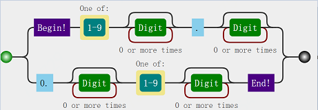

### 三、Python文件、日期和多线程

Python文件IO操作涉及文件读写操作，获取文件`后缀名`，修改后缀名，获取文件修改时间，`压缩`文件，`加密`文件等操作。

Python日期章节，由表示大日期的`calendar`, `date`模块，逐渐过渡到表示时间刻度更小的模块：`datetime`, `time`模块，按照此逻辑展开。

Python`多线程`希望透过5个小例子，帮助你对多线程模型编程本质有些更清晰的认识。

一共总结最常用的`24`个关于文件和时间处理模块的例子。

#### 1 获取后缀名

```python
import os
file_ext = os.path.splitext('./data/py/test.py')
front,ext = file_ext
In [5]: front
Out[5]: './data/py/test'

In [6]: ext
Out[6]: '.py'
```

#### 2 文件读操作

```python
import os
# 创建文件夹

def mkdir(path):
    isexists = os.path.exists(path)
    if not isexists:
        os.mkdir(path)
# 读取文件信息

def openfile(filename):
    f = open(filename)
    fllist = f.read()
    f.close()
    return fllist  # 返回读取内容
```


#### 3 文件写操作

```python
# 写入文件信息
# example1
# w写入，如果文件存在，则清空内容后写入，不存在则创建
f = open(r"./data/test.txt", "w", encoding="utf-8")
print(f.write("测试文件写入"))
f.close

# example2
# a写入，文件存在，则在文件内容后追加写入，不存在则创建
f = open(r"./data/test.txt", "a", encoding="utf-8")
print(f.write("测试文件写入"))
f.close

# example3
# with关键字系统会自动关闭文件和处理异常
with open(r"./data/test.txt", "w") as f:
    f.write("hello world!")
```


#### 4 路径中的文件名

```python
In [11]: import os
    ...: file_ext = os.path.split('./data/py/test.py')
    ...: ipath,ifile = file_ext
    ...:

In [12]: ipath
Out[12]: './data/py'

In [13]: ifile
Out[13]: 'test.py'
```


#### 5 批量修改文件后缀

**批量修改文件后缀**

本例子使用Python的`os`模块和 `argparse`模块，将工作目录`work_dir`下所有后缀名为`old_ext`的文件修改为后缀名为`new_ext`

通过本例子，大家将会大概清楚`argparse`模块的主要用法。

导入模块

```python
import argparse
import os
```

定义脚本参数

```python
def get_parser():
    parser = argparse.ArgumentParser(
        description='工作目录中文件后缀名修改')
    parser.add_argument('work_dir', metavar='WORK_DIR', type=str, nargs=1,
                        help='修改后缀名的文件目录')
    parser.add_argument('old_ext', metavar='OLD_EXT',
                        type=str, nargs=1, help='原来的后缀')
    parser.add_argument('new_ext', metavar='NEW_EXT',
                        type=str, nargs=1, help='新的后缀')
    return parser
```

后缀名批量修改

```python
def batch_rename(work_dir, old_ext, new_ext):
    """
    传递当前目录，原来后缀名，新的后缀名后，批量重命名后缀
    """
    for filename in os.listdir(work_dir):
        # 获取得到文件后缀
        split_file = os.path.splitext(filename)
        file_ext = split_file[1]
        # 定位后缀名为old_ext 的文件
        if old_ext == file_ext:
            # 修改后文件的完整名称
            newfile = split_file[0] + new_ext
            # 实现重命名操作
            os.rename(
                os.path.join(work_dir, filename),
                os.path.join(work_dir, newfile)
            )
    print("完成重命名")
    print(os.listdir(work_dir))
```

实现Main

```python
def main():
    """
    main函数
    """
    # 命令行参数
    parser = get_parser()
    args = vars(parser.parse_args())
    # 从命令行参数中依次解析出参数
    work_dir = args['work_dir'][0]
    old_ext = args['old_ext'][0]
    if old_ext[0] != '.':
        old_ext = '.' + old_ext
    new_ext = args['new_ext'][0]
    if new_ext[0] != '.':
        new_ext = '.' + new_ext

    batch_rename(work_dir, old_ext, new_ext)
```


#### 6 xls批量转换成xlsx

```python
import os


def xls_to_xlsx(work_dir):
    """
    传递当前目录，原来后缀名，新的后缀名后，批量重命名后缀
    """
    old_ext, new_ext = '.xls', '.xlsx'
    for filename in os.listdir(work_dir):
        # 获取得到文件后缀
        split_file = os.path.splitext(filename)
        file_ext = split_file[1]
        # 定位后缀名为old_ext 的文件
        if old_ext == file_ext:
            # 修改后文件的完整名称
            newfile = split_file[0] + new_ext
            # 实现重命名操作
            os.rename(
                os.path.join(work_dir, filename),
                os.path.join(work_dir, newfile)
            )
    print("完成重命名")
    print(os.listdir(work_dir))


xls_to_xlsx('./data')

# 输出结果：
# ['cut_words.csv', 'email_list.xlsx', 'email_test.docx', 'email_test.jpg', 'email_test.xlsx', 'geo_data.png', 'geo_data.xlsx',
'iotest.txt', 'pyside2.md', 'PySimpleGUI-4.7.1-py3-none-any.whl', 'test.txt', 'test_excel.xlsx', 'ziptest', 'ziptest.zip']
```


#### 7 定制文件不同行


比较两个文件在哪些行内容不同，返回这些行的编号，行号编号从1开始。

定义统计文件行数的函数

```python
# 统计文件个数
    def statLineCnt(statfile):
        print('文件名：'+statfile)
        cnt = 0
        with open(statfile, encoding='utf-8') as f:
            while f.readline():
                cnt += 1
            return cnt
```


统计文件不同之处的子函数：

```python
# more表示含有更多行数的文件
        def diff(more, cnt, less):
            difflist = []
            with open(less, encoding='utf-8') as l:
                with open(more, encoding='utf-8') as m:
                    lines = l.readlines()
                    for i, line in enumerate(lines):
                        if line.strip() != m.readline().strip():
                            difflist.append(i)
            if cnt - i > 1:
                difflist.extend(range(i + 1, cnt))
            return [no+1 for no in difflist]
```


主函数：

```python
# 返回的结果行号从1开始
# list表示fileA和fileB不同的行的编号

def file_diff_line_nos(fileA, fileB):
    try:
        cntA = statLineCnt(fileA)
        cntB = statLineCnt(fileB)
        if cntA > cntB:
            return diff(fileA, cntA, fileB)
        return diff(fileB, cntB, fileA)

    except Exception as e:
        print(e)
```

比较两个文件A和B，拿相对较短的文件去比较，过滤行后的换行符`\n`和空格。

暂未考虑某个文件最后可能有的多行空行等特殊情况

使用`file_diff_line_nos` 函数：

```python
if __name__ == '__main__':
    import os
    print(os.getcwd())

    '''
    例子：
    fileA = "'hello world!!!!''\
            'nice to meet you'\
            'yes'\
            'no1'\
            'jack'"
    fileB = "'hello world!!!!''\
            'nice to meet you'\
            'yes' "
    '''
    diff = file_diff_line_nos('./testdir/a.txt', './testdir/b.txt')
    print(diff)  # [4, 5]
```

关于文件比较的，实际上，在Python中有对应模块`difflib` , 提供更多其他格式的文件更详细的比较，大家可参考：

> https://docs.python.org/3/library/difflib.html?highlight=difflib#module-difflib


#### 8 获取指定后缀名的文件

```python
import os

def find_file(work_dir,extension='jpg'):
    lst = []
    for filename in os.listdir(work_dir):
        print(filename)
        splits = os.path.splitext(filename)
        ext = splits[1] # 拿到扩展名
        if ext == '.'+extension:
            lst.append(filename)
    return lst

r = find_file('.','md') 
print(r) # 返回所有目录下的md文件
```


#### 9 批量获取文件修改时间

```python
# 获取目录下文件的修改时间
import os
from datetime import datetime

print(f"当前时间：{datetime.now().strftime('%Y-%m-%d %H:%M:%S')}")

def get_modify_time(indir):
    for root, _, files in os.walk(indir):  # 循环D:\works目录和子目录
        for file in files:
            absfile = os.path.join(root, file)
            modtime = datetime.fromtimestamp(os.path.getmtime(absfile))
            now = datetime.now()
            difftime = now-modtime
            if difftime.days < 20:  # 条件筛选超过指定时间的文件
                print(f"""{absfile}
                    修改时间[{modtime.strftime('%Y-%m-%d %H:%M:%S')}]
                    距今[{difftime.days:3d}天{difftime.seconds//3600:2d}时{difftime.seconds%3600//60:2d}]"""
                      )  # 打印相关信息


get_modify_time('./data')
```

    打印效果：
    当前时间：2019-12-22 16:38:53
    ./data\cut_words.csv
                        修改时间[2019-12-21 10:34:15]
                        距今[  1天 6时 4]
    当前时间：2019-12-22 16:38:53
    ./data\cut_words.csv
                        修改时间[2019-12-21 10:34:15]
                        距今[  1天 6时 4]
    ./data\email_test.docx
                        修改时间[2019-12-03 07:46:29]
                        距今[ 19天 8时52]
    ./data\email_test.jpg
                        修改时间[2019-12-03 07:46:29]
                        距今[ 19天 8时52]
    ./data\email_test.xlsx
                        修改时间[2019-12-03 07:46:29]
                        距今[ 19天 8时52]
    ./data\iotest.txt
                        修改时间[2019-12-13 08:23:18]
                        距今[  9天 8时15]
    ./data\pyside2.md
                        修改时间[2019-12-05 08:17:22]
                        距今[ 17天 8时21]
    ./data\PySimpleGUI-4.7.1-py3-none-any.whl
                        修改时间[2019-12-05 00:25:47]
                        距今[ 17天16时13]

#### 10 批量压缩文件


```python
import zipfile  # 导入zipfile,这个是用来做压缩和解压的Python模块；
import os
import time


def batch_zip(start_dir):
    start_dir = start_dir  # 要压缩的文件夹路径
    file_news = start_dir + '.zip'  # 压缩后文件夹的名字

    z = zipfile.ZipFile(file_news, 'w', zipfile.ZIP_DEFLATED)
    for dir_path, dir_names, file_names in os.walk(start_dir):
        # 这一句很重要，不replace的话，就从根目录开始复制
        f_path = dir_path.replace(start_dir, '')
        f_path = f_path and f_path + os.sep  # 实现当前文件夹以及包含的所有文件的压缩
        for filename in file_names:
            z.write(os.path.join(dir_path, filename), f_path + filename)
    z.close()
    return file_news


batch_zip('./data/ziptest')


```

#### 11 32位加密

```python
import hashlib
# 对字符串s实现32位加密


def hash_cry32(s):
    m = hashlib.md5()
    m.update((str(s).encode('utf-8')))
    return m.hexdigest()


print(hash_cry32(1))  # c4ca4238a0b923820dcc509a6f75849b
print(hash_cry32('hello'))  # 5d41402abc4b2a76b9719d911017c592
```


#### 12 年的日历图

```python
import calendar
from datetime import date
mydate = date.today()
year_calendar_str = calendar.calendar(2019)
print(f"{mydate.year}年的日历图：{year_calendar_str}\n")
```

打印结果：

```python
2019

      January                   February                   March
Mo Tu We Th Fr Sa Su      Mo Tu We Th Fr Sa Su      Mo Tu We Th Fr Sa Su
    1  2  3  4  5  6                   1  2  3                   1  2  3
 7  8  9 10 11 12 13       4  5  6  7  8  9 10       4  5  6  7  8  9 10
14 15 16 17 18 19 20      11 12 13 14 15 16 17      11 12 13 14 15 16 17
21 22 23 24 25 26 27      18 19 20 21 22 23 24      18 19 20 21 22 23 24
28 29 30 31               25 26 27 28               25 26 27 28 29 30 31

       April                      May                       June
Mo Tu We Th Fr Sa Su      Mo Tu We Th Fr Sa Su      Mo Tu We Th Fr Sa Su
 1  2  3  4  5  6  7             1  2  3  4  5                      1  2
 8  9 10 11 12 13 14       6  7  8  9 10 11 12       3  4  5  6  7  8  9
15 16 17 18 19 20 21      13 14 15 16 17 18 19      10 11 12 13 14 15 16
22 23 24 25 26 27 28      20 21 22 23 24 25 26      17 18 19 20 21 22 23
29 30                     27 28 29 30 31            24 25 26 27 28 29 30

        July                     August                  September
Mo Tu We Th Fr Sa Su      Mo Tu We Th Fr Sa Su      Mo Tu We Th Fr Sa Su
 1  2  3  4  5  6  7                1  2  3  4                         1
 8  9 10 11 12 13 14       5  6  7  8  9 10 11       2  3  4  5  6  7  8
15 16 17 18 19 20 21      12 13 14 15 16 17 18       9 10 11 12 13 14 15
22 23 24 25 26 27 28      19 20 21 22 23 24 25      16 17 18 19 20 21 22
29 30 31                  26 27 28 29 30 31         23 24 25 26 27 28 29
                                                    30

      October                   November                  December
Mo Tu We Th Fr Sa Su      Mo Tu We Th Fr Sa Su      Mo Tu We Th Fr Sa Su
    1  2  3  4  5  6                   1  2  3                         1
 7  8  9 10 11 12 13       4  5  6  7  8  9 10       2  3  4  5  6  7  8
14 15 16 17 18 19 20      11 12 13 14 15 16 17       9 10 11 12 13 14 15
21 22 23 24 25 26 27      18 19 20 21 22 23 24      16 17 18 19 20 21 22
28 29 30 31               25 26 27 28 29 30         23 24 25 26 27 28 29
                                                    30 31
```


#### 13 判断是否为闰年

```python
import calendar
from datetime import date

mydate = date.today()
is_leap = calendar.isleap(mydate.year)
print_leap_str = "%s年是闰年" if is_leap else "%s年不是闰年\n"
print(print_leap_str % mydate.year)
```

打印结果：

```python
2019年不是闰年
```

#### 3 月的日历图

```python
import calendar
from datetime import date

mydate = date.today()
month_calendar_str = calendar.month(mydate.year, mydate.month)

print(f"{mydate.year}年-{mydate.month}月的日历图：{month_calendar_str}\n")
```

打印结果：

```python
December 2019
Mo Tu We Th Fr Sa Su
                   1
 2  3  4  5  6  7  8
 9 10 11 12 13 14 15
16 17 18 19 20 21 22
23 24 25 26 27 28 29
30 31
```

#### 14 月有几天

```python
import calendar
from datetime import date

mydate = date.today()
weekday, days = calendar.monthrange(mydate.year, mydate.month)
print(f'{mydate.year}年-{mydate.month}月的第一天是那一周的第{weekday}天\n')
print(f'{mydate.year}年-{mydate.month}月共有{days}天\n')
```

打印结果：

```python
2019年-12月的第一天是那一周的第6天

2019年-12月共有31天
```


#### 15 月第一天

```python
from datetime import date
mydate = date.today()
month_first_day = date(mydate.year, mydate.month, 1)
print(f"当月第一天:{month_first_day}\n")
```

打印结果：

```python
当月第一天:2019-12-01
```


#### 16 月最后一天

```python
from datetime import date
import calendar
mydate = date.today()
_, days = calendar.monthrange(mydate.year, mydate.month)
month_last_day = date(mydate.year, mydate.month, days)
print(f"当月最后一天:{month_last_day}\n")
```

打印结果：

```python
当月最后一天:2019-12-31
```


#### 17 获取当前时间

```python
from datetime import date, datetime
from time import localtime

today_date = date.today()
print(today_date)  # 2019-12-22

today_time = datetime.today()
print(today_time)  # 2019-12-22 18:02:33.398894

local_time = localtime()
print(strftime("%Y-%m-%d %H:%M:%S", local_time))  # 转化为定制的格式 2019-12-22 18:13:41
```


#### 18 字符时间转时间

```python
from time import strptime

# parse str time to struct time
struct_time = strptime('2019-12-22 10:10:08', "%Y-%m-%d %H:%M:%S")
print(struct_time) # struct_time类型就是time中的一个类

# time.struct_time(tm_year=2019, tm_mon=12, tm_mday=22, tm_hour=10, tm_min=10, tm_sec=8, tm_wday=6, tm_yday=356, tm_isdst=-1)
```


#### 19 时间转字符时间

```python
from time import strftime, strptime, localtime

In [2]: print(localtime()) #这是输入的时间
Out[2]: time.struct_time(tm_year=2019, tm_mon=12, tm_mday=22, tm_hour=18, tm_min=24, tm_sec=56, tm_wday=6, tm_yday=356, tm_isdst=0)

print(strftime("%m-%d-%Y %H:%M:%S", localtime()))  # 转化为定制的格式
# 这是字符串表示的时间：   12-22-2019 18:26:21
```


#### 20 默认启动主线程

一般的，程序默认执行只在一个线程，这个线程称为主线程，例子演示如下：

导入线程相关的模块 `threading`:

```python
import threading
```

threading的类方法 `current_thread()`返回当前线程：

```python
t = threading.current_thread()
print(t) # <_MainThread(MainThread, started 139908235814720)>
```

所以，验证了程序默认是在`MainThead`中执行。

`t.getName()`获得这个线程的名字，其他常用方法，`getName()`获得线程`id`,`isAlive()`判断线程是否存活等。

```python
print(t.getName()) # MainThread
print(t.ident) # 139908235814720
print(t.isAlive()) # True
```

以上这些仅是介绍多线程的`背景知识`，因为到目前为止，我们有且仅有一个"干活"的主线程

#### 21 创建线程

创建一个线程：

```python
my_thread = threading.Thread()
```

创建一个名称为`my_thread`的线程：

```python
my_thread = threading.Thread(name='my_thread')
```

创建线程的目的是告诉它帮助我们做些什么，做些什么通过参数`target`传入，参数类型为`callable`，函数就是可调用的：

```python
def print_i(i):
    print('打印i:%d'%(i,))
my_thread = threading.Thread(target=print_i,args=(1,))
```

`my_thread`线程已经全副武装，但是我们得按下发射按钮，启动start()，它才开始真正起飞。

```python
my_thread().start()
```

打印结果如下，其中`args`指定函数`print_i`需要的参数i，类型为元祖。

```python
打印i:1
```

至此，多线程相关的核心知识点，已经总结完毕。但是，仅仅知道这些，还不够！光纸上谈兵，当然远远不够。

接下来，聊聊应用多线程编程，最本质的一些东西。

**3 交替获得CPU时间片**

为了更好解释，假定计算机是单核的，尽管对于`cpython`，这个假定有些多余。

开辟3个线程，装到`threads`中:

```python
import time
from datetime import datetime
import threading


def print_time():
    for _ in range(5): # 在每个线程中打印5次
        time.sleep(0.1) # 模拟打印前的相关处理逻辑
        print('当前线程%s,打印结束时间为:%s'%(threading.current_thread().getName(),datetime.today()))


threads = [threading.Thread(name='t%d'%(i,),target=print_time) for i in range(3)]
```

启动3个线程：

```python
[t.start() for t in threads]
```

打印结果如下，`t0`,`t1`,`t2`三个线程，根据操作系统的调度算法，轮询获得CPU时间片，注意观察，`t2`线程可能被连续调度，从而获得时间片。

```python
当前线程t0,打印结束时间为:2020-01-12 02:27:15.705235
当前线程t1,打印结束时间为:2020-01-12 02:27:15.705402
当前线程t2,打印结束时间为:2020-01-12 02:27:15.705687
当前线程t0,打印结束时间为:2020-01-12 02:27:15.805767
当前线程t1,打印结束时间为:2020-01-12 02:27:15.805886
当前线程t2,打印结束时间为:2020-01-12 02:27:15.806044
当前线程t0,打印结束时间为:2020-01-12 02:27:15.906200
当前线程t2,打印结束时间为:2020-01-12 02:27:15.906320
当前线程t1,打印结束时间为:2020-01-12 02:27:15.906433
当前线程t0,打印结束时间为:2020-01-12 02:27:16.006581
当前线程t1,打印结束时间为:2020-01-12 02:27:16.006766
当前线程t2,打印结束时间为:2020-01-12 02:27:16.007006
当前线程t2,打印结束时间为:2020-01-12 02:27:16.107564
当前线程t0,打印结束时间为:2020-01-12 02:27:16.107290
当前线程t1,打印结束时间为:2020-01-12 02:27:16.107741
```

#### 22 多线程抢夺同一个变量

多线程编程，存在抢夺同一个变量的问题。

比如下面例子，创建的10个线程同时竞争全局变量`a`:
​

```python
import threading


a = 0
def add1():
    global a    
    a += 1
    print('%s  adds a to 1: %d'%(threading.current_thread().getName(),a))
    
threads = [threading.Thread(name='t%d'%(i,),target=add1) for i in range(10)]
[t.start() for t in threads]
```

执行结果：

```python
t0  adds a to 1: 1
t1  adds a to 1: 2
t2  adds a to 1: 3
t3  adds a to 1: 4
t4  adds a to 1: 5
t5  adds a to 1: 6
t6  adds a to 1: 7
t7  adds a to 1: 8
t8  adds a to 1: 9
t9  adds a to 1: 10
```

结果一切正常，每个线程执行一次，把`a`的值加1，最后`a` 变为10，一切正常。

运行上面代码十几遍，一切也都正常。

所以，我们能下结论：这段代码是线程安全的吗？

NO！

多线程中，只要存在同时读取和修改一个全局变量的情况，如果不采取其他措施，就一定不是线程安全的。

尽管，有时，某些情况的资源竞争，暴露出问题的概率`极低极低`：

本例中，如果线程0 在修改a后，其他某些线程还是get到的是没有修改前的值，就会暴露问题。


但是在本例中，`a = a + 1`这种修改操作，花费的时间太短了，短到我们无法想象。所以，线程间轮询执行时，都能get到最新的a值。所以，暴露问题的概率就变得微乎其微。

#### 23 代码稍作改动，叫问题暴露出来

只要弄明白问题暴露的原因，叫问题出现还是不困难的。

想象数据库的写入操作，一般需要耗费我们可以感知的时间。

为了模拟这个写入动作，简化期间，我们只需要延长修改变量`a`的时间，问题很容易就会还原出来。

```python
import threading
import time


a = 0
def add1():
    global a    
    tmp = a + 1
    time.sleep(0.2) # 延时0.2秒，模拟写入所需时间
    a = tmp
    print('%s  adds a to 1: %d'%(threading.current_thread().getName(),a))
    
threads = [threading.Thread(name='t%d'%(i,),target=add1) for i in range(10)]
[t.start() for t in threads]
```

重新运行代码，只需一次，问题立马完全暴露，结果如下：

```python
t0  adds a to 1: 1
t1  adds a to 1: 1
t2  adds a to 1: 1
t3  adds a to 1: 1
t4  adds a to 1: 1
t5  adds a to 1: 1
t7  adds a to 1: 1
t6  adds a to 1: 1
t8  adds a to 1: 1
t9  adds a to 1: 1
```

看到，10个线程全部运行后，`a`的值只相当于一个线程执行的结果。

下面分析，为什么会出现上面的结果：

这是一个很有说服力的例子，因为在修改a前，有0.2秒的休眠时间，某个线程延时后，CPU立即分配计算资源给其他线程。直到分配给所有线程后，根据结果反映出，0.2秒的休眠时长还没耗尽，这样每个线程get到的a值都是0，所以才出现上面的结果。


以上最核心的三行代码：

```python
tmp = a + 1
time.sleep(0.2) # 延时0.2秒，模拟写入所需时间
a = tmp
```


#### 24 加上一把锁，避免以上情况出现

知道问题出现的原因后，要想修复问题，也没那么复杂。

通过python中提供的锁机制，某段代码只能单线程执行时，上锁，其他线程等待，直到释放锁后，其他线程再争锁，执行代码，释放锁，重复以上。

创建一把锁`locka`:

```python
import threading
import time


locka = threading.Lock()
```

通过 `locka.acquire()` 获得锁，通过`locka.release()`释放锁，它们之间的这些代码，只能单线程执行。

```python
a = 0
def add1():
    global a    
    try:
        locka.acquire() # 获得锁
        tmp = a + 1
        time.sleep(0.2) # 延时0.2秒，模拟写入所需时间
        a = tmp
    finally:
        locka.release() # 释放锁
    print('%s  adds a to 1: %d'%(threading.current_thread().getName(),a))
    
threads = [threading.Thread(name='t%d'%(i,),target=add1) for i in range(10)]
[t.start() for t in threads]
```

执行结果如下：

```python
t0  adds a to 1: 1
t1  adds a to 1: 2
t2  adds a to 1: 3
t3  adds a to 1: 4
t4  adds a to 1: 5
t5  adds a to 1: 6
t6  adds a to 1: 7
t7  adds a to 1: 8
t8  adds a to 1: 9
t9  adds a to 1: 10
```

一起正常，其实这已经是单线程顺序执行了，就本例子而言，已经失去多线程的价值，并且还带来了因为线程创建开销，浪费时间的副作用。

程序中只有一把锁，通过 `try...finally`还能确保不发生死锁。但是，当程序中启用多把锁，还是很容易发生死锁。

注意使用场合，避免死锁，是我们在使用多线程开发时需要注意的一些问题。

#### 25 1 分钟掌握 time 模块

time 模块提供时间相关的类和函数

记住一个类：`struct_time`，9 个整数组成的元组

记住下面 5 个最常用函数

首先导入`time`模块

```python
import time
```

**1 此时此刻时间浮点数**

```python
In [58]: seconds = time.time()
In [60]: seconds
Out[60]: 1582341559.0950701
```

**2 时间数组**

```python
In [61]: local_time = time.localtime(seconds)

In [62]: local_time
Out[62]: time.struct_time(tm_year=2020, tm_mon=2, tm_mday=22, tm_hour=11, tm_min=19, tm_sec=19, tm_wday=5, tm_yday=53, tm_isdst=0)
```

**3 时间字符串**

`time.asctime` 语义： `as convert time`

```python
In [63]: str_time = time.asctime(local_time)

In [64]: str_time
Out[64]: 'Sat Feb 22 11:19:19 2020'
```

**4 格式化时间字符串**

`time.strftime` 语义： `string format time`

```python
In [65]: format_time = time.strftime('%Y-%m-%d %H:%M:%S',local_time)

In [66]: format_time
Out[66]: '2020-02-22 11:19:19'
```

**5 字符时间转时间数组**

```python
In [68]: str_to_struct = time.strptime(format_time,'%Y-%m-%d %H:%M:%S')

In [69]: str_to_struct
Out[69]: time.struct_time(tm_year=2020, tm_mon=2, tm_mday=22, tm_hour=11, tm_min=19, tm_sec=19, tm_wday=5, tm_yday=53, tm_isdst=-1)
```

最后再记住常用字符串格式

**常用字符串格式**

%m：月

%M: 分钟

```markdown
    %Y  Year with century as a decimal number.
    %m  Month as a decimal number [01,12].
    %d  Day of the month as a decimal number [01,31].
    %H  Hour (24-hour clock) as a decimal number [00,23].
    %M  Minute as a decimal number [00,59].
    %S  Second as a decimal number [00,61].
    %z  Time zone offset from UTC.
    %a  Locale's abbreviated weekday name.
    %A  Locale's full weekday name.
    %b  Locale's abbreviated month name.
```

#### 26 4G 内存处理 10G 大小的文件

4G 内存处理 10G 大小的文件，单机怎么做？

下面的讨论基于的假定：可以单独处理一行数据，行间数据相关性为零。

方法一：

仅使用 Python 内置模板，逐行读取到内存。

使用 yield，好处是解耦读取操作和处理操作：

```python
def python_read(filename):
    with open(filename,'r',encoding='utf-8') as f:
        while True:
            line = f.readline()
            if not line:
                return
            yield line
```

以上每次读取一行，逐行迭代，逐行处理数据

```python
if __name__ == '__main__':
    g = python_read('./data/movies.dat')
    for c in g:
        print(c)
        # process c
```

方法二：

方法一有缺点，逐行读入，频繁的 IO 操作拖累处理效率。是否有一次 IO ，读取多行的方法？

`pandas` 包 `read_csv` 函数，参数有 38 个之多，功能非常强大。

关于单机处理大文件，`read_csv` 的 `chunksize` 参数能做到，设置为 `5`， 意味着一次读取 5 行。

```python
def pandas_read(filename,sep=',',chunksize=5):
    reader = pd.read_csv(filename,sep,chunksize=chunksize)
    while True:
        try:
            yield reader.get_chunk()
        except StopIteration:
            print('---Done---')
            break
```

使用如同方法一：
```python
if __name__ == '__main__':
    g = pandas_read('./data/movies.dat',sep="::")
    for c in g:
        print(c)
        # process c
```

以上就是单机处理大文件的两个方法，推荐使用方法二，更加灵活。除了工作中会用到，面试中也有时被问到。

### 四、Python三大利器

Python中的三大利器包括：`迭代器`，`生成器`，`装饰器`，利用好它们才能开发出最高性能的Python程序，涉及到的内置模块 `itertools`提供迭代器相关的操作。此部分收录有意思的例子共计`14`例。


#### 1 寻找第n次出现位置

```python
def search_n(s, c, n):
    size = 0
    for i, x in enumerate(s):
        if x == c:
            size += 1
        if size == n:
            return i
    return -1


print(search_n("fdasadfadf", "a", 3))# 结果为7，正确
print(search_n("fdasadfadf", "a", 30))# 结果为-1，正确
```


#### 2 斐波那契数列前n项

```python
def fibonacci(n):
    a, b = 1, 1
    for _ in range(n):
        yield a
        a, b = b, a + b


list(fibonacci(5))  # [1, 1, 2, 3, 5]
```

#### 3 找出所有重复元素

```python
from collections import Counter


def find_all_duplicates(lst):
    c = Counter(lst)
    return list(filter(lambda k: c[k] > 1, c))


find_all_duplicates([1, 2, 2, 3, 3, 3])  # [2,3]
```

#### 4 联合统计次数
Counter对象间可以做数学运算

```python
from collections import Counter
a = ['apple', 'orange', 'computer', 'orange']
b = ['computer', 'orange']

ca = Counter(a)
cb = Counter(b)
#Counter对象间可以做数学运算
ca + cb  # Counter({'orange': 3, 'computer': 2, 'apple': 1})


# 进一步抽象，实现多个列表内元素的个数统计


def sumc(*c):
    if (len(c) < 1):
        return
    mapc = map(Counter, c)
    s = Counter([])
    for ic in mapc: # ic 是一个Counter对象
        s += ic
    return s


#Counter({'orange': 3, 'computer': 3, 'apple': 1, 'abc': 1, 'face': 1})
sumc(a, b, ['abc'], ['face', 'computer'])

```

#### 5 groupby单字段分组

天气记录：

```python
a = [{'date': '2019-12-15', 'weather': 'cloud'},
 {'date': '2019-12-13', 'weather': 'sunny'},
 {'date': '2019-12-14', 'weather': 'cloud'}]
```

按照天气字段`weather`分组汇总：

```python
from itertools import groupby
for k, items in  groupby(a,key=lambda x:x['weather']):
     print(k)
```

输出结果看出，分组失败！原因：分组前必须按照分组字段`排序`，这个很坑~

```python
cloud
sunny
cloud
```

修改代码：

```python
a.sort(key=lambda x: x['weather'])
for k, items in  groupby(a,key=lambda x:x['weather']):
     print(k)
     for i in items:
         print(i)
```

输出结果：

```python
cloud
{'date': '2019-12-15', 'weather': 'cloud'}
{'date': '2019-12-14', 'weather': 'cloud'}
sunny
{'date': '2019-12-13', 'weather': 'sunny'}
```

#### 6 itemgetter和key函数

注意到`sort`和`groupby`所用的`key`函数，除了`lambda`写法外，还有一种简写，就是使用`itemgetter`：

```python
a = [{'date': '2019-12-15', 'weather': 'cloud'},
 {'date': '2019-12-13', 'weather': 'sunny'},
 {'date': '2019-12-14', 'weather': 'cloud'}]
from operator import itemgetter
from itertools import groupby

a.sort(key=itemgetter('weather'))
for k, items in groupby(a, key=itemgetter('weather')):
     print(k)
     for i in items:
         print(i)
```

结果：

```python
cloud
{'date': '2019-12-15', 'weather': 'cloud'}
{'date': '2019-12-14', 'weather': 'cloud'}
sunny
{'date': '2019-12-13', 'weather': 'sunny'}
```

#### 7 groupby多字段分组

`itemgetter`是一个类，`itemgetter('weather')`返回一个可调用的对象，它的参数可有多个：

```python
from operator import itemgetter
from itertools import groupby

a.sort(key=itemgetter('weather', 'date'))
for k, items in groupby(a, key=itemgetter('weather')):
     print(k)
     for i in items:
         print(i)
```

结果如下，使用`weather`和`date`两个字段排序`a`，

```python
cloud
{'date': '2019-12-14', 'weather': 'cloud'}
{'date': '2019-12-15', 'weather': 'cloud'}
sunny
{'date': '2019-12-13', 'weather': 'sunny'}
```

注意这个结果与上面结果有些微妙不同，这个更多是我们想看到和使用更多的。

#### 8 sum函数计算和聚合同时做

Python中的聚合类函数`sum`,`min`,`max`第一个参数是`iterable`类型，一般使用方法如下：

```python
a = [4,2,5,1]
sum([i+1 for i in a]) # 16
```

使用列表生成式`[i+1 for i in a]`创建一个长度与`a`一行的临时列表，这步完成后，再做`sum`聚合。

试想如果你的数组`a`长度十百万级，再创建一个这样的临时列表就很不划算，最好是一边算一边聚合，稍改动为如下：

```python
a = [4,2,5,1]
sum(i+1 for i in a) # 16
```

此时`i+1 for i in a`是`(i+1 for i in a)`的简写，得到一个生成器(`generator`)对象，如下所示：

```python
In [8]:(i+1 for i in a)
OUT [8]:<generator object <genexpr> at 0x000002AC7FFA8CF0>
```

生成器每迭代一步吐出(`yield`)一个元素并计算和聚合后，进入下一次迭代，直到终点。

#### 9 list分组(生成器版)

```python
from math import ceil

def divide_iter(lst, n):
    if n <= 0:
        yield lst
        return
    i, div = 0, ceil(len(lst) / n)
    while i < n:
        yield lst[i * div: (i + 1) * div]
        i += 1

list(divide_iter([1, 2, 3, 4, 5], 0))  # [[1, 2, 3, 4, 5]]
list(divide_iter([1, 2, 3, 4, 5], 2))  # [[1, 2, 3], [4, 5]]
```

#### 10 列表全展开（生成器版）
```python
#多层列表展开成单层列表
a=[1,2,[3,4,[5,6],7],8,["python",6],9]
def function(lst):
    for i in lst:
        if type(i)==list:
            yield from function(i)
        else:
            yield i
print(list(function(a))) # [1, 2, 3, 4, 5, 6, 7, 8, 'python', 6, 9]
```

#### 11 测试函数运行时间的装饰器
```python
#测试函数执行时间的装饰器示例
import time
def timing_func(fn):
    def wrapper():
        start=time.time()
        fn()   #执行传入的fn参数
        stop=time.time()
        return (stop-start)
    return wrapper
@timing_func
def test_list_append():
    lst=[]
    for i in range(0,100000):
        lst.append(i)  
@timing_func
def test_list_compre():
    [i for i in range(0,100000)]  #列表生成式
a=test_list_append()
c=test_list_compre()
print("test list append time:",a)
print("test list comprehension time:",c)
print("append/compre:",round(a/c,3))

test list append time: 0.0219423770904541
test list comprehension time: 0.007980823516845703
append/compre: 2.749
```

#### 12 统计异常出现次数和时间的装饰器


写一个装饰器，统计某个异常重复出现指定次数时，经历的时长。
```python
import time
import math


def excepter(f):
    i = 0
    t1 = time.time()
    def wrapper(): 
        try:
            f()
        except Exception as e:
            nonlocal i
            i += 1
            print(f'{e.args[0]}: {i}')
            t2 = time.time()
            if i == n:
                print(f'spending time:{round(t2-t1,2)}')
    return wrapper

```

关键词`nonlocal`常用于函数嵌套中，声明变量i为非局部变量；

如果不声明，`i+=1`表明`i`为函数`wrapper`内的局部变量，因为在`i+=1`引用(reference)时,`i`未被声明，所以会报`unreferenced variable`的错误。

使用创建的装饰函数`excepter`, `n`是异常出现的次数。

共测试了两类常见的异常：`被零除`和`数组越界`。

```python
n = 10 # except count

@excepter
def divide_zero_except():
    time.sleep(0.1)
    j = 1/(40-20*2)

# test zero divived except
for _ in range(n):
    divide_zero_except()


@excepter
def outof_range_except():
    a = [1,3,5]
    time.sleep(0.1)
    print(a[3])
# test out of range except
for _ in range(n):
    outof_range_except()

```

打印出来的结果如下：
```python
division by zero: 1
division by zero: 2
division by zero: 3
division by zero: 4
division by zero: 5
division by zero: 6
division by zero: 7
division by zero: 8
division by zero: 9
division by zero: 10
spending time:1.01
list index out of range: 1
list index out of range: 2
list index out of range: 3
list index out of range: 4
list index out of range: 5
list index out of range: 6
list index out of range: 7
list index out of range: 8
list index out of range: 9
list index out of range: 10
spending time:1.01
```


#### 13 测试运行时长的装饰器


```python
#测试函数执行时间的装饰器示例
import time
def timing(fn):
    def wrapper():
        start=time.time()
        fn()   #执行传入的fn参数
        stop=time.time()
        return (stop-start)
    return wrapper

@timing
def test_list_append():
    lst=[]
    for i in range(0,100000):
        lst.append(i)  

@timing
def test_list_compre():
    [i for i in range(0,100000)]  #列表生成式

a=test_list_append()
c=test_list_compre()
print("test list append time:",a)
print("test list comprehension time:",c)
print("append/compre:",round(a/c,3))

# test list append time: 0.0219
# test list comprehension time: 0.00798
# append/compre: 2.749
```


#### 14 装饰器通俗理解

再看一个装饰器：

```python
def call_print(f):
  def g():
    print('you\'re calling %s function'%(f.__name__,))
  return g
```

使用`call_print`装饰器：

```python
@call_print
def myfun():
  pass
 
@call_print
def myfun2():
  pass
```

myfun()后返回：

```python
In [27]: myfun()
you're calling myfun function

In [28]: myfun2()
you're calling myfun2 function
```

**使用call_print**

你看，`@call_print`放置在任何一个新定义的函数上面，都会默认输出一行，你正在调用这个函数的名。

这是为什么呢？注意观察新定义的`call_print`函数(加上@后便是装饰器):

```python
def call_print(f):
  def g():
    print('you\'re calling %s function'%(f.__name__,))
  return g
```

它必须接受一个函数`f`，然后返回另外一个函数`g`.

**装饰器本质**

本质上，它与下面的调用方式效果是等效的：

```
def myfun():
  pass

def myfun2():
  pass
  
def call_print(f):
  def g():
    print('you\'re calling %s function'%(f.__name__,))
  return g
```

下面是最重要的代码：

```
myfun = call_print(myfun)
myfun2 = call_print(myfun2)
```

大家看明白吗？也就是call_print(myfun)后不是返回一个函数吗，然后再赋值给myfun.

再次调用myfun, myfun2时，效果是这样的：

```python
In [32]: myfun()
you're calling myfun function

In [33]: myfun2()
you're calling myfun2 function
```

你看，这与装饰器的实现效果是一模一样的。装饰器的写法可能更加直观些，所以不用显示的这样赋值：`myfun = call_print(myfun)`，`myfun2 = call_print(myfun2)`，但是装饰器的这种封装，猛一看，有些不好理解。

#### 15 定制递减迭代器

```python
#编写一个迭代器，通过循环语句，实现对某个正整数的依次递减1，直到0.
class Descend(Iterator):
    def __init__(self,N):
        self.N=N
        self.a=0
    def __iter__(self):
        return self 
    def __next__(self):
        while self.a<self.N:
            self.N-=1
            return self.N
        raise StopIteration
    
descend_iter=Descend(10)
print(list(descend_iter))
[9, 8, 7, 6, 5, 4, 3, 2, 1, 0]
```

核心要点：

1 `__nex__ `名字不能变，实现定制的迭代逻辑

2 `raise StopIteration`：通过 raise 中断程序，必须这样写


### 五、Python绘图

Python常用的绘图工具包括：`matplotlib`, `seaborn`, `plotly`等，以及一些其他专用于绘制某类图如词云图等的包，描绘绘图轨迹的`turtle`包等。本章节将会使用一些例子由易到难的阐述绘图的经典小例子，目前共收录`21`个。

#### 1 turtle绘制奥运五环图

turtle绘图的函数非常好用，基本看到函数名字，就能知道它的含义，下面使用turtle，仅用15行代码来绘制奥运五环图。

1 导入库

```python
import turtle as p
```

2 定义画圆函数

```python
def drawCircle(x,y,c='red'):
    p.pu()# 抬起画笔
    p.goto(x,y) # 绘制圆的起始位置
    p.pd()# 放下画笔
    p.color(c)# 绘制c色圆环
    p.circle(30,360) #绘制圆：半径，角度
```

3 画笔基本设置

```python
p = turtle
p.pensize(3) # 画笔尺寸设置3
```

4 绘制五环图

调用画圆函数

```python
drawCircle(0,0,'blue')
drawCircle(60,0,'black')
drawCircle(120,0,'red')
drawCircle(90,-30,'green')
drawCircle(30,-30,'yellow')    

p.done()
```

结果：


#### 2 turtle绘制漫天雪花


导入模块

导入 `turtle`库和 python的 `random`

```python
import turtle as p
import random
```

绘制雪花

```python
def snow(snow_count):
    p.hideturtle()
    p.speed(500)
    p.pensize(2)
    for i in range(snow_count):
        r = random.random()
        g = random.random()
        b = random.random()
        p.pencolor(r, g, b)
        p.pu()
        p.goto(random.randint(-350, 350), random.randint(1, 270))
        p.pd()
        dens = random.randint(8, 12)
        snowsize = random.randint(10, 14)
        for _ in range(dens):
            p.forward(snowsize)  # 向当前画笔方向移动snowsize像素长度
            p.backward(snowsize)  # 向当前画笔相反方向移动snowsize像素长度
            p.right(360 / dens)  # 顺时针移动360 / dens度

```

绘制地面

```python
def ground(ground_line_count):
    p.hideturtle()
    p.speed(500)
    for i in range(ground_line_count):
        p.pensize(random.randint(5, 10))
        x = random.randint(-400, 350)
        y = random.randint(-280, -1)
        r = -y / 280
        g = -y / 280
        b = -y / 280
        p.pencolor(r, g, b)
        p.penup()  # 抬起画笔
        p.goto(x, y)  # 让画笔移动到此位置
        p.pendown()  # 放下画笔
        p.forward(random.randint(40, 100))  # 眼当前画笔方向向前移动40~100距离
```

主函数

```python
def main():
    p.setup(800, 600, 0, 0)
    # p.tracer(False)
    p.bgcolor("black")
    snow(30)
    ground(30)
    # p.tracer(True)
    p.mainloop()

main()
```


动态图结果展示：


#### 3 wordcloud词云图


```python
import hashlib
import pandas as pd
from wordcloud import WordCloud
geo_data=pd.read_excel(r"../data/geo_data.xlsx")
print(geo_data)
# 0     深圳
# 1     深圳
# 2     深圳
# 3     深圳
# 4     深圳
# 5     深圳
# 6     深圳
# 7     广州
# 8     广州
# 9     广州

words = ','.join(x for x in geo_data['city'] if x != []) #筛选出非空列表值
wc = WordCloud(
    background_color="green", #背景颜色"green"绿色
    max_words=100, #显示最大词数
    font_path='./fonts/simhei.ttf', #显示中文
    min_font_size=5,
    max_font_size=100,
    width=500  #图幅宽度
    )
x = wc.generate(words)
x.to_file('../data/geo_data.png')
```


#### 4 plotly画柱状图和折线图


```python
#柱状图+折线图
import plotly.graph_objects as go
fig = go.Figure()
fig.add_trace(
    go.Scatter(
        x=[0, 1, 2, 3, 4, 5],
        y=[1.5, 1, 1.3, 0.7, 0.8, 0.9]
    ))
fig.add_trace(
    go.Bar(
        x=[0, 1, 2, 3, 4, 5],
        y=[2, 0.5, 0.7, -1.2, 0.3, 0.4]
    ))
fig.show()
```

![]


#### 5 seaborn热力图

```python
# 导入库
import seaborn as sns
import pandas as pd
import numpy as np
import matplotlib.pyplot as plt

# 生成数据集
data = np.random.random((6,6))
np.fill_diagonal(data,np.ones(6))
features = ["prop1","prop2","prop3","prop4","prop5", "prop6"]
data = pd.DataFrame(data, index = features, columns=features)
print(data)
# 绘制热力图
heatmap_plot = sns.heatmap(data, center=0, cmap='gist_rainbow')
plt.show()
```


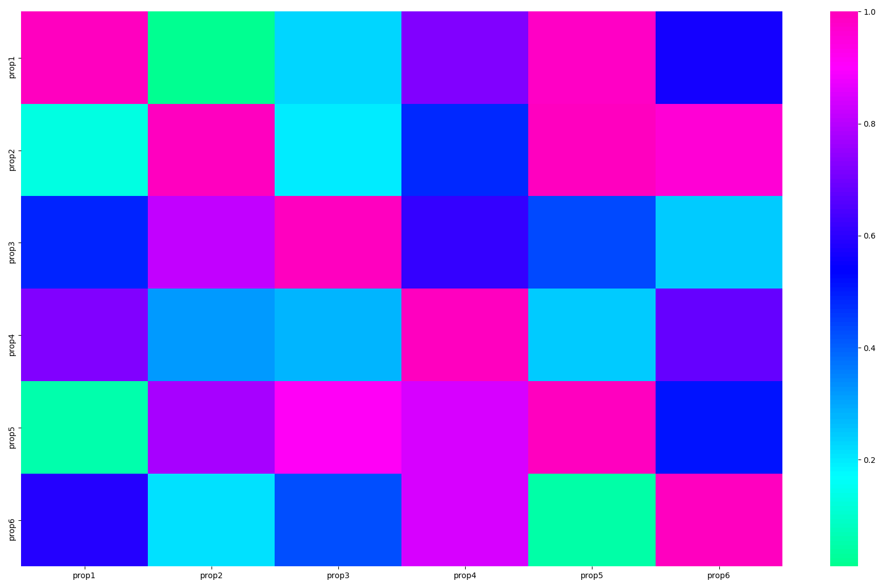

#### 6 matplotlib折线图

模块名称：example_utils.py，里面包括三个函数，各自功能如下：

```python
import matplotlib.pyplot as plt

# 创建画图fig和axes
def setup_axes():
    fig, axes = plt.subplots(ncols=3, figsize=(6.5,3))
    for ax in fig.axes:
        ax.set(xticks=[], yticks=[])
    fig.subplots_adjust(wspace=0, left=0, right=0.93)
    return fig, axes
# 图片标题
def title(fig, text, y=0.9):
    fig.suptitle(text, size=14, y=y, weight='semibold', x=0.98, ha='right',
                 bbox=dict(boxstyle='round', fc='floralwhite', ec='#8B7E66',
                           lw=2))
# 为数据添加文本注释
def label(ax, text, y=0):
    ax.annotate(text, xy=(0.5, 0.00), xycoords='axes fraction', ha='center',
                style='italic',
                bbox=dict(boxstyle='round', facecolor='floralwhite',
                          ec='#8B7E66'))
```


```python
import numpy as np
import matplotlib.pyplot as plt

import example_utils

x = np.linspace(0, 10, 100)

fig, axes = example_utils.setup_axes()
for ax in axes:
    ax.margins(y=0.10)

# 子图1 默认plot多条线，颜色系统分配
for i in range(1, 6):
    axes[0].plot(x, i * x)

# 子图2 展示线的不同linestyle
for i, ls in enumerate(['-', '--', ':', '-.']):
    axes[1].plot(x, np.cos(x) + i, linestyle=ls)

# 子图3 展示线的不同linestyle和marker
for i, (ls, mk) in enumerate(zip(['', '-', ':'], ['o', '^', 's'])):
    axes[2].plot(x, np.cos(x) + i * x, linestyle=ls, marker=mk, markevery=10)

# 设置标题
# example_utils.title(fig, '"ax.plot(x, y, ...)": Lines and/or markers', y=0.95)
# 保存图片
fig.savefig('plot_example.png', facecolor='none')
# 展示图片
plt.show()
```


#### 7 matplotlib散点图
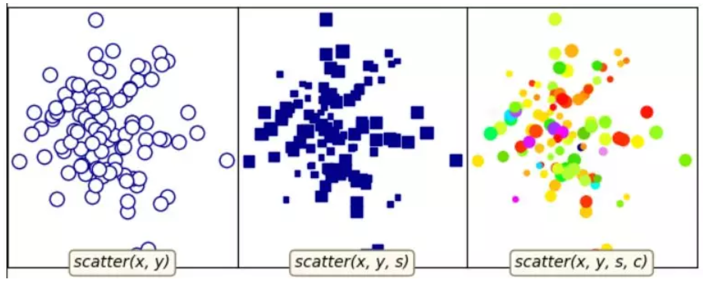

对应代码：

```python
"""
散点图的基本用法
"""
import numpy as np
import matplotlib.pyplot as plt

import example_utils

# 随机生成数据
np.random.seed(1874)
x, y, z = np.random.normal(0, 1, (3, 100))
t = np.arctan2(y, x)
size = 50 * np.cos(2 * t)**2 + 10

fig, axes = example_utils.setup_axes()

# 子图1
axes[0].scatter(x, y, marker='o',  color='darkblue', facecolor='white', s=80)
example_utils.label(axes[0], 'scatter(x, y)')

# 子图2
axes[1].scatter(x, y, marker='s', color='darkblue', s=size)
example_utils.label(axes[1], 'scatter(x, y, s)')

# 子图3
axes[2].scatter(x, y, s=size, c=z,  cmap='gist_ncar')
example_utils.label(axes[2], 'scatter(x, y, s, c)')

# example_utils.title(fig, '"ax.scatter(...)": Colored/scaled markers',
#                     y=0.95)
fig.savefig('scatter_example.png', facecolor='none')

plt.show()
```


#### 8 matplotlib柱状图


对应代码：

```python
import numpy as np
import matplotlib.pyplot as plt

import example_utils


def main():
    fig, axes = example_utils.setup_axes()

    basic_bar(axes[0])
    tornado(axes[1])
    general(axes[2])

    # example_utils.title(fig, '"ax.bar(...)": Plot rectangles')
    fig.savefig('bar_example.png', facecolor='none')
    plt.show()

# 子图1
def basic_bar(ax):
    y = [1, 3, 4, 5.5, 3, 2]
    err = [0.2, 1, 2.5, 1, 1, 0.5]
    x = np.arange(len(y))
    ax.bar(x, y, yerr=err, color='lightblue', ecolor='black')
    ax.margins(0.05)
    ax.set_ylim(bottom=0)
    example_utils.label(ax, 'bar(x, y, yerr=e)')

# 子图2
def tornado(ax):
    y = np.arange(8)
    x1 = y + np.random.random(8) + 1
    x2 = y + 3 * np.random.random(8) + 1
    ax.barh(y, x1, color='lightblue')
    ax.barh(y, -x2, color='salmon')
    ax.margins(0.15)
    example_utils.label(ax, 'barh(x, y)')

# 子图3
def general(ax):
    num = 10
    left = np.random.randint(0, 10, num)
    bottom = np.random.randint(0, 10, num)
    width = np.random.random(num) + 0.5
    height = np.random.random(num) + 0.5
    ax.bar(left, height, width, bottom, color='salmon')
    ax.margins(0.15)
    example_utils.label(ax, 'bar(l, h, w, b)')


main()
```

#### 9 matplotlib等高线图


对应代码：

```python
import matplotlib.pyplot as plt
import numpy as np
from matplotlib.cbook import get_sample_data

import example_utils

z = np.load(get_sample_data('bivariate_normal.npy'))

fig, axes = example_utils.setup_axes()

axes[0].contour(z, cmap='gist_earth')
example_utils.label(axes[0], 'contour')

axes[1].contourf(z, cmap='gist_earth')
example_utils.label(axes[1], 'contourf')

axes[2].contourf(z, cmap='gist_earth')
cont = axes[2].contour(z, colors='black')
axes[2].clabel(cont, fontsize=6)
example_utils.label(axes[2], 'contourf + contour\n + clabel')

# example_utils.title(fig, '"contour, contourf, clabel": Contour/label 2D data',
#                     y=0.96)
fig.savefig('contour_example.png', facecolor='none')

plt.show()
```

#### 10 imshow图


对应代码：

```python
import matplotlib.pyplot as plt
import numpy as np
from matplotlib.cbook import get_sample_data
from mpl_toolkits import axes_grid1

import example_utils


def main():
    fig, axes = setup_axes()
    plot(axes, *load_data())
    # example_utils.title(fig, '"ax.imshow(data, ...)": Colormapped or RGB arrays')
    fig.savefig('imshow_example.png', facecolor='none')
    plt.show()


def plot(axes, img_data, scalar_data, ny):

    # 默认线性插值
    axes[0].imshow(scalar_data, cmap='gist_earth', extent=[0, ny, ny, 0])

    # 最近邻插值
    axes[1].imshow(scalar_data, cmap='gist_earth', interpolation='nearest',
                   extent=[0, ny, ny, 0])

    # 展示RGB/RGBA数据
    axes[2].imshow(img_data)


def load_data():
    img_data = plt.imread(get_sample_data('5.png'))
    ny, nx, nbands = img_data.shape
    scalar_data = np.load(get_sample_data('bivariate_normal.npy'))
    return img_data, scalar_data, ny


def setup_axes():
    fig = plt.figure(figsize=(6, 3))
    axes = axes_grid1.ImageGrid(fig, [0, 0, .93, 1], (1, 3), axes_pad=0)

    for ax in axes:
        ax.set(xticks=[], yticks=[])
    return fig, axes


main()
```

#### 11 pyecharts绘制仪表盘

使用pip install pyecharts 安装，版本为 v1.6，pyecharts绘制仪表盘，只需要几行代码：

```python
from pyecharts import charts

# 仪表盘
gauge = charts.Gauge()
gauge.add('Python小例子', [('Python机器学习', 30), ('Python基础', 70.),
                        ('Python正则', 90)])
gauge.render(path="./data/仪表盘.html")
print('ok')
```

仪表盘中共展示三项，每项的比例为30%,70%,90%，如下图默认名称显示第一项：Python机器学习，完成比例为30%


#### 12 pyecharts漏斗图

```python
from pyecharts import options as opts
from pyecharts.charts import Funnel, Page
from random import randint

def funnel_base() -> Funnel:
  c = (
    Funnel()
    .add("豪车", [list(z) for z in zip(['宝马', '法拉利', '奔驰', '奥迪', '大众', '丰田', '特斯拉'],
                 [randint(1, 20) for _ in range(7)])])
    .set_global_opts(title_opts=opts.TitleOpts(title="豪车漏斗图"))
  )
  return c
funnel_base().render('./img/car_fnnel.html')
```

以7种车型及某个属性值绘制的漏斗图，属性值大越靠近漏斗的大端。


#### 13 pyecharts日历图

```python
import datetime
import random
from pyecharts import options as opts
from pyecharts.charts import Calendar

def calendar_interval_1() -> Calendar:
    begin = datetime.date(2019, 1, 1)
    end = datetime.date(2019, 12, 27)
    data = [
        [str(begin + datetime.timedelta(days=i)), random.randint(1000, 25000)]
        for i in range(0, (end - begin).days + 1, 2)  # 隔天统计
    ]
    calendar = (
      Calendar(init_opts=opts.InitOpts(width="1200px")).add(
            "", data, calendar_opts=opts.CalendarOpts(range_="2019"))
        .set_global_opts(
            title_opts=opts.TitleOpts(title="Calendar-2019年步数统计"),
            visualmap_opts=opts.VisualMapOpts(
                max_=25000,
                min_=1000,
                orient="horizontal",
                is_piecewise=True,
                pos_top="230px",
                pos_left="100px",
            ),
        )
    )
    return calendar

calendar_interval_1().render('./img/calendar.html')
```

绘制2019年1月1日到12月27日的步行数，官方给出的图形宽度`900px`不够，只能显示到9月份，本例使用`opts.InitOpts(width="1200px")`做出微调，并且`visualmap`显示所有步数，每隔一天显示一次：

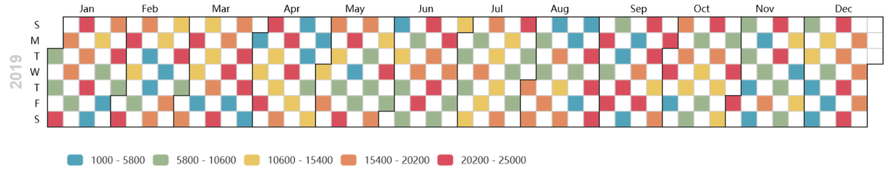

#### 14 pyecharts绘制graph图

```python
import json
import os
from pyecharts import options as opts
from pyecharts.charts import Graph, Page

def graph_base() -> Graph:
    nodes = [
        {"name": "cus1", "symbolSize": 10},
        {"name": "cus2", "symbolSize": 30},
        {"name": "cus3", "symbolSize": 20}
    ]
    links = []
    for i in nodes:
        if i.get('name') == 'cus1':
            continue
        for j in nodes:
            if j.get('name') == 'cus1':
                continue
            links.append({"source": i.get("name"), "target": j.get("name")})
    c = (
        Graph()
        .add("", nodes, links, repulsion=8000)
        .set_global_opts(title_opts=opts.TitleOpts(title="customer-influence"))
    )
    return c
```

构建图，其中客户点1与其他两个客户都没有关系(`link`)，也就是不存在有效边：


#### 15 pyecharts水球图

```python
from pyecharts import options as opts
from pyecharts.charts import Liquid, Page
from pyecharts.globals import SymbolType

def liquid() -> Liquid:
    c = (
        Liquid()
        .add("lq", [0.67, 0.30, 0.15])
        .set_global_opts(title_opts=opts.TitleOpts(title="Liquid"))
    )
    return c

liquid().render('./img/liquid.html')
```

水球图的取值`[0.67, 0.30, 0.15]`表示下图中的`三个波浪线`，一般代表三个百分比:


#### 16 pyecharts饼图

```python
from pyecharts import options as opts
from pyecharts.charts import Pie
from random import randint

def pie_base() -> Pie:
    c = (
        Pie()
        .add("", [list(z) for z in zip(['宝马', '法拉利', '奔驰', '奥迪', '大众', '丰田', '特斯拉'],
                                       [randint(1, 20) for _ in range(7)])])
        .set_global_opts(title_opts=opts.TitleOpts(title="Pie-基本示例"))
        .set_series_opts(label_opts=opts.LabelOpts(formatter="{b}: {c}"))
    )
    return c

pie_base().render('./img/pie_pyecharts.html')
```


#### 17 pyecharts极坐标图

```python
import random
from pyecharts import options as opts
from pyecharts.charts import Page, Polar

def polar_scatter0() -> Polar:
    data = [(alpha, random.randint(1, 100)) for alpha in range(101)] # r = random.randint(1, 100)
    print(data)
    c = (
        Polar()
        .add("", data, type_="bar", label_opts=opts.LabelOpts(is_show=False))
        .set_global_opts(title_opts=opts.TitleOpts(title="Polar"))
    )
    return c

polar_scatter0().render('./img/polar.html')
```

极坐标表示为`(夹角,半径)`，如(6,94)表示夹角为6，半径94的点：


#### 18 pyecharts词云图

```python
from pyecharts import options as opts
from pyecharts.charts import Page, WordCloud
from pyecharts.globals import SymbolType

words = [
    ("Python", 100),
    ("C++", 80),
    ("Java", 95),
    ("R", 50),
    ("JavaScript", 79),
    ("C", 65)
]

def wordcloud() -> WordCloud:
    c = (
        WordCloud()
        # word_size_range: 单词字体大小范围
        .add("", words, word_size_range=[20, 100], shape='cardioid')
        .set_global_opts(title_opts=opts.TitleOpts(title="WordCloud"))
    )
    return c

wordcloud().render('./img/wordcloud.html')
```

`("C",65)`表示在本次统计中C语言出现65次


#### 19 pyecharts系列柱状图

```python
from pyecharts import options as opts
from pyecharts.charts import Bar
from random import randint

def bar_series() -> Bar:
    c = (
        Bar()
        .add_xaxis(['宝马', '法拉利', '奔驰', '奥迪', '大众', '丰田', '特斯拉'])
        .add_yaxis("销量", [randint(1, 20) for _ in range(7)])
        .add_yaxis("产量", [randint(1, 20) for _ in range(7)])
        .set_global_opts(title_opts=opts.TitleOpts(title="Bar的主标题", subtitle="Bar的副标题"))
    )
    return c

bar_series().render('./img/bar_series.html')
```


#### 20 pyecharts热力图

```python
import random
from pyecharts import options as opts
from pyecharts.charts import HeatMap

def heatmap_car() -> HeatMap:
    x = ['宝马', '法拉利', '奔驰', '奥迪', '大众', '丰田', '特斯拉']
    y = ['中国','日本','南非','澳大利亚','阿根廷','阿尔及利亚','法国','意大利','加拿大']
    value = [[i, j, random.randint(0, 100)]
             for i in range(len(x)) for j in range(len(y))]
    c = (
        HeatMap()
        .add_xaxis(x)
        .add_yaxis("销量", y, value)
        .set_global_opts(
            title_opts=opts.TitleOpts(title="HeatMap"),
            visualmap_opts=opts.VisualMapOpts(),
        )
    )
    return c

heatmap_car().render('./img/heatmap_pyecharts.html')
```

热力图描述的实际是三维关系，x轴表示车型，y轴表示国家，每个色块的颜色值代表销量，颜色刻度尺显示在左下角，颜色越红表示销量越大。


#### 21 matplotlib绘制动画

`matplotlib`是python中最经典的绘图包，里面`animation`模块能绘制动画。

首先导入小例子使用的模块：
```python
from matplotlib import pyplot as plt
from matplotlib import animation
from random import randint, random
```

生成数据，`frames_count`是帧的个数，`data_count`每个帧的柱子个数

```python
class Data:
    data_count = 32
    frames_count = 2

    def __init__(self, value):
        self.value = value
        self.color = (0.5, random(), random()) #rgb

    # 造数据
    @classmethod
    def create(cls):
        return [[Data(randint(1, cls.data_count)) for _ in range(cls.data_count)]
                for frame_i in range(cls.frames_count)]
```

绘制动画：`animation.FuncAnimation`函数的回调函数的参数`fi`表示第几帧，注意要调用`axs.cla()`清除上一帧。

```python
def draw_chart():
    fig = plt.figure(1, figsize=(16, 9))
    axs = fig.add_subplot(111)
    axs.set_xticks([])
    axs.set_yticks([])

    # 生成数据
    frames = Data.create()

    def animate(fi):
        axs.cla()  # clear last frame
        axs.set_xticks([])
        axs.set_yticks([])
        return axs.bar(list(range(Data.data_count)),        # X
                       [d.value for d in frames[fi]],       # Y
                       1,                                   # width
                       color=[d.color for d in frames[fi]]  # color
                       )
    # 动画展示
    anim = animation.FuncAnimation(fig, animate, frames=len(frames))
    plt.show()


draw_chart()
```

#### 22 pyecharts绘图属性设置方法

昨天一位读者朋友问我`pyecharts`中，y轴如何显示在右侧。先说下如何设置，同时阐述例子君是如何找到找到此属性的。

这是pyecharts中一般的绘图步骤：
```python
from pyecharts.faker import Faker
from pyecharts import options as opts
from pyecharts.charts import Bar
from pyecharts.commons.utils import JsCode

def bar_base() -> Bar:
    c = (
        Bar()
        .add_xaxis(Faker.choose())
        .add_yaxis("商家A", Faker.values())
        .set_global_opts(title_opts=opts.TitleOpts(title="Bar-基本示例", subtitle="我是副标题"))
    )
    return c

bar_base().render('./bar.html')
```
那么，如何设置y轴显示在右侧，添加一行代码：
```python
.set_global_opts(yaxis_opts=opts.AxisOpts(position='right'))
```
也就是：
```python
c = (
        Bar()
        .add_xaxis(Faker.choose())
        .add_yaxis("商家A", Faker.values())
        .set_global_opts(title_opts=opts.TitleOpts(title="Bar-基本示例", subtitle="我是副标题"))
        .set_global_opts(yaxis_opts=opts.AxisOpts(position='right'))
    )
```

如何锁定这个属性，首先应该在set_global_opts函数的参数中找，它一共有以下`11`个设置参数，它们位于模块`charts.py`:
```python
title_opts: types.Title = opts.TitleOpts(),
legend_opts: types.Legend = opts.LegendOpts(),
tooltip_opts: types.Tooltip = None,
toolbox_opts: types.Toolbox = None,
brush_opts: types.Brush = None,
xaxis_opts: types.Axis = None,
yaxis_opts: types.Axis = None,
visualmap_opts: types.VisualMap = None,
datazoom_opts: types.DataZoom = None,
graphic_opts: types.Graphic = None,
axispointer_opts: types.AxisPointer = None,
```
因为是设置y轴显示在右侧，自然想到设置参数`yaxis_opts`，因为其类型为`types.Axis`，所以再进入`types.py`，同时定位到`Axis`：
```python
Axis = Union[opts.AxisOpts, dict, None]
```
Union是pyecharts中可容纳多个类型的并集列表，也就是Axis可能为`opts.AxisOpt`, `dict`, 或`None`三种类型。查看第一个`opts.AxisOpt`类，它共定义以下`25`个参数：
```python
type_: Optional[str] = None,
name: Optional[str] = None,
is_show: bool = True,
is_scale: bool = False,
is_inverse: bool = False,
name_location: str = "end",
name_gap: Numeric = 15,
name_rotate: Optional[Numeric] = None,
interval: Optional[Numeric] = None,
grid_index: Numeric = 0,
position: Optional[str] = None,
offset: Numeric = 0,
split_number: Numeric = 5,
boundary_gap: Union[str, bool, None] = None,
min_: Union[Numeric, str, None] = None,
max_: Union[Numeric, str, None] = None,
min_interval: Numeric = 0,
max_interval: Optional[Numeric] = None,
axisline_opts: Union[AxisLineOpts, dict, None] = None,
axistick_opts: Union[AxisTickOpts, dict, None] = None,
axislabel_opts: Union[LabelOpts, dict, None] = None,
axispointer_opts: Union[AxisPointerOpts, dict, None] = None,
name_textstyle_opts: Union[TextStyleOpts, dict, None] = None,
splitarea_opts: Union[SplitAreaOpts, dict, None] = None,
splitline_opts: Union[SplitLineOpts, dict] = SplitLineOpts(),
```
观察后尝试参数`position`，结合官档：`https://pyecharts.org/#/zh-cn/global_options?id=axisopts%ef%bc%9a%e5%9d%90%e6%a0%87%e8%bd%b4%e9%85%8d%e7%bd%ae%e9%a1%b9`，介绍x轴设置position时有bottom, top, 所以y轴设置很可能就是left,right.

OK！

#### 23 pyecharts绘图属性设置方法(下)

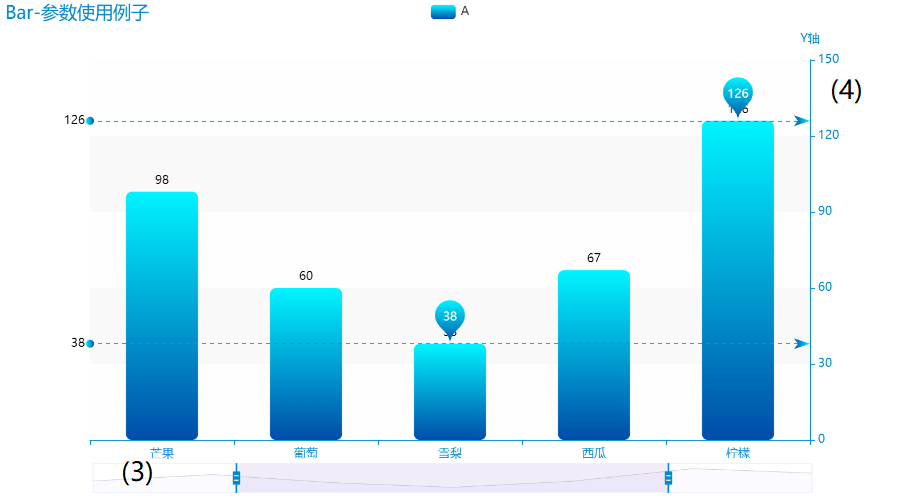

**分步讲解如何配置为上图**

1)柱状图显示效果动画对应控制代码：

```python
animation_opts=opts.AnimationOpts(
                    animation_delay=500, animation_easing="cubicOut"
                )
```
2)柱状图显示主题对应控制代码：
```python
theme=ThemeType.MACARONS
```
3)添加x轴对应的控制代码：
```python
add_xaxis( ["草莓", "芒果", "葡萄", "雪梨", "西瓜", "柠檬", "车厘子"]
```
4)添加y轴对应的控制代码：
```python
add_yaxis("A", Faker.values(),
```
5)修改柱间距对应的控制代码：
```python
category_gap="50%"
```

6)A系列柱子是否显示对应的控制代码：
```python
is_selected=True
```

7)A系列柱子颜色渐变对应的控制代码：
```python
itemstyle_opts={
            "normal": {
                "color": JsCode("""new echarts.graphic.LinearGradient(0, 0, 0, 1, [{
                    offset: 0,
                    color: 'rgba(0, 244, 255, 1)'
                }, {
                    offset: 1,
                    color: 'rgba(0, 77, 167, 1)'
                }], false)"""),
                "barBorderRadius": [6, 6, 6, 6],
                "shadowColor": 'rgb(0, 160, 221)',
            }}
```
8)A系列柱子最大和最小值`标记点`对应的控制代码：
```python
markpoint_opts=opts.MarkPointOpts(
                data=[
                    opts.MarkPointItem(type_="max", name="最大值"),
                    opts.MarkPointItem(type_="min", name="最小值"),
                ]
            )
```
9)A系列柱子最大和最小值`标记线`对应的控制代码：
```python
markline_opts=opts.MarkLineOpts(
                data=[
                    opts.MarkLineItem(type_="min", name="最小值"),
                    opts.MarkLineItem(type_="max", name="最大值")
                ]
            )
```
10)柱状图标题对应的控制代码：
```python
title_opts=opts.TitleOpts(title="Bar-参数使用例子"
```
11)柱状图非常有用的toolbox显示对应的控制代码：
```python
toolbox_opts=opts.ToolboxOpts()
```

12)Y轴显示在右侧对应的控制代码：
```python
yaxis_opts=opts.AxisOpts(position="right")
```
13)Y轴名称对应的控制代码：
```python
yaxis_opts=opts.AxisOpts(,name="Y轴")
```
14)数据轴区域放大缩小设置对应的控制代码：
```python
datazoom_opts=opts.DataZoomOpts()
```

**完整代码**

```python
def bar_border_radius():
    c = (
        Bar(init_opts=opts.InitOpts(
                animation_opts=opts.AnimationOpts(
                    animation_delay=500, animation_easing="cubicOut"
                ),
                theme=ThemeType.MACARONS))
        .add_xaxis( ["草莓", "芒果", "葡萄", "雪梨", "西瓜", "柠檬", "车厘子"])
        .add_yaxis("A", Faker.values(),category_gap="50%",markpoint_opts=opts.MarkPointOpts(),is_selected=True)
        .set_series_opts(itemstyle_opts={
            "normal": {
                "color": JsCode("""new echarts.graphic.LinearGradient(0, 0, 0, 1, [{
                    offset: 0,
                    color: 'rgba(0, 244, 255, 1)'
                }, {
                    offset: 1,
                    color: 'rgba(0, 77, 167, 1)'
                }], false)"""),
                "barBorderRadius": [6, 6, 6, 6],
                "shadowColor": 'rgb(0, 160, 221)',
            }}, markpoint_opts=opts.MarkPointOpts(
                data=[
                    opts.MarkPointItem(type_="max", name="最大值"),
                    opts.MarkPointItem(type_="min", name="最小值"),
                ]
            ),markline_opts=opts.MarkLineOpts(
                data=[
                    opts.MarkLineItem(type_="min", name="最小值"),
                    opts.MarkLineItem(type_="max", name="最大值")
                ]
            ))
        .set_global_opts(title_opts=opts.TitleOpts(title="Bar-参数使用例子"), toolbox_opts=opts.ToolboxOpts(),yaxis_opts=opts.AxisOpts(position="right",name="Y轴"),datazoom_opts=opts.DataZoomOpts(),)
        
    )

    return c

bar_border_radius().render()
```

#### 24 pyecharts原来可以这样快速入门(上)

最近两天，翻看下`pyecharts`的源码，感叹这个框架写的真棒，思路清晰，设计简洁，通俗易懂，推荐读者们有空也阅读下。

bee君是被pyecharts官档介绍-五个特性所吸引：

1)简洁的 API 设计，使用如丝滑般流畅，支持链式调用;

2)囊括了 30+ 种常见图表，应有尽有;

3)支持主流 Notebook 环境，Jupyter Notebook 和 JupyterLab;

4)可轻松集成至 Flask，Django 等主流 Web 框架;

5)高度灵活的配置项，可轻松搭配出精美的图表

pyecharts 确实也如上面五个特性介绍那样，使用起来非常方便。那么，有些读者不禁好奇会问，pyecharts 是如何做到的？

我们不妨从pyecharts官档`5分钟入门pyecharts`章节开始，由表(最高层函数)及里(底层函数也就是所谓的`源码`)，一探究竟。


**官方第一个例子**

不妨从官档给出的第一个例子说起，

```python
from pyecharts.charts import Bar

bar = Bar()
bar.add_xaxis(["衬衫", "羊毛衫", "雪纺衫", "裤子", "高跟鞋", "袜子"])
bar.add_yaxis("商家A", [5, 20, 36, 10, 75, 90])
# render 会生成本地 HTML 文件，默认会在当前目录生成 render.html 文件
# 也可以传入路径参数，如 bar.render("mycharts.html")
bar.render()
```

第一行代码：`from pyecharts.charts import Bar`，先上一张源码中`包的结构图`：

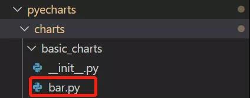

`bar.py`模块中定义了类`Bar(RectChart)`，如下所示：

```python
class Bar(RectChart):
    """
    <<< Bar Chart >>>

    Bar chart presents categorical data with rectangular bars
    with heights or lengths proportional to the values that they represent.
    """
```


这里有读者可能会有以下两个问题：

1)为什么根据图1中的包结构，为什么不这么写：`from pyecharts.charts.basic_charts import Bar`

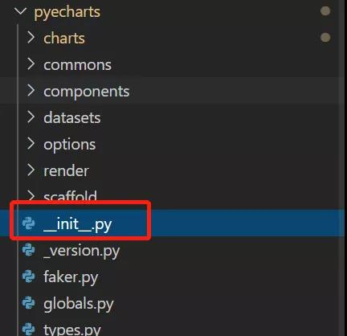


答：请看图2中`__init__.py`模块，文件内容如下，看到导入`charts`包，而非`charts.basic_charts`

```python
from pyecharts import charts, commons, components, datasets, options, render, scaffold
from pyecharts._version import __author__, __version__
```

2)`Bar(RectChart)`是什么意思

答：RectChart是Bar的子类

下面4行代码，很好理解，没有特殊性。

pyecharts主要两个大版本,0.5基版本和1.0基版本，从1.0基版本开始全面支持`链式调用`，bee君也很喜爱这种链式调用模式，代码看起来更加紧凑：

```python
from pyecharts.charts import Bar

bar = (
    Bar()
    .add_xaxis(["衬衫", "羊毛衫", "雪纺衫", "裤子", "高跟鞋", "袜子"])
    .add_yaxis("商家A", [5, 20, 36, 10, 75, 90])
)
bar.render()
```

实现`链式调用`也没有多难，保证返回类本身`self`即可，如果非要有其他返回对象，那么要提到类内以便被全局共享，

add_xaxis函数返回`self`

```python
    def add_xaxis(self, xaxis_data: Sequence):
        self.options["xAxis"][0].update(data=xaxis_data)
        self._xaxis_data = xaxis_data
        return self
```

add_yaxis函数同样返回`self`.

#### 25 pyecharts原来可以这样快速入门(中)

**一切皆options**


pyecharts用起来很爽的另一个重要原因，`参数配置项`封装的非常nice，通过定义一些列基础的配置组件，比如`global_options.py`模块中定义的配置对象有以下`27`个

```python
    AngleAxisItem,
    AngleAxisOpts,
    AnimationOpts,
    Axis3DOpts,
    AxisLineOpts,
    AxisOpts,
    AxisPointerOpts,
    AxisTickOpts,
    BrushOpts,
    CalendarOpts,
    DataZoomOpts,
    Grid3DOpts,
    GridOpts,
    InitOpts,
    LegendOpts,
    ParallelAxisOpts,
    ParallelOpts,
    PolarOpts,
    RadarIndicatorItem,
    RadiusAxisItem,
    RadiusAxisOpts,
    SingleAxisOpts,
    TitleOpts,
    ToolBoxFeatureOpts,
    ToolboxOpts,
    TooltipOpts,
    VisualMapOpts,
```

#### 26 pyecharts原来可以这样快速入门(下)

**第二个例子**

了解上面的配置对象后，再看官档给出的第二个例子，与第一个例子相比，增加了一行代码：`set_global_opts`函数

```python
from pyecharts.charts import Bar
from pyecharts import options as opts

# V1 版本开始支持链式调用
# 你所看到的格式其实是 `black` 格式化以后的效果
# 可以执行 `pip install black` 下载使用
bar = (
    Bar()
    .add_xaxis(["衬衫", "羊毛衫", "雪纺衫", "裤子", "高跟鞋", "袜子"])
    .add_yaxis("商家A", [5, 20, 36, 10, 75, 90])
    .set_global_opts(title_opts=opts.TitleOpts(title="主标题", subtitle="副标题"))
    
bar.render()
```

`set_global_opts`函数在pyecharts中被高频使用，它定义在底层基础模块`Chart.py`中，它是前面说到的`RectChart`的子类，`Bar`类的孙子类。

浏览下函数的参数：

```python
def set_global_opts(
        self,
        title_opts: types.Title = opts.TitleOpts(),
        legend_opts: types.Legend = opts.LegendOpts(),
        tooltip_opts: types.Tooltip = None,
        toolbox_opts: types.Toolbox = None,
        brush_opts: types.Brush = None,
        xaxis_opts: types.Axis = None,
        yaxis_opts: types.Axis = None,
        visualmap_opts: types.VisualMap = None,
        datazoom_opts: types.DataZoom = None,
        graphic_opts: types.Graphic = None,
        axispointer_opts: types.AxisPointer = None,
    ):
```

以第二个参数`title_opts`为例，说明`pyecharts`中参数赋值的风格。

首先，`title_opts`是`默认参数`，默认值为`opts.TitleOpts()`，这个对象在上一节中，我们提到过，是`global_options.py`模块中定义的`27`个配置对象种的一个。

其次，pyecharts中为了增强代码可读性，参数的类型都显示的给出。此处它的类型为：`types.Title`. 这是什么类型？它的类型不是`TitleOpts`吗？不急，看看Title这个类型的定义：

```python
Title = Union[opts.TitleOpts, dict]
```

原来`Title`可能是`opts.TitleOpts`, 也可能是python原生的`dict`. 通过`Union`实现的就是这种`类型效果`。所以这就解释了官档中为什么说也可以使用字典配置参数的问题，如下官档：

```python
  # 或者直接使用字典参数
    # .set_global_opts(title_opts={"text": "主标题", "subtext": "副标题"})
)
```

最后，真正的关于图表的标题相关的属性都被封装到TitleOpts类中，比如`title`,`subtitle`属性，查看源码，TitleOpts对象还有更多属性：

```python
class TitleOpts(BasicOpts):
    def __init__(
        self,
        title: Optional[str] = None,
        title_link: Optional[str] = None,
        title_target: Optional[str] = None,
        subtitle: Optional[str] = None,
        subtitle_link: Optional[str] = None,
        subtitle_target: Optional[str] = None,
        pos_left: Optional[str] = None,
        pos_right: Optional[str] = None,
        pos_top: Optional[str] = None,
        pos_bottom: Optional[str] = None,
        padding: Union[Sequence, Numeric] = 5,
        item_gap: Numeric = 10,
        title_textstyle_opts: Union[TextStyleOpts, dict, None] = None,
        subtitle_textstyle_opts: Union[TextStyleOpts, dict, None] = None,
    ):
```

OK. 到此跟随5分钟入门的官档，结合两个例子实现的背后源码，探讨了：

1)与包结构组织相关的`__init__.py`；

2)类的继承关系:Bar->RectChart->Chart；

3)链式调用；

4)重要的参数配置包`options`，以TitleOpts类为例，`set_global_opts`将它装载到Bar类中实现属性自定义。

#### 27 1 分钟学会画 pairplot 图

seaborn 绘图库，基于 matplotlib 开发，提供更高层绘图接口。

学习使用 seaborn 绘制 `pairplot` 图

`pairplot` 图能直观的反映出两两特征间的关系，帮助我们对数据集建立初步印象，更好的完成分类和聚类任务。

使用 skearn 导入经典的 Iris 数据集，共有 150 条记录，4 个特征，target 有三种不同值。如下所示：

```markdown
     sepal_length  sepal_width  petal_length  petal_width    species
0             5.1          3.5           1.4          0.2     setosa
1             4.9          3.0           1.4          0.2     setosa
2             4.7          3.2           1.3          0.2     setosa
3             4.6          3.1           1.5          0.2     setosa
4             5.0          3.6           1.4          0.2     setosa
..            ...          ...           ...          ...        ...
145           6.7          3.0           5.2          2.3  virginica
146           6.3          2.5           5.0          1.9  virginica
147           6.5          3.0           5.2          2.0  virginica
148           6.2          3.4           5.4          2.3  virginica
149           5.9          3.0           5.1          1.8  virginica
```

使用 seaborn 绘制 `sepal_length`, `petal_length` 两个特征间的关系矩阵：

```python
from sklearn.datasets import load_iris
import matplotlib.pyplot as plt
import seaborn as sns
from sklearn import tree

sns.set(style="ticks")

df02 = df.iloc[:,[0,2,4]] # 选择一对特征
sns.pairplot(df02)
plt.show()
```

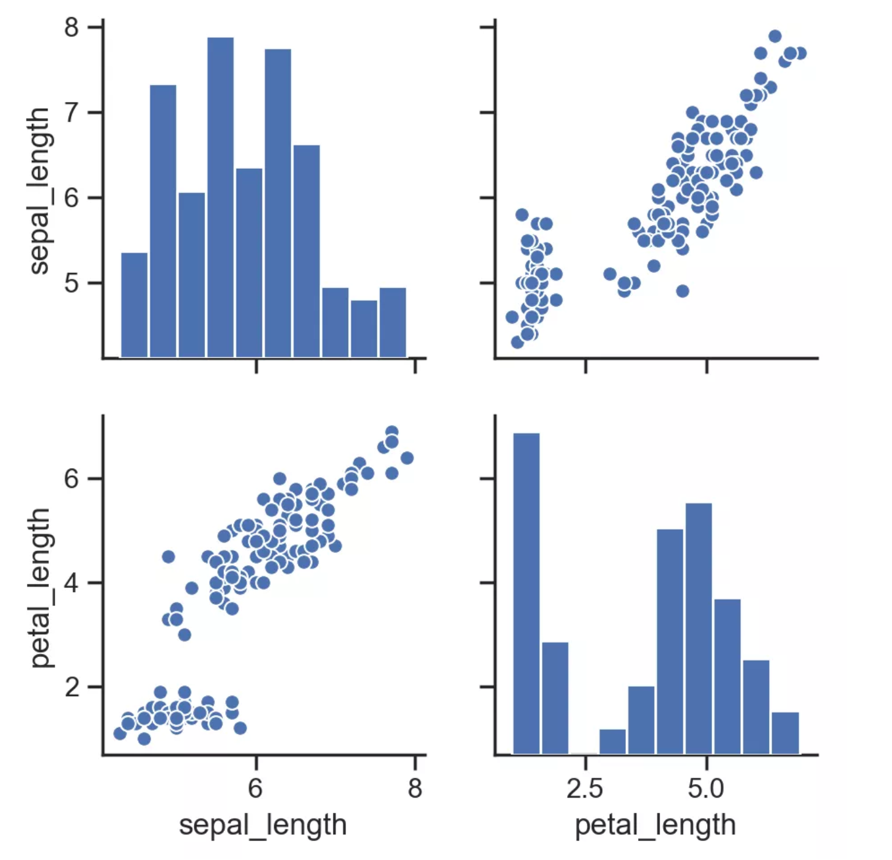

设置颜色多显：

```
sns.pairplot(df02, hue="species")
plt.show()
```

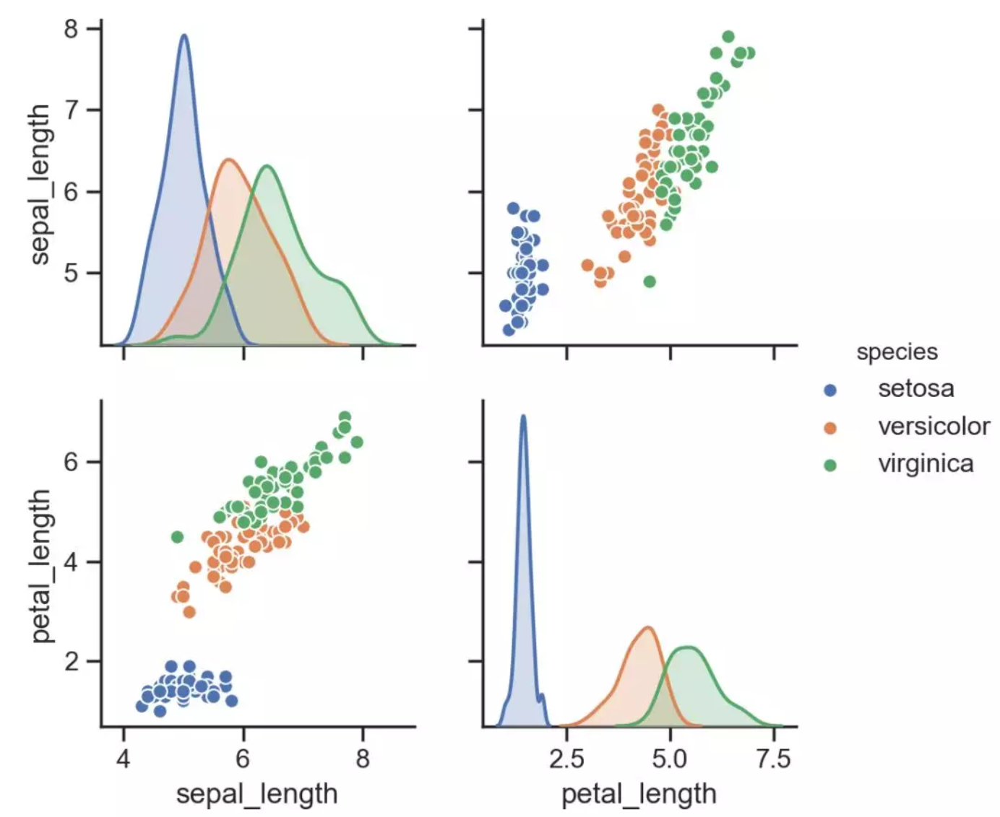

绘制所有特征散点矩阵：

```
sns.pairplot(df, hue="species")
plt.show()
```

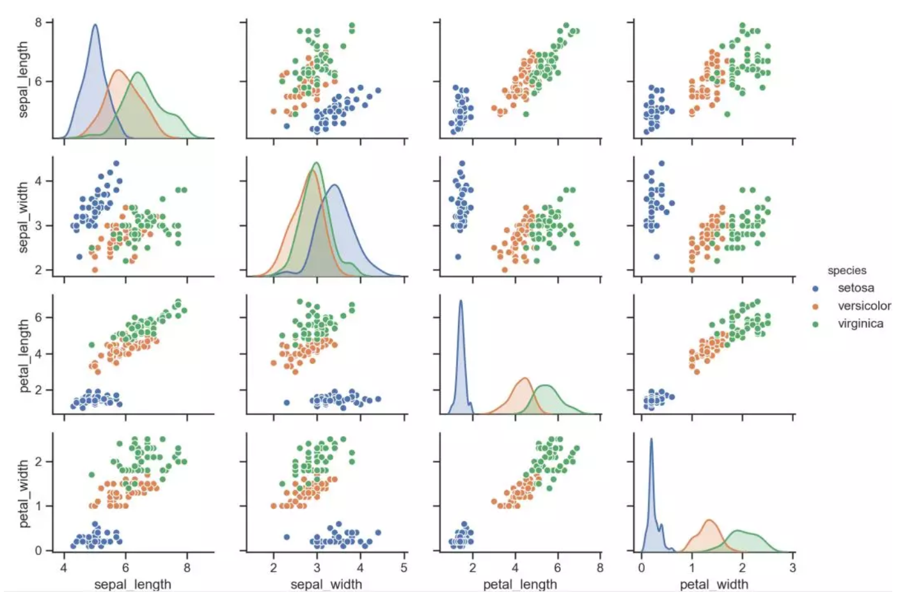

### 六、 Python之坑

#### 1 含单个元素的元组

Python中有些函数的参数类型为元组，其内有1个元素，这样创建是错误的：

```python
c = (5) # NO!
```

它实际创建一个整型元素5，必须要在元素后加一个`逗号`:

```python
c = (5,) # YES!
```

#### 2 默认参数设为空

含有默认参数的函数，如果类型为容器，且设置为空：

```python
def f(a,b=[]):  # NO!
    print(b)
    return b

ret = f(1)
ret.append(1)
ret.append(2)
# 当再调用f(1)时，预计打印为 []
f(1)
# 但是却为 [1,2]
```

这是可变类型的默认参数之坑，请务必设置此类默认参数为None：

```python
def f(a,b=None): # YES!
    pass
```

#### 3 共享变量未绑定之坑

有时想要多个函数共享一个全局变量，但却在某个函数内试图修改它为局部变量：

```python
i = 1
def f():
    i+=1 #NO!
    
def g():
    print(i)
```

应该在f函数内显示声明`i`为global变量：

```python
i = 1
def f():
    global i # YES!
    i+=1
```

#### 4 lambda自由参数之坑

排序和分组的key函数常使用lambda，表达更加简洁，但是有个坑新手容易掉进去：

```python
a = [lambda x: x+i for i in range(3)] # NO!
for f in a:
    print(f(1))
# 你可能期望输出：1,2,3
```

但是实际却输出: 3,3,3. 定义lambda使用的`i`被称为自由参数，它只在调用lambda函数时，值才被真正确定下来，这就犹如下面打印出2，你肯定确信无疑吧。

```python
a = 0
a = 1
a = 2
def f(a):
    print(a)
```

正确做法是转化`自由参数`为lambda函数的`默认参数`：

```python
a = [lambda x,i=i: x+i for i in range(3)] # YES!
```

#### 5 各种参数使用之坑

Python强大多变，原因之一在于函数参数类型的多样化。方便的同时，也为使用者带来更多的约束规则。如果不了解这些规则，调用函数时，可能会出现如下一些语法异常：

*(1) SyntaxError: positional argument follows keyword argument*


*(2) TypeError: f() missing 1 required keyword-only argument: 'b'*


*(3) SyntaxError: keyword argument repeated*

*(4) TypeError: f() missing 1 required positional argument: 'b'*

*(5) TypeError: f() got an unexpected keyword argument 'a'*

*(6) TypeError: f() takes 0 positional arguments but 1 was given*


总结主要的参数使用规则

位置参数

`位置参数`的定义：`函数调用`时根据函数定义的参数位（形参）置来传递参数，是最常见的参数类型。

```python
def f(a):
  return a

f(1) # 位置参数 
```
位置参数不能缺少：
```python
def f(a,b):
  pass

f(1) # TypeError: f() missing 1 required positional argument: 'b'
```

**规则1：位置参数必须一一对应，缺一不可**

关键字参数

在函数调用时，通过‘键--值’方式为函数形参传值，不用按照位置为函数形参传值。

```python
def f(a):
  print(f'a:{a}')
```
这么调用，`a`就是关键字参数：
```python
f(a=1)
```
但是下面调用就不OK:
```python
f(a=1,20.) # SyntaxError: positional argument follows keyword argument
```

**规则2：关键字参数必须在位置参数右边**


下面调用也不OK:
```python
f(1,width=20.,width=30.) #SyntaxError: keyword argument repeated

```

**规则3：对同一个形参不能重复传值**


默认参数

在定义函数时，可以为形参提供默认值。对于有默认值的形参，调用函数时如果为该参数传值，则使用传入的值，否则使用默认值。如下`b`是默认参数：
```python
def f(a,b=1):
  print(f'a:{a}, b:{b}')

```


**规则4：无论是函数的定义还是调用，默认参数的定义应该在位置形参右面**

只在定义时赋值一次；默认参数通常应该定义成不可变类型


可变位置参数

如下定义的参数a为可变位置参数：
```python
def f(*a):
  print(a)
```
调用方法：
```python
f(1) #打印结果为元组： (1,)
f(1,2,3) #打印结果：(1, 2, 3)
```

但是，不能这么调用：
```python
f(a=1) # TypeError: f() got an unexpected keyword argument 'a'
```


可变关键字参数

如下`a`是可变关键字参数：
```python
def f(**a):
  print(a)
```
调用方法：
```python
f(a=1) #打印结果为字典：{'a': 1}
f(a=1,b=2,width=3) #打印结果：{'a': 1, 'b': 2, 'width': 3}
```

但是，不能这么调用：
```python
f(1) TypeError: f() takes 0 positional arguments but 1 was given
```

接下来，单独推送分析一个小例子，综合以上各种参数类型的函数及调用方法，敬请关注。

#### 6 列表删除之坑

删除一个列表中的元素，此元素可能在列表中重复多次：

```python
def del_item(lst,e):
    return [lst.remove(i) for i in e if i==e] # NO!
```

考虑删除这个序列[1,3,3,3,5]中的元素3，结果发现只删除其中两个：

```python
del_item([1,3,3,3,5],3) # 结果：[1,3,5]
```

正确做法：

```python
def del_item(lst,e):
    d = dict(zip(range(len(lst)),lst)) # YES! 构造字典
    return [v for k,v in d.items() if v!=e]

```

#### 7 列表快速复制之坑

在python中`*`与列表操作，实现快速元素复制：

```python
a = [1,3,5] * 3 # [1,3,5,1,3,5,1,3,5]
a[0] = 10 # [10, 2, 3, 1, 2, 3, 1, 2, 3]
```

如果列表元素为列表或字典等复合类型：

```python
a = [[1,3,5],[2,4]] * 3 # [[1, 3, 5], [2, 4], [1, 3, 5], [2, 4], [1, 3, 5], [2, 4]]

a[0][0] = 10 #  
```

结果可能出乎你的意料，其他`a[1[0]`等也被修改为10

```python
[[10, 3, 5], [2, 4], [10, 3, 5], [2, 4], [10, 3, 5], [2, 4]]
```

这是因为*复制的复合对象都是浅引用，也就是说id(a[0])与id(a[2])门牌号是相等的。如果想要实现深复制效果，这么做：

```python
a = [[] for _ in range(3)]
```

#### 8 字符串驻留
```python
In [1]: a = 'something'
    ...: b = 'some'+'thing'
    ...: id(a)==id(b)
Out[1]: True
```
如果上面例子返回`True`，但是下面例子为什么是`False`:
```python
In [1]: a = '@zglg.com'

In [2]: b = '@zglg'+'.com'

In [3]: id(a)==id(b)
Out[3]: False
```
这与Cpython 编译优化相关，行为称为`字符串驻留`，但驻留的字符串中只包含字母，数字或下划线。

#### 9 相同值的不可变对象
```python
In [5]: d = {}
    ...: d[1] = 'java'
    ...: d[1.0] = 'python'

In [6]: d
Out[6]: {1: 'python'}

### key=1,value=java的键值对神奇消失了
In [7]: d[1]
Out[7]: 'python'
In [8]: d[1.0]
Out[8]: 'python'
```
这是因为具有相同值的不可变对象在Python中始终具有`相同的哈希值`

由于存在`哈希冲突`，不同值的对象也可能具有相同的哈希值。

#### 10 对象销毁顺序
创建一个类`SE`:
```python
class SE(object):
  def __init__(self):
    print('init')
  def __del__(self):
    print('del')
```
创建两个SE实例，使用`is`判断：
```python
In [63]: SE() is SE()
init
init
del
del
Out[63]: False

```
创建两个SE实例，使用`id`判断：
```python
In [64]: id(SE()) == id(SE())
init
del
init
del
Out[64]: True
```

调用`id`函数, Python 创建一个 SE 类的实例，并使用`id`函数获得内存地址后，销毁内存丢弃这个对象。

当连续两次进行此操作, Python会将相同的内存地址分配给第二个对象，所以两个对象的id值是相同的.


但是is行为却与之不同，通过打印顺序就可以看到。

#### 11 充分认识for
```python
In [65]: for i in range(5):
    ...:   print(i)
    ...:   i = 10
0
1
2
3
4
```
为什么不是执行一次就退出？

按照for在Python中的工作方式, i = 10 并不会影响循环。range(5)生成的下一个元素就被解包，并赋值给目标列表的变量`i`.

#### 12 认识执行时机

```python
array = [1, 3, 5]
g = (x for x in array if array.count(x) > 0)
```
`g`为生成器，list(g)后返回`[1,3,5]`，因为每个元素肯定至少都出现一次。所以这个结果这不足为奇。但是，请看下例：
```python
array = [1, 3, 5]
g = (x for x in array if array.count(x) > 0)
array = [5, 7, 9]
```
请问,list(g)等于多少？这不是和上面那个例子结果一样吗，结果也是`[1,3,5]`，但是：
```python
In [74]: list(g)
Out[74]: [5]
```

这有些不可思议~~ 原因在于：

生成器表达式中, in 子句在声明时执行, 而条件子句则是在运行时执行。


所以代码：
```python
array = [1, 3, 5]
g = (x for x in array if array.count(x) > 0)
array = [5, 7, 9]
```

等价于：
```python
g = (x for x in [1,3,5] if [5,7,9].count(x) > 0)
```


#### 13 创建空集合错误

这是Python的一个集合：`{1,3,5}`，它里面没有重复元素，在去重等场景有重要应用。下面这样创建空集合是错误的：

```python
empty = {} #NO!
```

cpython会解释它为字典

使用内置函数`set()`创建空集合：

```python
empty = set() #YES!
```


#### 14 pyecharts传入Numpy数据绘图失败

echarts使用广泛，echarts+python结合后的包：pyecharts，同样可很好用，但是传入Numpy的数据，像下面这样绘图会失败：

```python
from pyecharts.charts import Bar
import pyecharts.options as opts
import numpy as np
c = (
    Bar()
    .add_xaxis([1, 2, 3, 4, 5])
    # 传入Numpy数据绘图失败！
    .add_yaxis("商家A", np.array([0.1, 0.2, 0.3, 0.4, 0.5]))
)

c.render()
```

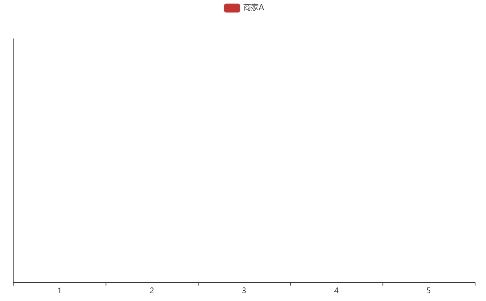

由此可见pyecharts对Numpy数据绘图不支持，传入原生Python的list:

```python
from pyecharts.charts import Bar
import pyecharts.options as opts
import numpy as np
c = (
    Bar()
    .add_xaxis([1, 2, 3, 4, 5])
    # 传入Python原生list
    .add_yaxis("商家A", np.array([0.1, 0.2, 0.3, 0.4, 0.5]).tolist())
)

c.render()
```

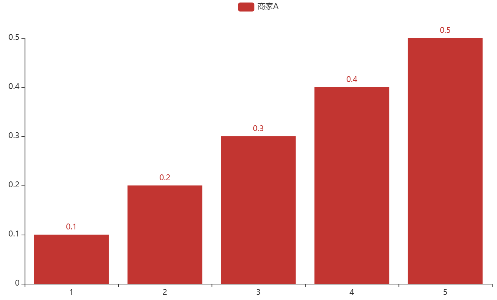


### 七、 Python第三方包

#### 1 优化代码异常输出包

一行代码优化输出的异常信息
```python
pip install pretty-errors
```

写一个函数测试：

```python
def divided_zero():
    for i in range(10, -1, -1):
        print(10/i)


divided_zero()
```

在没有import这个`pretty-errors`前，输出的错误信息有些冗余：

```python
Traceback (most recent call last):
  File "c:\Users\HUAWEI\.vscode\extensions\ms-python.python-2019.11.50794\pythonFiles\ptvsd_launcher.py", line 43, in <module>
    main(ptvsdArgs)
  File "c:\Users\HUAWEI\.vscode\extensions\ms-python.python-2019.11.50794\pythonFiles\lib\python\old_ptvsd\ptvsd\__main__.py",
line 432, in main
    run()
  File "c:\Users\HUAWEI\.vscode\extensions\ms-python.python-2019.11.50794\pythonFiles\lib\python\old_ptvsd\ptvsd\__main__.py",
line 316, in run_file
    runpy.run_path(target, run_name='__main__')
  File "D:\anaconda3\lib\runpy.py", line 263, in run_path
    pkg_name=pkg_name, script_name=fname)
  File "D:\anaconda3\lib\runpy.py", line 96, in _run_module_code
    mod_name, mod_spec, pkg_name, script_name)
  File "D:\anaconda3\lib\runpy.py", line 85, in _run_code
    exec(code, run_globals)
  File "d:\source\sorting-visualizer-master\sorting\debug_test.py", line 6, in <module>
    divided_zero()
  File "d:\source\sorting-visualizer-master\sorting\debug_test.py", line 3, in divided_zero
    print(10/i)
ZeroDivisionError: division by zero
```

我们使用刚安装的`pretty_errors`，`import`下:

```python
import pretty_errors

def divided_zero():
    for i in range(10, -1, -1):
        print(10/i)

divided_zero()
```

此时看看输出的错误信息，非常精简只有2行，去那些冗余信息：

```python
ZeroDivisionError:
division by zero
```

完整的输出信息如下图片所示：


#### 2 图像处理包pillow

两行代码实现旋转和缩放图像

首先安装pillow:

```python
pip install pillow
```

旋转图像下面图像45度：

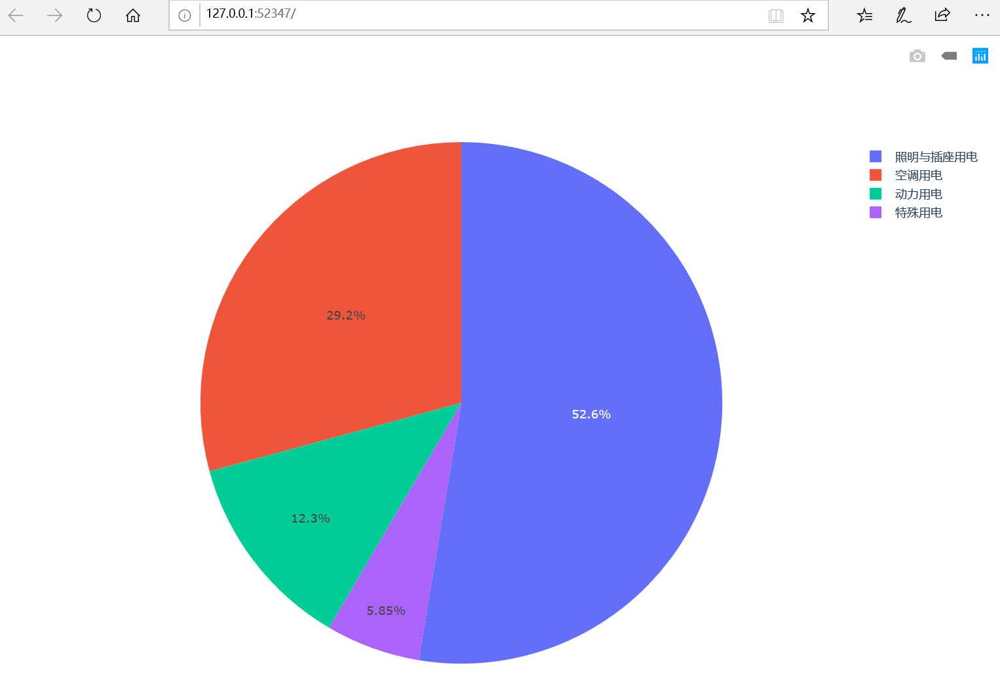

```python
In [1]: from PIL import Image
In [2]: im = Image.open('./img/plotly2.png')
In [4]: im.rotate(45).show()
```

旋转45度后的效果图


等比例缩放图像：

```python
im.thumbnail((128,72),Image.ANTIALIAS)
```

缩放后的效果图：


过滤图像后的效果图：

```python
from PIL import ImageFilter
im.filter(ImageFilter.CONTOUR).show()
```

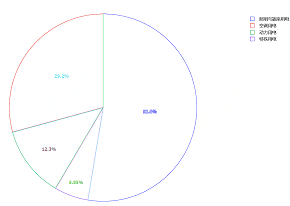

#### 3 一行代码找到编码

兴高采烈地，从网页上抓取一段 `content`

但是，一 `print ` 就不那么兴高采烈了，结果看到一串这个：

```markdown
b'\xc8\xcb\xc9\xfa\xbf\xe0\xb6\xcc\xa3\xac\xce\xd2\xd3\xc3Python'
```

这是啥？ 又 x 又 c 的！

再一看，哦，原来是十六进制字节串 (`bytes`)，`\x` 表示十六进制

接下来，你一定想转化为人类能看懂的语言，想到 `decode`：

```python
In [3]: b'\xc8\xcb\xc9\xfa\xbf\xe0\xb6\xcc\xa3\xac\xce\xd2\xd3\xc3Python'.decode()
---------------------------------------------------------------------------
UnicodeDecodeError                        Traceback (most recent call last)
<ipython-input-3-7d0ea6148880> in <module>
----> 1 b'\xc8\xcb\xc9\xfa\xbf\xe0\xb6\xcc\xa3\xac\xce\xd2\xd3\xc3Python'.decode()

UnicodeDecodeError: 'utf-8' codec can't decode byte 0xc8 in position 0: invalid continuation byte
```

马上，一盆冷水泼头上，抛异常了。。。。。

根据提示，`UnicodeDecodeError`，这是 unicode 解码错误。

原来，`decode` 默认的编码方法：`utf-8` 

所以排除  b'\xc8\xcb\xc9\xfa\xbf\xe0\xb6\xcc\xa3\xac\xce\xd2\xd3\xc3Python' 使用 `utf-8` 的编码方式

可是，这不是四选一选择题啊，逐个排除不正确的！

编码方式几十种，不可能逐个排除吧。

那就猜吧！！！！！！！！！！！！！

**人生苦短，我用Python**

**Python， 怎忍心让你受累呢~**

尽量三行代码解决问题

**第一步，安装 chardet**  它是 char detect 的缩写。

**第二步，pip install chardet**

**第三步，出结果**

```python
In [6]: chardet.detect(b'\xc8\xcb\xc9\xfa\xbf\xe0\xb6\xcc\xa3\xac\xce\xd2\xd3\xc3Python')
Out[6]: {'encoding': 'GB2312', 'confidence': 0.99, 'language': 'Chinese'}
```

编码方法：gb2312

解密字节串：

```python
In [7]: b'\xc8\xcb\xc9\xfa\xbf\xe0\xb6\xcc\xa3\xac\xce\xd2\xd3\xc3Python'.decode('gb2312')
Out[7]: '人生苦短，我用Python'
```

目前，`chardet` 包支持的检测编码几十种，如下所示：


### 八、 机器学习和深度学必知算法

#### 1 领略算法魅力

深刻研究排序算法是入门算法较为好的一种方法，现在还记得4年前手动实现常见8种排序算法，通过随机生成一些数据，逐个校验代码实现的排序过程是否与预期的一致，越做越有劲，越有劲越想去研究，公交车上，吃饭的路上。。。那些画面，现在依然记忆犹新。

能力有限，当时并没有生成排序过程的动画，所以这些年想着抽时间一定把排序的过程都制作成动画，然后分享出来，让更多的小伙伴看到，通过排序算法的动态演示动画，找到学习算法的真正乐趣，从而迈向一个新的认知领域。

当时我还是用C++写的，时过境迁，Python迅速崛起，得益于Python的简洁，接口易用，最近终于有人在github中开源了使用Python动画展示排序算法的项目，真是倍感幸运。

动画还是用matplotlib做出来的，这就更完美了，一边学完美的算法，一边还能提升Python熟练度，一边还能学到使用matplotlib制作动画。

快速排序动画展示


归并排序动画展示


堆排序动画展示

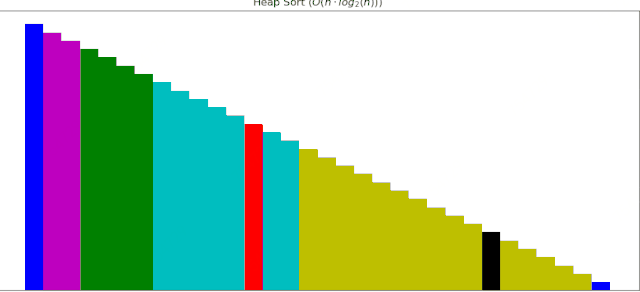

这些算法动画使用Matplotlib制作，接下来逐个补充。

#### 2 排序算法的动画展示

学会第一部分如何制作动画后，可将此技术应用于排序算法调整过程的动态展示上。

首先生成测试使用的数据，待排序的数据个数至多`20个`，待排序序列为`random_wait_sort`，为每个值赋一个颜色值，这个由`random_rgb`负责：

```python
data_count = 20  # here, max value of data_count is 20

random_wait_sort = [12, 34, 32, 24, 28, 39, 5,
                    22, 11, 25, 33, 32, 1, 25, 3, 8, 7, 1, 34, 7]

random_rgb = [(0.5, 0.811565104942967, 0.11211028937187217),
              (0.5, 0.5201323831224014, 0.6660999602342474),
              (0.5, 0.575976663060455, 0.17788242607567772),
              (0.5, 0.6880174797416493, 0.43581701833249353),
              (0.5, 0.4443131322001743, 0.6993600264279745),
              (0.5, 0.5538835821863523, 0.889276053938713),
              (0.5, 0.4851681185146841, 0.7977608586163772),
              (0.5, 0.3886717808488436, 0.09319137949618972),
              (0.5, 0.8952456581687489, 0.8282376936934484),
              (0.5, 0.16360202854998007, 0.4538892160157194),
              (0.5, 0.23233400128809478, 0.8544141586189615),
              (0.5, 0.5224648797546528, 0.8194014475829123),
              (0.5, 0.49396099968405016, 0.47441724394796825),
              (0.5, 0.12078104526714728, 0.7715022079860492),
              (0.5, 0.19428498518228154, 0.08174917157481443),
              (0.5, 0.6058698403873457, 0.6085936584142663),
              (0.5, 0.7801178568951216, 0.6414767240649862),
              (0.5, 0.4768865661174162, 0.3889866229610085),
              (0.5, 0.4301945092238082, 0.961688141676841),
              (0.5, 0.40496648895289855, 0.24234095882836093)]


```

再封装一个简单的数据对象`Data`：
```python
class Data:
    def __init__(self, value, rgb):
        self.value = value
        self.color = rgb

    # 造数据
    @classmethod
    def create(cls):
        return [Data(val, rgb) for val, rgb in zip(random_wait_sort[:data_count],
                                                   random_rgb[:data_count])]
```


#### 3 先拿冒泡实验

一旦发生调整，我们立即保存到帧列表`frames`中，注意此处需要`deepcopy`:
```python
# 冒泡排序
def bubble_sort(waiting_sort_data):
    frames = [waiting_sort_data]
    ds = copy.deepcopy(waiting_sort_data)
    for i in range(data_count-1):
        for j in range(data_count-i-1):
            if ds[j].value > ds[j+1].value:
                ds[j], ds[j+1] = ds[j+1], ds[j]
                frames.append(copy.deepcopy(ds))
    frames.append(ds)
    return frames
```

实验结果图：

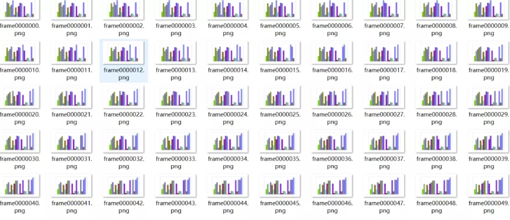

完整动画演示：


#### 4 快速排序
先上代码，比较经典，值得回味：
```python
def quick_sort(data_set):
    frames = [data_set]
    ds = copy.deepcopy(data_set)

    def qsort(head, tail):
        if tail - head > 1:
            i = head
            j = tail - 1
            pivot = ds[j].value
            while i < j:
                if ds[i].value > pivot or ds[j].value < pivot:
                    ds[i], ds[j] = ds[j], ds[i]
                    frames.append(copy.deepcopy(ds))
                if ds[i].value == pivot:
                    j -= 1
                else:
                    i += 1
            qsort(head, i)
            qsort(i+1, tail)

    qsort(0, data_count)
    frames.append(ds)
    return frames
```
快速排序算法对输入为随机的序列优势往往较为明显，同样的输入数据，它只需要`24`帧调整就能完成排序：

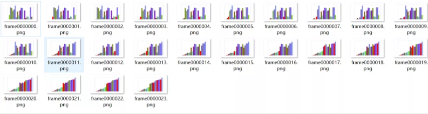

#### 5 选择排序
选择排序和堆排序都是选择思维，但是性能却不如堆排序：
```python
def selection_sort(data_set):
    frames = [data_set]
    ds = copy.deepcopy(data_set)
    for i in range(0, data_count-1):
        for j in range(i+1, data_count):
            if ds[j].value < ds[i].value:
                ds[i], ds[j] = ds[j], ds[i]
                frames.append(copy.deepcopy(ds))

    frames.append(ds)
    return frames
```
同样的输入数据，它完成排序需要`108`帧:

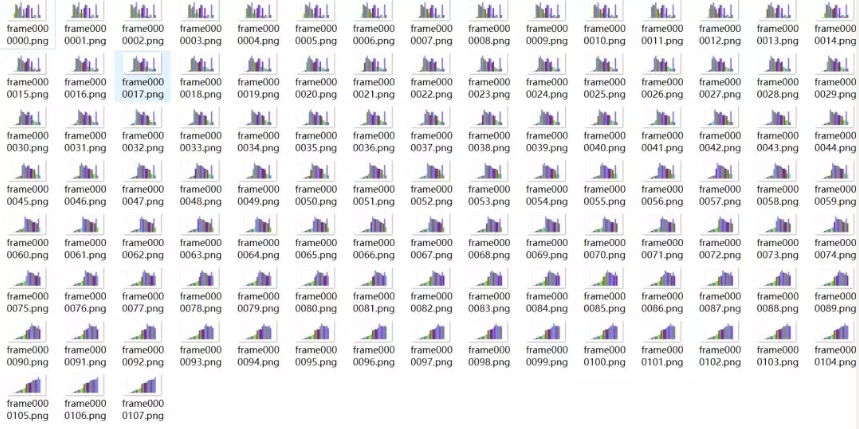


动画展示如下，每轮会从未排序的列表中，挑出一个最小值，放到已排序序列后面。

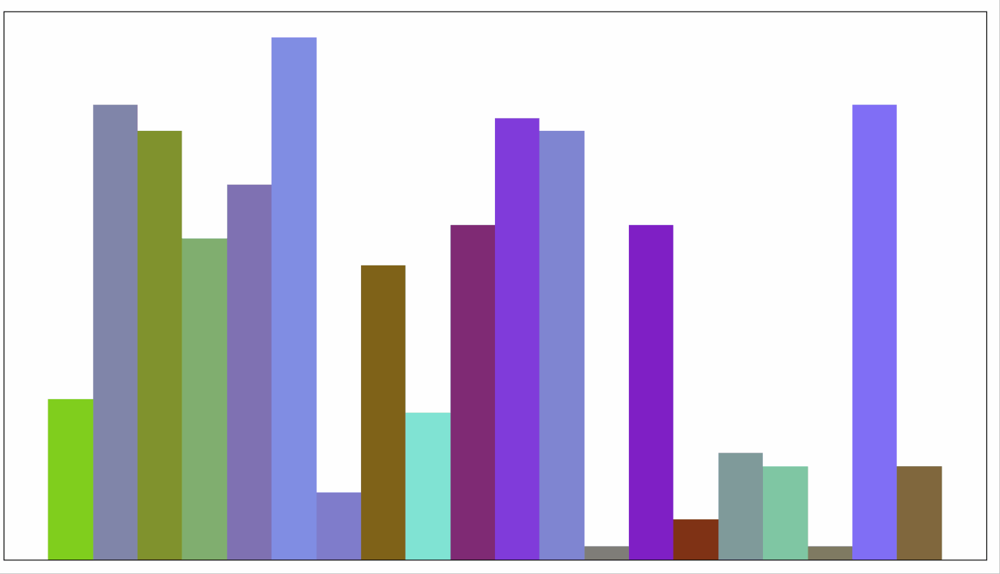

#### 6 堆排序
堆排序大大改进了选择排序，逻辑上使用二叉树，先建立一个大根堆，然后根节点与未排序序列的最后一个元素交换，重新对未排序序列建堆。

完整代码如下：

```python
def heap_sort(data_set):
    frames = [data_set]
    ds = copy.deepcopy(data_set)

    def heap_adjust(head, tail):
        i = head * 2 + 1  # head的左孩子
        while i < tail:
            if i + 1 < tail and ds[i].value < ds[i+1].value:  # 选择一个更大的孩子
                i += 1
            if ds[i].value <= ds[head].value:
                break
            ds[head], ds[i] = ds[i], ds[head]
            frames.append(copy.deepcopy(ds))
            head = i
            i = i * 2 + 1

    # 建立一个最大堆，从最后一个父节点开始调整
    for i in range(data_count//2-1, -1, -1):
        heap_adjust(i, data_count)
    for i in range(data_count-1, 0, -1):
        ds[i], ds[0] = ds[0], ds[i]  # 把最大值放在位置i处
        heap_adjust(0, i)  # 从0~i-1进行堆调整
    frames.append(ds)
    return frames
```
堆排序的性能也比较优秀，完成排序需要51次调整。


#### 7 综合
依次调用以上常见的4种排序算法，分别保存所有帧和html文件。

```python
waiting_sort_data = Data.create()
for sort_method in [bubble_sort, quick_sort, selection_sort, heap_sort]:
    frames = sort_method(waiting_sort_data)
    draw_chart(frames, file_name='%s.html' % (sort_method.__name__,))
```

获取以上完整代码、所有数据文件、结果文件：[完整源码下载](./data/sort.zip)

---

### 

#### 9 优化算法

机器学习是一个目标函数优化问题，给定目标函数f，约束条件会有一般包括以下三类：

1. 仅含等式约束
2. 仅含不等式约束
3. 等式和不等式约束混合型

当然还有一类没有任何约束条件的最优化问题

关于最优化问题，大都令人比较头疼，首先大多教材讲解通篇都是公式，各种符号表达，各种梯度，叫人看的云里雾里。

有没有结合几何图形阐述以上问题的？很庆幸，还真有这么好的讲解材料，图文并茂，逻辑推导严谨，更容易叫我们理解`拉格朗日乘数法`、`KKT条件`为什么就能求出极值。


#### 10 仅含等式约束
假定目标函数是连续可导函数，问题定义如下：

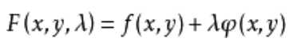

然后：

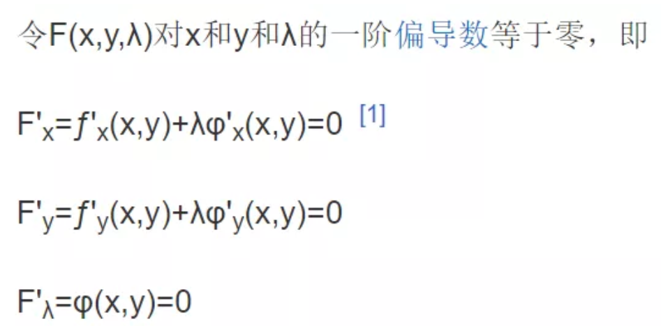


通过以上方法求解此类问题，但是为什么它能求出极值呢？

#### 11 找找感觉

大家时间都有限，只列出最核心的逻辑，找找sense, 如有兴趣可回去下载PPT仔细体会。

此解释中对此类问题的定义：


为了更好的阐述，给定一个具体例子，锁定：


所以，f(x)的一系列取值包括0,1,100,10000等任意实数：


但是，约束条件`h(x)`注定会约束`f(x)`不会等于100，不会等于10000...


一个可行点：

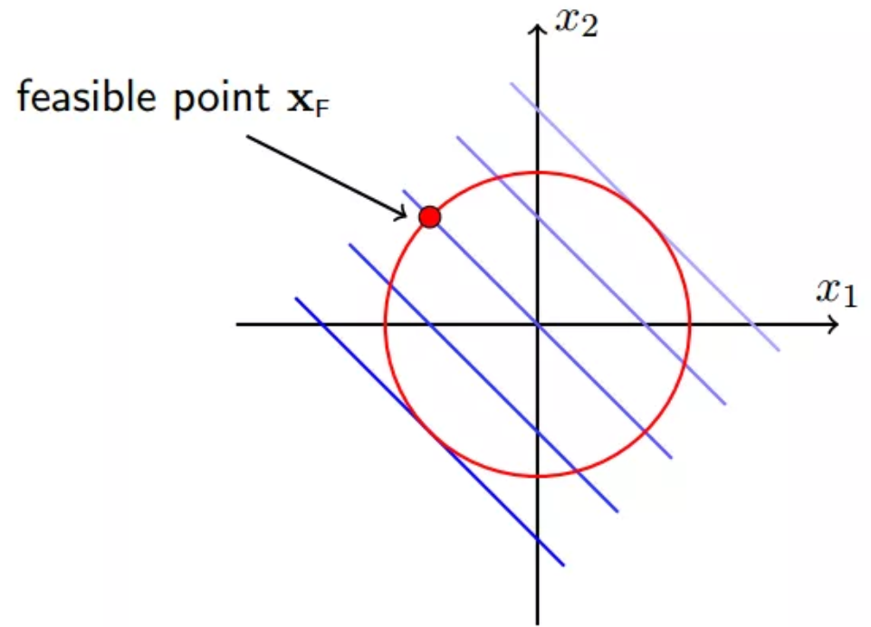

#### 12 梯度下降

我们想要寻找一个移动`x`的规则，使得移动后`f(x+delta_x)`变小，当然必须满足约束`h(x+delta_x)=0`

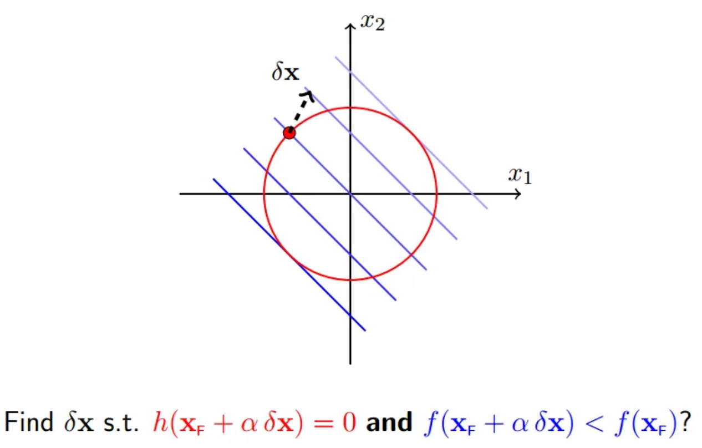

使得`f(x`)减小最快的方向就是它的梯度反方向，即

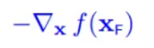

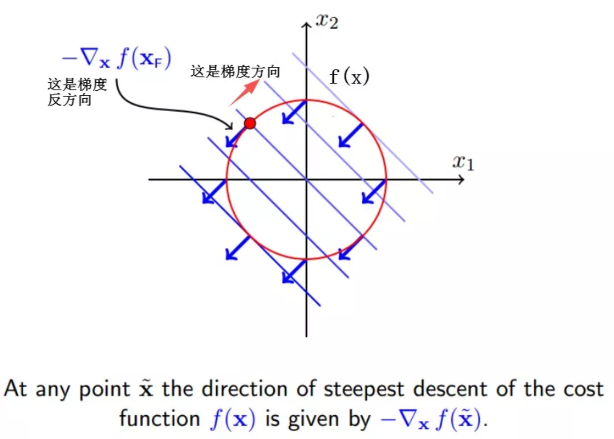

因此，要想f(x+delta_x) 变小，通过图形可以看出，只要保持和梯度反方向夹角小于90，也就是保持大概一个方向，`f(x+delta_x)`就会变小，转化为公式就是：

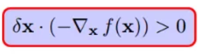

如下所示的一个`delta_x`就是一个会使得f(x)减小的方向，但是这种移动将会破坏等式约束: `h(x)=0`，关于准确的移动方向下面第四小节会讲到

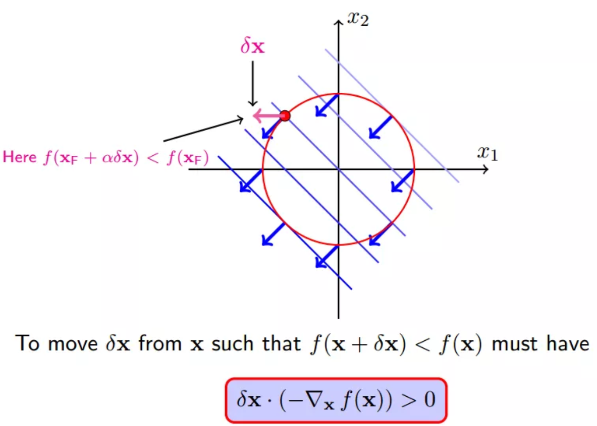

#### 13 约束面的法向


约束面的外法向：

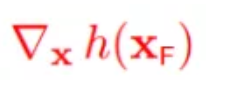


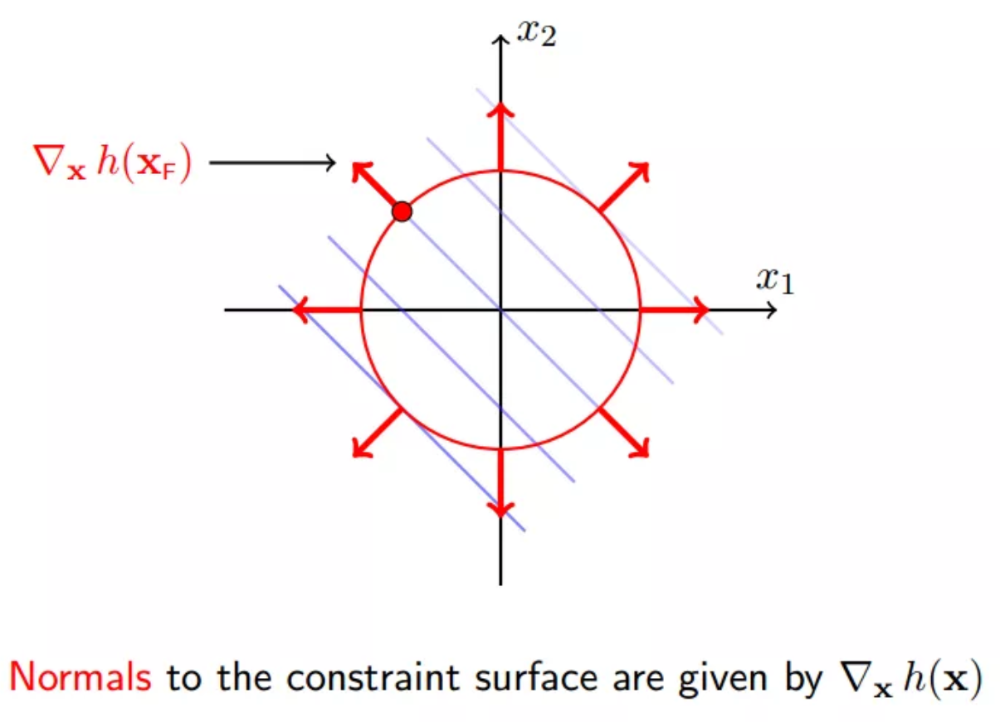

约束面的内法向：


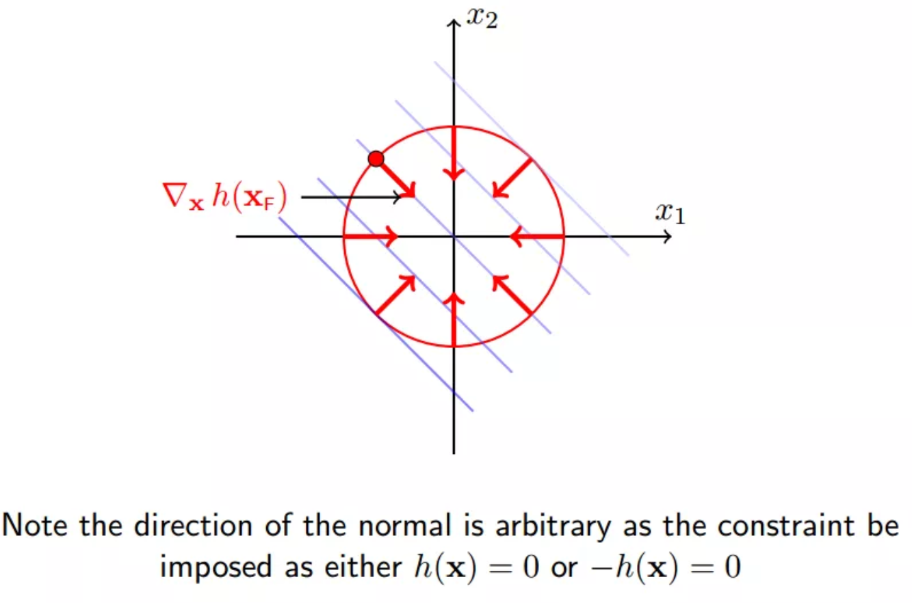

绿圈表示法向的`正交`方向

**x沿着绿圈内的方向移动，将会使得f(x)减小，同时满足等式约束h(x) = 0**

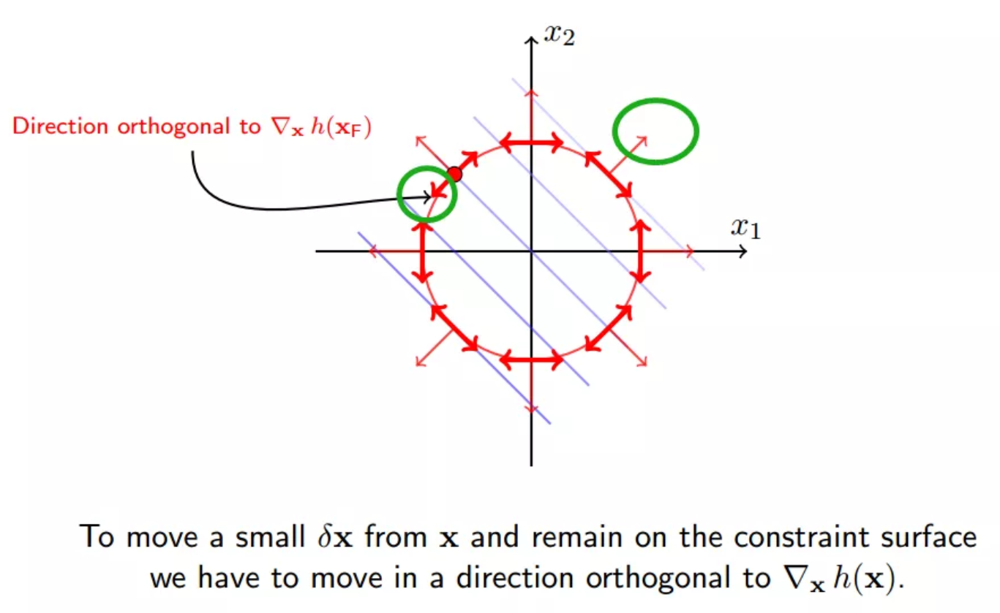

#### 14 大胆猜想


 我们不妨大胆假设，如果满足下面的条件：

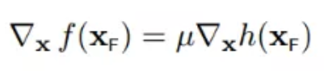

根据第四小节讲述，`delta_x`必须正交于`h(x)`，所以：

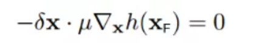

所以：

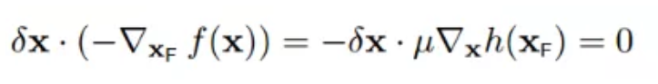

至此，我们就找到`f(x)`偏导数等于0的点，就是下图所示的**两个关键点（它们也是f(x)与h(x)的临界点）**。且必须满足以下条件，也就是两个向量必须是平行的：

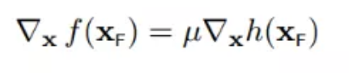

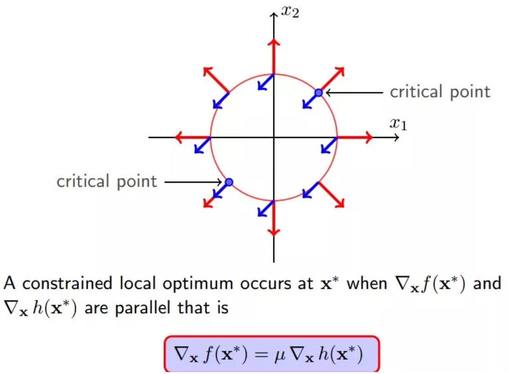

#### 15 完全解码拉格朗日乘数法

至此，已经完全解码拉格朗日乘数法，拉格朗日巧妙的构造出下面这个式子：

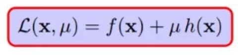

**还有取得极值的的三个条件，都是对以上五个小节中涉及到的条件的编码**

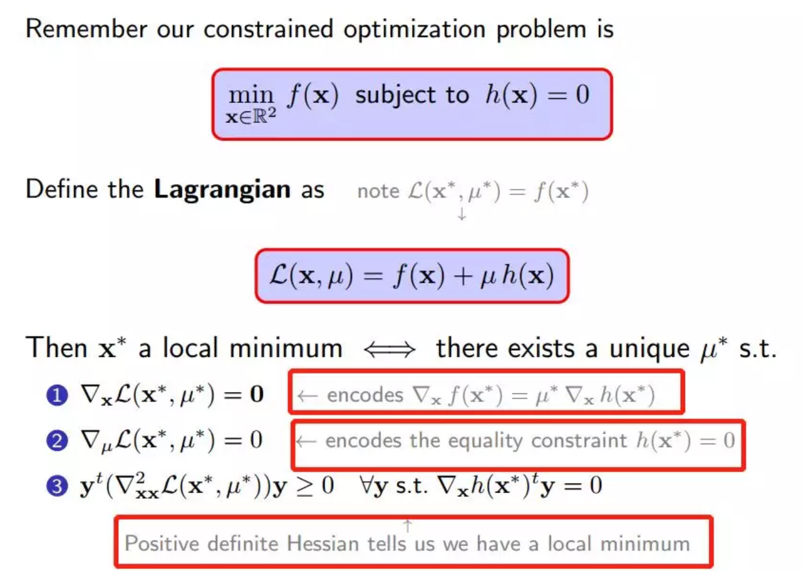

关于第三个条件，稍加说明。

对于含有多个变量，比如本例子就含有2个变量`x1`, `x2`，就是一个多元优化问题，需要求二阶导，二阶导的矩阵就被称为`海塞矩阵`（Hessian Matrix）

与求解一元问题一样，仅凭一阶导数等于是无法判断极值的，需要求二阶导，并且二阶导大于0才是极小值，小于0是极大值，等于0依然无法判断是否在此点去的极值。


> 以上就是机器学习最常用的优化技巧：拉格朗日乘数法的图形讲解，相信大家已经找到一定感觉，接下来几天我们通过例子，详细阐述机器学习的具体概念，常用算法，使用Python实现主要的算法，使用Sklearn，Kaggle数据实战这些算法。


#### 16 均匀分布

导入本次实验所用的4种常见分布，连续分布的代表：`beta`分布、`正态`分布，`均匀`分布，离散分布的代表：`二项`分布。

绘图装饰器带有四个参数分别表示`legend`的2类说明文字，y轴label, 保存的png文件名称。

```python
import pretty_errors
import numpy as np
from scipy.stats import beta, norm, uniform, binom
import matplotlib.pyplot as plt
from functools import wraps

# 定义带四个参数的画图装饰器

def my_plot(label0=None, label1=None, ylabel='probability density function', fn=None):
    def decorate(f):
        @wraps(f)
        def myplot():
            fig = plt.figure(figsize=(16, 9))
            ax = fig.add_subplot(111)
            x, y, y1 = f()
            ax.plot(x, y, linewidth=2, c='r', label=label0)
            ax.plot(x, y1, linewidth=2, c='b', label=label1)
            ax.legend()
            plt.ylabel(ylabel)
            # plt.show()
            plt.savefig('./img/%s' % (fn,))
            print('%s保存成功' % (fn,))
            plt.close()
        return myplot
    return decorate
```

```python
# 均匀分布(uniform)
@my_plot(label0='b-a=1.0', label1='b-a=2.0', fn='uniform.png')
def unif():
    x = np.arange(-0.01, 2.01, 0.01)
    y = uniform.pdf(x, loc=0.0, scale=1.0)
    y1 = uniform.pdf(x, loc=0.0, scale=2.0)
    return x, y, y1
```

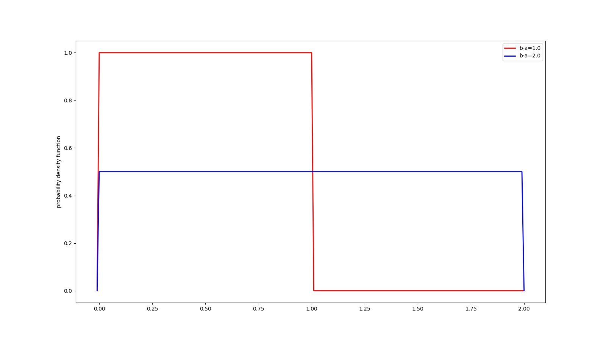

#### 17 **二项分布**

红色曲线表示发生一次概率为0.3，重复50次的密度函数，二项分布期望值为0.3*50 = 15次。看到这50次实验，很可能出现的次数为10~20.可与蓝色曲线对比分析。

```python
# 二项分布
@my_plot(label0='n=50,p=0.3', label1='n=50,p=0.7', fn='binom.png', ylabel='probability mass function')
def bino():
    x = np.arange(50)
    n, p, p1 = 50, 0.3, 0.7
    y = binom.pmf(x, n=n, p=p)
    y1 = binom.pmf(x, n=n, p=p1)
    return x, y, y1
```

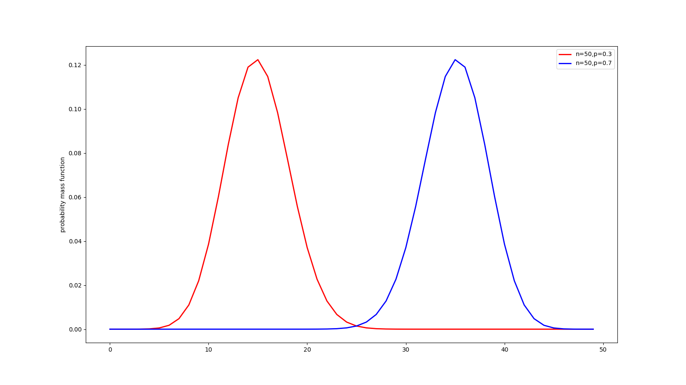

#### 18 高斯分布

红色曲线表示均值为0，标准差为1.0的概率密度函数，蓝色曲线的标准差更大，所以它更矮胖，显示出取值的多样性，和不稳定性。

```python
# 高斯 分布
@my_plot(label0='u=0.,sigma=1.0', label1='u=0.,sigma=2.0', fn='guass.png')
def guass():
    x = np.arange(-5, 5, 0.1)
    y = norm.pdf(x, loc=0.0, scale=1.0)
    y1 = norm.pdf(x, loc=0., scale=2.0)
    return x, y, y1
```

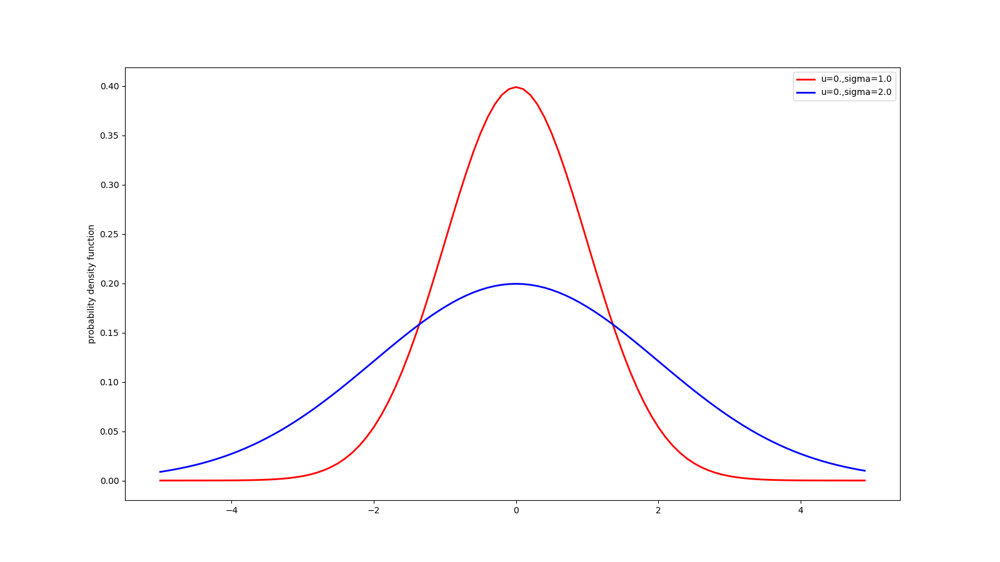

#### 19 beta分布

beta分布的期望值如下，可从下面的两条曲线中加以验证：

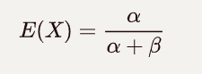

```python
# beta 分布
@my_plot(label0='a=10., b=30.', label1='a=4., b=4.', fn='beta.png')
def bet():
    x = np.arange(-0.01, 1, 0.001)
    y = beta.pdf(x, a=10., b=30.)
    y1 = beta.pdf(x, a=4., b=4.)
    return x, y, y1
```


### 九、Python、机器学习和深度学习实战


#### 1 环境搭建

区分几个小白容易混淆的概念：pycharm，python解释器，conda安装，pip安装，总结来说：

- `pycharm`是python开发的集成开发环境(Integrated Development Environment，简称IDE)，它本身无法执行Python代码
- `python解释器`才是真正执行代码的工具，pycharm里可设置Python解释器，一般去python官网下载python3.7或python3.8版本；如果安装过`anaconda`，它里面必然也包括一个某版本的Python解释器；pycharm配置python解释器选择哪一个都可以。
- anaconda是python常用包的合集，并提供给我们使用`conda`命令非常方便的安装各种Python包。
- `conda安装`：我们安装过anaconda软件后，就能够使用conda命令下载anaconda源里(比如中科大镜像源)的包
- `pip安装`：类似于conda安装的python安装包的方法，更加全面

**修改镜像源**

在使用安装`conda` 安装某些包会出现慢或安装失败问题，最有效方法是修改镜像源为国内镜像源。之前都选用清华镜像源，但是2019年后已停止服务。推荐选用中科大镜像源。

先查看已经安装过的镜像源，cmd窗口执行命令：

```python
conda config --show
```

查看配置项`channels`，如果显示带有`tsinghua`，则说明已安装过清华镜像。

```python
channels:
- https://mirrors.tuna.tsinghua.edu.cn/tensorflow/linux/cpu/
- https://mirrors.tuna.tsinghua.edu.cn/anaconda/cloud/msys2/
- https://mirrors.tuna.tsinghua.edu.cn/anaconda/cloud/conda-forge/
- https://mirrors.tuna.tsinghua.edu.cn/anaconda/pkgs/free/
- https://mirrors.tuna.tsinghua.edu.cn/anaconda/cloud/pytorch/
```

下一步，使用`conda config --remove channels url地址 `删除清华镜像，如下命令删除第一个。然后，依次删除所有镜像源

```python
conda config --remove channels https://mirrors.tuna.tsinghua.edu.cn/tensorflow/linux/cpu/
```

添加目前可用的中科大镜像源：

```
conda config --add channels https://mirrors.ustc.edu.cn/anaconda/pkgs/free/
```

并设置搜索时显示通道地址：

```python
conda config --set show_channel_urls yes
```

确认是否安装镜像源成功，执行`conda config --show`，找到`channels`值为如下：

```
channels:
  - https://mirrors.ustc.edu.cn/anaconda/pkgs/free/
  - defaults
```

Done~

#### 2 pytorch慢到无法安装，怎么办？

**1 安装慢到装不上**

最近几天，后台几个小伙伴问我，无论pip还是conda安装`pytorch`都太慢了，都是安装官方文档去做的，就是超时装不上，无法开展下一步，卡脖子的感觉太不好受。

这些小伙伴按照pytorch官档提示，选择好后，完整复制上面命令`conda install pytorch torchvision cudatoolkit=10.1 -c pytorch`到cmd中，系统是windows.

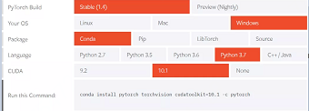

接下来提示，conda需要安装的包，他们操作选择`y`，继续安装，但是在安装时，发现进度条几乎一动不动。

反复尝试，就是这样，有些无奈，还感叹怎么深度学习的路一开始就TMD的这么难！


**2 这样能正常安装**

无论是安装`cpu`版还是`cuda`版，网上关于这些的参考资料太多了，无非就是cuda硬件和cuda开发包的版本要对应，python版本要对应等，这些bee君觉得都不是事。

就像几位读者朋友遇到的问题，关键还是如何解决`慢到无法装`的问题。

最有效方法是添加镜像源，常见的清华或中科大。

先查看是否已经安装相关镜像源，windows系统在`cmd`窗口中执行命令：

```python
conda config --show
```

bee君这里显示：
```python
channels:
  - https://mirrors.tuna.tsinghua.edu.cn/anaconda/cloud/pytorch/
  - https://mirrors.tuna.tsinghua.edu.cn/anaconda/cloud/menpo/
  - https://mirrors.tuna.tsinghua.edu.cn/anaconda/cloud/bioconda/
  - https://mirrors.tuna.tsinghua.edu.cn/anaconda/cloud/msys2/
  - https://mirrors.tuna.tsinghua.edu.cn/anaconda/cloud/conda-forge/
  - https://mirrors.tuna.tsinghua.edu.cn/anaconda/pkgs/main/
  - https://mirrors.tuna.tsinghua.edu.cn/anaconda/pkgs/free/
```
说明已经安装好清华的镜像源。如果没有安装，请参考下面命令安装源：
```python
conda config --add channels https://mirrors.tuna.tsinghua.edu.cn/anaconda/cloud/pytorch/
```
依次安装上面所有的源。

并设置搜索时显示通道地址，执行下面命令：

```python
conda config --set show_channel_urls yes
```

**3 最关键一步**

有的读者问我，他们已经都安装好镜像源，但是为什么安装还是龟速？问他们，是用哪个命令，他们回复：`conda install pytorch torchvision cudatoolkit=10.1 -c pytorch`

好吧，执行上面命令，因为命令最后是`-c pytorch`，所以默认还是从conda源下载，新安装的清华等源没有用上。

正确命令：`conda install pytorch torchvision cudatoolkit=10.1`，也就是去掉`-c pytorch`

并且在安装时，也能看到使用了清华源。并且安装速度直线提升，顺利done

**4 测试是否安装成功**

结合官档，执行下面代码，`torch.cuda.is_available()`返回`True`，说明安装cuda成功。

```python
In [1]: import torch

In [2]: torch.cuda
Out[2]: <module 'torch.cuda' from 'D:\\Programs\\anaconda\\lib\\site-packages\\torch\\cuda\\__init__.py'>

In [3]: torch.cuda.is_available()
Out[3]: True

In [4]: from __future__ import print_function

In [5]: x = torch.rand(5,3)

In [6]: print(x)
tensor([[0.0604, 0.1135, 0.2656],
        [0.5353, 0.9246, 0.3004],
        [0.4872, 0.9592, 0.2215],
        [0.2598, 0.5031, 0.6093],
        [0.2986, 0.1599, 0.5862]])
```

这篇文章主要讨论安装`pytorch`慢到不能装的问题及方案，希望对读者朋友们有帮助。


#### 3 自动群发邮件

Python自动群发邮件

```python
import smtplib
from email import (header)
from email.mime import (text, application, multipart)
import time

def sender_mail():
    smt_p = smtplib.SMTP()
    smt_p.connect(host='smtp.qq.com', port=25)
    sender, password = '113097485@qq.com', "**************"
    smt_p.login(sender, password)
    receiver_addresses, count_num = [
        'guozhennianhua@163.com', 'xiaoxiazi99@163.com'], 1
    for email_address in receiver_addresses:
        try:
            msg = multipart.MIMEMultipart()
            msg['From'] = "zhenguo"
            msg['To'] = email_address
            msg['subject'] = header.Header('这是邮件主题通知', 'utf-8')
            msg.attach(text.MIMEText(
                '这是一封测试邮件，请勿回复本邮件~', 'plain', 'utf-8'))
            smt_p.sendmail(sender, email_address, msg.as_string())
            time.sleep(10)
            print('第%d次发送给%s' % (count_num, email_address))
            count_num = count_num + 1
        except Exception as e:
            print('第%d次给%s发送邮件异常' % (count_num, email_address))
            continue
    smt_p.quit()

sender_mail()
```


注意：
发送邮箱是qq邮箱，所以要在qq邮箱中设置开启SMTP服务，设置完成时会生成一个授权码，将这个授权码赋值给文中的`password`变量。


发送后的截图：


#### 4 二分搜索

二分搜索是程序员必备的算法，无论什么场合，都要非常熟练地写出来。

小例子描述：
在**有序数组**`arr`中，指定区间`[left,right]`范围内，查找元素`x`
如果不存在，返回`-1`

二分搜索`binarySearch`实现的主逻辑

```python
def binarySearch(arr, left, right, x):
    while left <= right:

        mid = int(left + (right - left) / 2); # 找到中间位置。求中点写成(left+right)/2更容易溢出，所以不建议这样写

        # 检查x是否出现在位置mid
        if arr[mid] == x:
            print('found %d 在索引位置%d 处' %(x,mid))
            return mid

            # 假如x更大，则不可能出现在左半部分
        elif arr[mid] < x:
            left = mid + 1 #搜索区间变为[mid+1,right]
            print('区间缩小为[%d,%d]' %(mid+1,right))

        # 同理，假如x更小，则不可能出现在右半部分
        elif x<arr[mid]:
            right = mid - 1 #搜索区间变为[left,mid-1]
            print('区间缩小为[%d,%d]' %(left,mid-1))

    # 假如搜索到这里，表明x未出现在[left,right]中
    return -1
```

在`Ipython`交互界面中，调用`binarySearch`的小Demo:

```python
In [8]: binarySearch([4,5,6,7,10,20,100],0,6,5)
区间缩小为[0,2]
found 5 at 1
Out[8]: 1

In [9]: binarySearch([4,5,6,7,10,20,100],0,6,4)
区间缩小为[0,2]
区间缩小为[0,0]
found 4 at 0
Out[9]: 0

In [10]: binarySearch([4,5,6,7,10,20,100],0,6,20)
区间缩小为[4,6]
found 20 at 5
Out[10]: 5

In [11]: binarySearch([4,5,6,7,10,20,100],0,6,100)
区间缩小为[4,6]
区间缩小为[6,6]
found 100 at 6
Out[11]: 6
```

#### 5 爬取天气数据并解析温度值

爬取天气数据并解析温度值

素材来自朋友袁绍，感谢！

爬取的html 结构

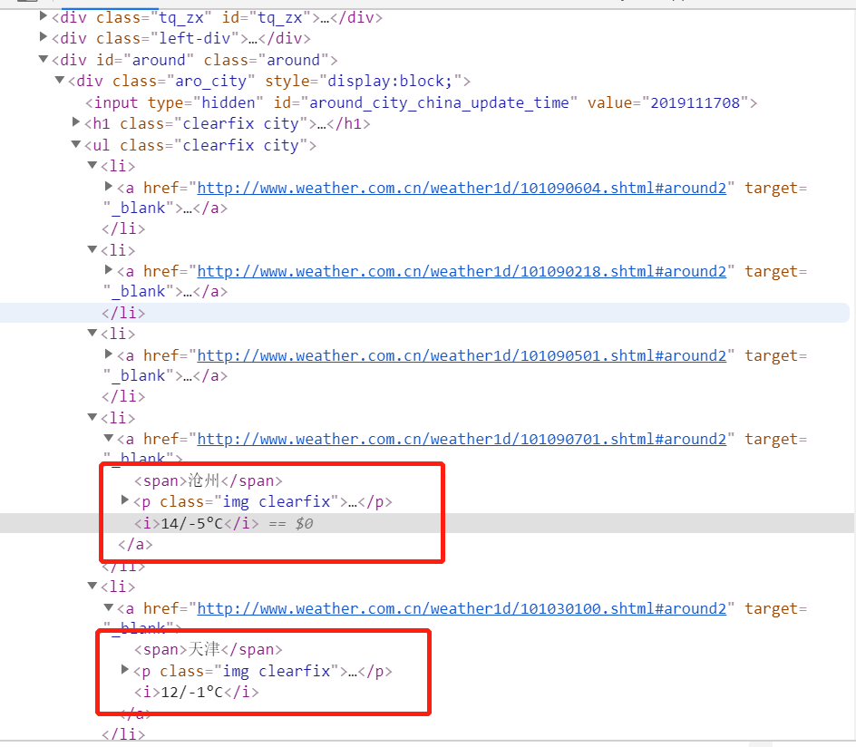

```python
import requests
from lxml import etree
import pandas as pd
import re

url = 'http://www.weather.com.cn/weather1d/101010100.shtml#input'
with requests.get(url) as res:
    content = res.content
    html = etree.HTML(content)
```


通过lxml模块提取值

lxml比beautifulsoup解析在某些场合更高效

```python
location = html.xpath('//*[@id="around"]//a[@target="_blank"]/span/text()')
temperature = html.xpath('//*[@id="around"]/div/ul/li/a/i/text()')
```

结果：

```python
['香河', '涿州', '唐山', '沧州', '天津', '廊坊', '太原', '石家庄', '涿鹿', '张家口', '保定', '三河', '北京孔庙', '北京国子监', '中国地质博物馆', '月坛公
园', '明城墙遗址公园', '北京市规划展览馆', '什刹海', '南锣鼓巷', '天坛公园', '北海公园', '景山公园', '北京海洋馆']

['11/-5°C', '14/-5°C', '12/-6°C', '12/-5°C', '11/-1°C', '11/-5°C', '8/-7°C', '13/-2°C', '8/-6°C', '5/-9°C', '14/-6°C', '11/-4°C', '13/-3°C'
, '13/-3°C', '12/-3°C', '12/-3°C', '13/-3°C', '12/-2°C', '12/-3°C', '13/-3°C', '12/-2°C', '12/-2°C', '12/-2°C', '12/-3°C']
```


构造DataFrame对象

```python
df = pd.DataFrame({'location':location, 'temperature':temperature})
print('温度列')
print(df['temperature'])
```

正则解析温度值

```python
df['high'] = df['temperature'].apply(lambda x: int(re.match('(-?[0-9]*?)/-?[0-9]*?°C', x).group(1) ) )
df['low'] = df['temperature'].apply(lambda x: int(re.match('-?[0-9]*?/(-?[0-9]*?)°C', x).group(1) ) )
print(df)
```

详细说明子字符创捕获

除了简单地判断是否匹配之外，正则表达式还有提取子串的强大功能。用`()`表示的就是要提取的分组（group）。比如：`^(\d{3})-(\d{3,8})$`分别定义了两个组，可以直接从匹配的字符串中提取出区号和本地号码

```python
m = re.match(r'^(\d{3})-(\d{3,8})$', '010-12345')
print(m.group(0))
print(m.group(1))
print(m.group(2))

# 010-12345
# 010
# 12345
```

如果正则表达式中定义了组，就可以在`Match`对象上用`group()`方法提取出子串来。

注意到`group(0)`永远是原始字符串，`group(1)`、`group(2)`……表示第1、2、……个子串。


最终结果

```python
Name: temperature, dtype: object
    location temperature  high  low
0         香河     11/-5°C    11   -5
1         涿州     14/-5°C    14   -5
2         唐山     12/-6°C    12   -6
3         沧州     12/-5°C    12   -5
4         天津     11/-1°C    11   -1
5         廊坊     11/-5°C    11   -5
6         太原      8/-7°C     8   -7
7        石家庄     13/-2°C    13   -2
8         涿鹿      8/-6°C     8   -6
9        张家口      5/-9°C     5   -9
10        保定     14/-6°C    14   -6
11        三河     11/-4°C    11   -4
12      北京孔庙     13/-3°C    13   -3
13     北京国子监     13/-3°C    13   -3
14   中国地质博物馆     12/-3°C    12   -3
15      月坛公园     12/-3°C    12   -3
16   明城墙遗址公园     13/-3°C    13   -3
17  北京市规划展览馆     12/-2°C    12   -2
18       什刹海     12/-3°C    12   -3
19      南锣鼓巷     13/-3°C    13   -3
20      天坛公园     12/-2°C    12   -2
21      北海公园     12/-2°C    12   -2
22      景山公园     12/-2°C    12   -2
23     北京海洋馆     12/-3°C    12   -3
```


#### 6 制作小而美的计算器

1)  ui设计

使用`qt designer` ，按装anaconda后，在如下路径找到：

> conda3.05\Library\bin

`designer.exe`文件，双击启动：

![1578811899182]./img/1578811899182.png)

创建窗体，命名为`XiaoDing`，整个的界面如下所示：


`qt 设计器`提供的常用控件基本都能满足开发需求，通过拖动左侧的控件，很便捷的就能搭建出如下的UI界面，比传统的手写控件代码要方便很多。

最终设计的计算器`XiaoDing`界面如下，


比如，其中一个用于计算器显示的对象：`lcdNumber`，对象的类型为：`LCD Number`。右侧为计算器中用到的所有对象。


2)  转py文件

使用如下命令，将设计好的`ui`文件转为`py`文件：

```python
pyuic5 -o ./calculator/MainWindow.py ./calculator/mainwindow.ui
```

3)  计算器实现逻辑

导入库：

```python
from PyQt5.QtGui import *
from PyQt5.QtWidgets import *
from PyQt5.QtCore import *

import operator

from MainWindow import Ui_MainWindow
```

主题代码逻辑很精简：

```python
# Calculator state.
READY = 0
INPUT = 1


class MainWindow(QMainWindow, Ui_MainWindow):
    def __init__(self, *args, **kwargs):
        super(MainWindow, self).__init__(*args, **kwargs)
        self.setupUi(self)

        # Setup numbers.
        for n in range(0, 10):
            getattr(self, 'pushButton_n%s' % n).pressed.connect(lambda v=n: self.input_number(v))

        # Setup operations.
        self.pushButton_add.pressed.connect(lambda: self.operation(operator.add))
        self.pushButton_sub.pressed.connect(lambda: self.operation(operator.sub))
        self.pushButton_mul.pressed.connect(lambda: self.operation(operator.mul))
        self.pushButton_div.pressed.connect(lambda: self.operation(operator.truediv))  # operator.div for Python2.7

        self.pushButton_pc.pressed.connect(self.operation_pc)
        self.pushButton_eq.pressed.connect(self.equals)

        # Setup actions
        self.actionReset.triggered.connect(self.reset)
        self.pushButton_ac.pressed.connect(self.reset)

        self.actionExit.triggered.connect(self.close)

        self.pushButton_m.pressed.connect(self.memory_store)
        self.pushButton_mr.pressed.connect(self.memory_recall)

        self.memory = 0
        self.reset()

        self.show()
```


基础方法：

```python
    def input_number(self, v):
        if self.state == READY:
            self.state = INPUT
            self.stack[-1] = v
        else:
            self.stack[-1] = self.stack[-1] * 10 + v

        self.display()

    def display(self):
        self.lcdNumber.display(self.stack[-1])
```

按钮`RE`,`M`, `RE`对应的实现逻辑：

```python
    def reset(self):
        self.state = READY
        self.stack = [0]
        self.last_operation = None
        self.current_op = None
        self.display()

    def memory_store(self):
        self.memory = self.lcdNumber.value()

    def memory_recall(self):
        self.state = INPUT
        self.stack[-1] = self.memory
        self.display()
```


`+`,`-`,`x`,`/`,`/100`对应实现方法：

```python
def operation(self, op):
        if self.current_op:  # Complete the current operation
            self.equals()

        self.stack.append(0)
        self.state = INPUT
        self.current_op = op

    def operation_pc(self):
        self.state = INPUT
        self.stack[-1] *= 0.01
        self.display()
```

`=`号对应的方法实现：

```python
 def equals(self):
        if self.state == READY and self.last_operation:
            s, self.current_op = self.last_operation
            self.stack.append(s)

        if self.current_op:
            self.last_operation = self.stack[-1], self.current_op

            try:
                self.stack = [self.current_op(*self.stack)]
            except Exception:
                self.lcdNumber.display('Err')
                self.stack = [0]
            else:
                self.current_op = None
                self.state = READY
                self.display()
```

main函数：

```python
if __name__ == '__main__':
    app = QApplication([])
    app.setApplicationName("XiaoDing")

    window = MainWindow()
    app.exec_()
```


### 十、数据分析

本项目基于Kaggle电影影评数据集，通过这个系列，你将学到如何进行数据探索性分析(EDA)，学会使用数据分析利器`pandas`，会用绘图包`pyecharts`，以及EDA时可能遇到的各种实际问题及一些处理技巧。


本项目需要导入的包：

```python
import pandas as pd
import numpy as np
import matplotlib.pyplot as plt
from pyecharts.charts import Bar,Grid,Line
import pyecharts.options as opts
from pyecharts.globals import ThemeType
```

#### 1 创建DataFrame
pandas中一个dataFrame实例：
```python
Out[89]:
        a  val
0  apple1  1.0
1  apple2  2.0
2  apple3  3.0
3  apple4  4.0
4  apple5  5.0
```

我们的**目标**是变为如下结构：
```python
a  apple1  apple2  apple3  apple4  apple5
0     1.0     2.0     3.0     4.0     5.0
```

乍看可使用`pivot`，但很难一步到位。

所以另辟蹊径，提供一种简单且好理解的方法：

```python
In [113]: pd.DataFrame(index=[0],columns=df.a,data=dict(zip(df.a,df.val)))
Out[113]:
a  apple1  apple2  apple3  apple4  apple5
0     1.0     2.0     3.0     4.0     5.0
```
以上方法是重新创建一个DataFrame,直接把`df.a`所有可能取值作为新dataframe的列，index调整为`[0]`，注意类型必须是数组类型(array-like 或者 Index)，两个轴确定后，`data`填充数据域。

```python
In [116]: dict(zip(df.a,df.val))
Out[116]: {'apple1': 1.0, 'apple2': 2.0, 'apple3': 3.0, 'apple4': 4.0, 'apple5': 5.0}
```


#### 2 导入数据
数据来自kaggle，共包括三个文件：

1. movies.dat
2. ratings.dat
3. users.dat

`movies.dat`包括三个字段：['Movie ID', 'Movie Title', 'Genre']

使用pandas导入此文件：

```python
import pandas as pd

movies = pd.read_csv('./data/movietweetings/movies.dat', delimiter='::', engine='python', header=None, names = ['Movie ID', 'Movie Title', 'Genre'])
```

导入后，显示前5行：

```python
   Movie ID                                        Movie Title  \
0         8      Edison Kinetoscopic Record of a Sneeze (1894)   
1        10                La sortie des usines Lumi猫re (1895)   
2        12                      The Arrival of a Train (1896)   
3        25  The Oxford and Cambridge University Boat Race ...   
4        91                         Le manoir du diable (1896)   
5       131                           Une nuit terrible (1896)   
6       417                      Le voyage dans la lune (1902)   
7       439                     The Great Train Robbery (1903)   
8       443        Hiawatha, the Messiah of the Ojibway (1903)   
9       628                    The Adventures of Dollie (1908)  
                                          Genre  
0                             Documentary|Short  
1                             Documentary|Short  
2                             Documentary|Short  
3                                           NaN  
4                                  Short|Horror  
5                           Short|Comedy|Horror  
6  Short|Action|Adventure|Comedy|Fantasy|Sci-Fi  
7                    Short|Action|Crime|Western  
8                                           NaN  
9                                  Action|Short  
```


次导入其他两个数据文件

`users.dat`:

```python
users = pd.read_csv('./data/movietweetings/users.dat', delimiter='::', engine='python', header=None, names = ['User ID', 'Twitter ID'])
print(users.head())
```

结果：

```python
   User ID  Twitter ID
0        1   397291295
1        2    40501255
2        3   417333257
3        4   138805259
4        5  2452094989
5        6   391774225
6        7    47317010
7        8    84541461
8        9  2445803544
9       10   995885060
```


`rating.data`:

```python
ratings = pd.read_csv('./data/movietweetings/ratings.dat', delimiter='::', engine='python', header=None, names = ['User ID', 'Movie ID', 'Rating', 'Rating Timestamp'])
print(ratings.head())
```

结果：

```python
   User ID  Movie ID  Rating  Rating Timestamp
0        1    111161      10        1373234211
1        1    117060       7        1373415231
2        1    120755       6        1373424360
3        1    317919       6        1373495763
4        1    454876      10        1373621125
5        1    790724       8        1374641320
6        1    882977       8        1372898763
7        1   1229238       9        1373506523
8        1   1288558       5        1373154354
9        1   1300854       8        1377165712
```

 **read_csv 使用说明**

说明，本次导入`dat`文件使用`pandas.read_csv`函数。

第一个位置参数`./data/movietweetings/ratings.dat` 表示文件的相对路径

第二个关键字参数：`delimiter='::'`，表示文件分隔符使用`::`

后面几个关键字参数分别代表使用的引擎，文件没有表头，所以`header`为`None;`

导入后dataframe的列名使用`names`关键字设置，这个参数大家可以记住，比较有用。


Kaggle电影数据集第一节，我们使用数据处理利器 `pandas`， 函数`read_csv` 导入给定的三个数据文件。

```python
import pandas as pd

movies = pd.read_csv('./data/movietweetings/movies.dat', delimiter='::', engine='python', header=None, names = ['Movie ID', 'Movie Title', 'Genre'])
users = pd.read_csv('./data/movietweetings/users.dat', delimiter='::', engine='python', header=None, names = ['User ID', 'Twitter ID'])
ratings = pd.read_csv('./data/movietweetings/ratings.dat', delimiter='::', engine='python', header=None, names = ['User ID', 'Movie ID', 'Rating', 'Rating Timestamp'])
```

用到的`read_csv`，某些重要的参数，如何使用在上一节也有所提到。下面开始数据探索分析(EDA)

> 找出得分前10喜剧(comedy)


#### 3 处理组合值

表`movies`字段`Genre`表示电影的类型，可能有多个值，分隔符为`|`，取值也可能为`None`.

针对这类字段取值，可使用Pandas中Series提供的`str`做一步转化，**注意它是向量级的**，下一步，如Python原生的`str`类似，使用`contains`判断是否含有`comedy`字符串：

```python
mask = movies.Genre.str.contains('comedy',case=False,na=False)
```

注意使用的两个参数：`case`, `na`

case为 False，表示对大小写不敏感；
na Genre列某个单元格为`NaN`时，我们使用的充填值，此处填充为`False`

返回的`mask`是一维的`Series`，结构与 movies.Genre相同，取值为True 或 False.

观察结果：

```python
0    False
1    False
2    False
3    False
4    False
5     True
6     True
7    False
8    False
9    False
Name: Genre, dtype: bool

```


 #### 4 访问某列

得到掩码mask后，pandas非常方便地能提取出目标记录：

```python
comedy = movies[mask]
comdey_ids = comedy['Movie ID']

```

以上，在pandas中被最频率使用，不再解释。看结果`comedy_ids.head()`：

```python
5      131
6      417
15    2354
18    3863
19    4099
20    4100
21    4101
22    4210
23    4395
25    4518
Name: Movie ID, dtype: int64

```


1-4介绍`数据读入`，`处理组合值`，`索引数据`等, pandas中使用较多的函数，基于Kaggle真实电影影评数据集，最后得到所有`喜剧 ID`：

```python
5      131
6      417
15    2354
18    3863
19    4099
20    4100
21    4101
22    4210
23    4395
25    4518
Name: Movie ID, dtype: int64

```

下面继续数据探索之旅~

#### 5 连接两个表

拿到所有喜剧的ID后，要想找出其中平均得分最高的前10喜剧，需要关联另一张表：`ratings`:

再回顾下ratings表结构：

```python
   User ID  Movie ID  Rating  Rating Timestamp
0        1    111161      10        1373234211
1        1    117060       7        1373415231
2        1    120755       6        1373424360
3        1    317919       6        1373495763
4        1    454876      10        1373621125
5        1    790724       8        1374641320
6        1    882977       8        1372898763
7        1   1229238       9        1373506523
8        1   1288558       5        1373154354
9        1   1300854       8        1377165712

```


pandas 中使用`join`关联两张表，连接字段是`Movie ID`，如果顺其自然这么使用`join`：

```python
combine = ratings.join(comedy, on='Movie ID', rsuffix='2')

```

左右滑动，查看完整代码

大家可验证这种写法，仔细一看，会发现结果非常诡异。

究其原因，这是pandas join函数使用的一个算是坑点，它在官档中介绍，连接右表时，此处右表是`comedy`，它的`index`要求是连接字段，也就是 `Movie ID`. 

左表的index不要求，但是要在参数 `on`中给定。

**以上是要注意的一点**

修改为：

```python
combine = ratings.join(comedy.set_index('Movie ID'), on='Movie ID')
print(combine.head(10))

```

以上是OK的写法

观察结果：

```python
   User ID  Movie ID  Rating  Rating Timestamp Movie Title Genre
0        1    111161      10        1373234211         NaN   NaN
1        1    117060       7        1373415231         NaN   NaN
2        1    120755       6        1373424360         NaN   NaN
3        1    317919       6        1373495763         NaN   NaN
4        1    454876      10        1373621125         NaN   NaN
5        1    790724       8        1374641320         NaN   NaN
6        1    882977       8        1372898763         NaN   NaN
7        1   1229238       9        1373506523         NaN   NaN
8        1   1288558       5        1373154354         NaN   NaN
9        1   1300854       8        1377165712         NaN   NaN

```

Genre列为`NaN`表明，这不是喜剧。需要筛选出此列不为`NaN` 的记录。

#### 6 按列筛选

pandas最方便的地方，就是向量化运算，尽可能减少了for循环的嵌套。

按列筛选这种常见需求，自然可以轻松应对。

为了照顾初次接触 pandas 的朋友，分两步去写：

```python
mask = pd.notnull(combine['Genre'])

```

结果是一列只含`True 或 False`的值

```python
result = combine[mask]
print(result.head())

```

结果中，Genre字段中至少含有一个Comedy字符串，表明验证了我们以上操作是OK的。

```python
    User ID  Movie ID  Rating  Rating Timestamp             Movie Title  \
12        1   1588173       9        1372821281      Warm Bodies (2013)   
13        1   1711425       3        1372604878        21 & Over (2013)   
14        1   2024432       8        1372703553   Identity Thief (2013)   
17        1   2101441       1        1372633473  Spring Breakers (2012)   
28        2   1431045       7        1457733508         Deadpool (2016)   

                             Genre  
12           Comedy|Horror|Romance  
13                          Comedy  
14    Adventure|Comedy|Crime|Drama  
17              Comedy|Crime|Drama  
28  Action|Adventure|Comedy|Sci-Fi  


```


截止目前已经求出所有喜剧电影`result`，前5行如下，Genre中都含有`Comedy`字符串：
```python
    User ID  Movie ID  Rating  Rating Timestamp             Movie Title  \
12        1   1588173       9        1372821281      Warm Bodies (2013)   
13        1   1711425       3        1372604878        21 & Over (2013)   
14        1   2024432       8        1372703553   Identity Thief (2013)   
17        1   2101441       1        1372633473  Spring Breakers (2012)   
28        2   1431045       7        1457733508         Deadpool (2016)   

                             Genre  
12           Comedy|Horror|Romance  
13                          Comedy  
14    Adventure|Comedy|Crime|Drama  
17              Comedy|Crime|Drama  
28  Action|Adventure|Comedy|Sci-Fi  
```


#### 7 按照Movie ID 分组

result中会有很多观众对同一部电影的打分，所以要求得分前10的喜剧，先按照`Movie ID`分组，然后求出平均值：
```python
score_as_movie = result.groupby('Movie ID').mean()
```

前5行显示如下：
```python
               User ID  Rating  Rating Timestamp
Movie ID                                        
131       34861.000000     7.0      1.540639e+09
417       34121.409091     8.5      1.458680e+09
2354       6264.000000     8.0      1.456343e+09
3863      43803.000000    10.0      1.430439e+09
4099      25084.500000     7.0      1.450323e+09
```

#### 8 按照电影得分排序

```python
score_as_movie.sort_values(by='Rating', ascending = False,inplace=True)
score_as_movie
```
前5行显示如下：
```python
	User ID	Rating	Rating Timestamp
Movie ID			
7134690	30110.0	10.0	1.524974e+09
416889	1319.0	10.0	1.543320e+09
57840	23589.0	10.0	1.396802e+09
5693562	50266.0	10.0	1.511024e+09
5074	43803.0	10.0	1.428352e+09
```
都是满分？这有点奇怪，会不会这些电影都只有几个人评分，甚至只有1个？评分样本个数太少，显然最终的平均分数不具有太强的说服力。

所以，下面要进行每部电影的评分人数统计

#### 9 分组后使用聚合函数

根据`Movie ID`分组后，使用`count`函数统计`每组个数`，只保留count列，最后得到`watchs2`:

```python
watchs = result.groupby('Movie ID').agg(['count'])
watchs2 = watchs['Rating']['count']
```
打印前20行：
```python
print(watchs2.head(20))
```
结果：
```python
Movie ID
131      1
417     22
2354     1
3863     1
4099     2
4100     1
4101     1
4210     1
4395     1
4518     1
4546     2
4936     2
5074     1
5571     1
6177     1
6414     3
6684     1
6689     1
7145     1
7162     2
Name: count, dtype: int64
```
果然，竟然有这么多电影的评论数只有1次！样本个数太少，评论的平均值也就没有什么说服力。

查看`watchs2`一些重要统计量：
```python
watchs2.describe()
```
结果：
```python
count    10740.000000
mean        20.192086
std         86.251411
min          1.000000
25%          1.000000
50%          2.000000
75%          7.000000
max       1843.000000
Name: count, dtype: float64
```
共有10740部**喜剧**电影被评分，平均打分次数20次，标准差86，75%的电影样本打分次数小于7次，最小1次，最多1843次。

#### 10 频率分布直方图

绘制评论数的频率分布直方图，便于更直观的观察电影被评论的分布情况。上面分析到，75%的电影打分次数小于7次，所以绘制打分次数小于20次的直方图：

```python
fig = plt.figure(figsize=(12,8))
histn = plt.hist(watchs2[watchs2 <=19],19,histtype='step')
plt.scatter([i+1 for i in range(len(histn[0]))],histn[0])
```

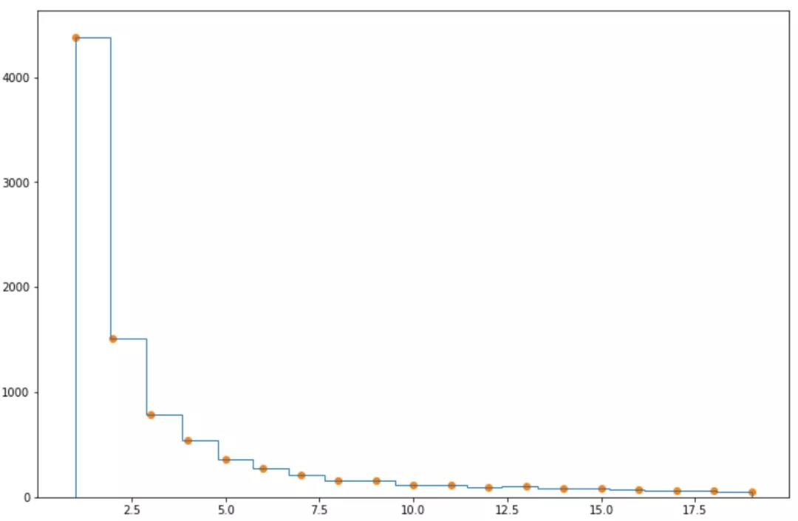

`histn`元祖表示个数和对应的被分割的区间，查看`histn[0]`:
```python
array([4383., 1507.,  787.,  541.,  356.,  279.,  209.,  163.,  158.,
        118.,  114.,   90.,  104.,   81.,   80.,   73.,   62.,   65.,
         52.])
```
```python
sum(histn[0]) # 9222
```
看到电影评论次数1到19次的喜剧电影9222部，共有10740部喜剧电影，大约`86%`的喜剧电影评论次数`小于20次`，有`1518`部电影评论数不小于20次。

我们肯定希望挑选出被评论次数尽可能多的电影，因为难免会有水军和滥竽充数等`异常评论`行为。那么，如何准确的量化最小抽样量呢？


#### 11 最小抽样量

根据统计学的知识，最小抽样量和Z值、样本方差和样本误差相关，下面给出具体的求解最小样本量的计算方法。

采用如下计算公式：

$$ n = \frac{Z^2\sigma^2}{E^2} $$


此处，$Z$ 值取为95%的置信度对应的Z值也就是1.96，样本误差取为均值的2.5%.

根据以上公式，编写下面代码：

```python
n3 = result.groupby('Movie ID').agg(['count','mean','std'])
n3r = n3[n3['Rating']['count']>=20]['Rating']
```
只计算影评超过20次，且满足最小样本量的电影。计算得到的`n3r`前5行：
```python
	count	mean	std
Movie ID			
417	22	8.500000	1.263027
12349	68	8.485294	1.227698
15324	20	8.350000	1.039990
15864	51	8.431373	1.374844
17925	44	8.636364	1.259216
```
进一步求出最小样本量：
```python
nmin = (1.96**2*n3r['std']**2) / ( (n3r['mean']*0.025)**2 )
```
`nmin`前5行：
```python
Movie ID
417         135.712480
12349       128.671290
15324        95.349276
15864       163.434005
17925       130.668350
```

筛选出满足最小抽样量的喜剧电影：

```python
n3s = n3r[ n3r['count'] >= nmin ]
```
结果显示如下，因此共有`173`部电影满足最小样本抽样量。

```python

count	mean	std
Movie ID			
53604	129	8.635659	1.230714
57012	207	8.449275	1.537899
70735	224	8.839286	1.190799
75686	209	8.095694	1.358885
88763	296	8.945946	1.026984
...	...	...	...
6320628	860	7.966279	1.469924
6412452	276	7.510870	1.389529
6662050	22	10.000000	0.000000
6966692	907	8.673649	1.286455
7131622	1102	7.851180	1.751500
173 rows × 3 columns
```

#### 12 去重和连表

按照平均得分从大到小排序：
```python
n3s_sort = n3s.sort_values(by='mean',ascending=False)
```
结果：
```python
	count	mean	std
Movie ID			
6662050	22	10.000000	0.000000
4921860	48	10.000000	0.000000
5262972	28	10.000000	0.000000
5512872	353	9.985836	0.266123
3863552	199	9.010050	1.163372
...	...	...	...
1291150	647	6.327666	1.785968
2557490	546	6.307692	1.858434
1478839	120	6.200000	0.728761
2177771	485	6.150515	1.523922
1951261	1091	6.083410	1.736127
173 rows × 3 columns
```
有一个细节容易忽视，因为上面连接的`ratings`表`Movie ID`会有重复，因为会有多个人评论同一部电影。所以再对`n3s_sort`去重：
```python
n3s_drops = n3s_sort.drop_duplicates(subset=['count'])
```
结果：
```python
	count	mean	std
Movie ID			
6662050	22	10.000000	0.000000
4921860	48	10.000000	0.000000
5262972	28	10.000000	0.000000
5512872	353	9.985836	0.266123
3863552	199	9.010050	1.163372
...	...	...	...
1291150	647	6.327666	1.785968
2557490	546	6.307692	1.858434
1478839	120	6.200000	0.728761
2177771	485	6.150515	1.523922
1951261	1091	6.083410	1.736127
157 rows × 3 columns
```

仅靠`Movie ID`还是不知道哪些电影，连接`movies`表：
```python
ms = movies.drop_duplicates(subset=['Movie ID'])
ms = ms.set_index('Movie ID')
n3s_final = n3s_drops.join(ms,on='Movie ID')
```

#### 13 结果分析

喜剧榜单前50名：
```python
Movie Title
Five Minutes (2017)
MSG 2 the Messenger (2015)
Avengers: Age of Ultron Parody (2015)
Be Somebody (2016)
Bajrangi Bhaijaan (2015)
Back to the Future (1985)
La vita 鐚?bella (1997)
The Intouchables (2011)
The Sting (1973)
Coco (2017)
Toy Story 3 (2010)
3 Idiots (2009)
Green Book (2018)
Dead Poets Society (1989)
The Apartment (1960)
P.K. (2014)
The Truman Show (1998)
Am鑼卨ie (2001)
Inside Out (2015)
Toy Story 4 (2019)
Toy Story (1995)
Finding Nemo (2003)
Dr. Strangelove or: How I Learned to Stop Worrying and Love the Bomb (1964)
Home Alone (1990)
Zootopia (2016)
Up (2009)
Monsters, Inc. (2001)
La La Land (2016)
Relatos salvajes (2014)
En man som heter Ove (2015)
Snatch (2000)
Lock, Stock and Two Smoking Barrels (1998)
How to Train Your Dragon 2 (2014)
As Good as It Gets (1997)
Guardians of the Galaxy (2014)
The Grand Budapest Hotel (2014)
Fantastic Mr. Fox (2009)
Silver Linings Playbook (2012)
Sing Street (2016)
Deadpool (2016)
Annie Hall (1977)
Pride (2014)
In Bruges (2008)
Big Hero 6 (2014)
Groundhog Day (1993)
The Breakfast Club (1985)
Little Miss Sunshine (2006)
Deadpool 2 (2018)
The Terminal (2004)
```

前10名评论数图：

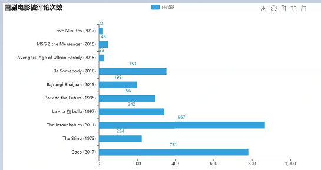

代码：
```python
x = n3s_final['Movie Title'][:10].tolist()[::-1]
y = n3s_final['count'][:10].tolist()[::-1]
bar = (
    Bar()
    .add_xaxis(x)
    .add_yaxis('评论数',y,category_gap='50%')
    .reversal_axis()
    .set_global_opts(title_opts=opts.TitleOpts(title="喜剧电影被评论次数"),
                    toolbox_opts=opts.ToolboxOpts(),)
)
grid = (
    Grid(init_opts=opts.InitOpts(theme=ThemeType.LIGHT))
    .add(bar, grid_opts=opts.GridOpts(pos_left="30%"))
)
grid.render_notebook()
```

前10名得分图：


代码：
```python
x = n3s_final['Movie Title'][:10].tolist()[::-1]
y = n3s_final['mean'][:10].round(3).tolist()[::-1]
bar = (
    Bar()
    .add_xaxis(x)
    .add_yaxis('平均得分',y,category_gap='50%')
    .reversal_axis()
    .set_global_opts(title_opts=opts.TitleOpts(title="喜剧电影平均得分"),
                    xaxis_opts=opts.AxisOpts(min_=8.0,name='平均得分'),
                    toolbox_opts=opts.ToolboxOpts(),)
)
grid = (
    Grid(init_opts=opts.InitOpts(theme=ThemeType.MACARONS))
    .add(bar, grid_opts=opts.GridOpts(pos_left="30%"))
)
grid.render_notebook()
```


#### 14 生成哑变量

分类变量的数值化，是指将枚举类变量转化为indicator变量或称dummy变量。

那么什么是`indicator变量`，看看如下例子，A变量解析为：`[1,0,0]`, B解析为：`[0,1,0]`, C解析为：`[0,0,1]`
```python
In [8]: s = pd.Series(list('ABCA'))
In [9]: pd.get_dummies(s)
Out[9]:
   A  B  C
0  1  0  0
1  0  1  0
2  0  0  1
3  1  0  0
```

如果输入的字符有4个唯一值，看到字符a被解析为[1,0,0,0]，向量长度为4.

```python
In [5]: s = pd.Series(list('abaccd'))
In [6]: pd.get_dummies(s)
Out[6]:
   a  b  c  d
0  1  0  0  0
1  0  1  0  0
2  1  0  0  0
3  0  0  1  0
4  0  0  1  0
5  0  0  0  1
```

也就是说dummy向量的长度等于输入字符串中，唯一字符的个数。

#### 15 讨厌的SettingWithCopyWarning！！！

Pandas 处理数据，太好用了，谁用谁知道！

使用过 Pandas 的，几乎都会遇到一个警告：

*SettingWithCopyWarning*

非常烦人！

尤其是刚接触 Pandas 的，完全不理解为什么弹出这么一串：

```python
d:\source\test\settingwithcopy.py:9: SettingWithCopyWarning:
A value is trying to be set on a copy of a slice from a DataFrame.
Try using .loc[row_indexer,col_indexer] = value instead

See the caveats in the documentation: http://pandas.pydata.org/pandas-docs/stable/user_guide/indexing.html#returning-a-view-versus-a-copy 
```

归根结底，是因为代码中出现`链式操作`...

有人就问了，什么是`链式操作`?

这样的：

```python
tmp = df[df.a<4]
tmp['c'] = 200
```

先记住这个最典型的情况，即可！

有的人就问了：出现这个 Warning, 需要理会它吗？ 

如果结果不对，当然要理会；如果结果对，不care.

举个例子~~

```python
import pandas as  pd

df = pd.DataFrame({'a':[1,3,5],'b':[4,2,7]},index=['a','b','c'])
df.loc[df.a<4,'c'] = 100
print(df)
print('it\'s ok')

tmp = df[df.a<4]
tmp['c'] = 200
print('-----tmp------')
print(tmp)
print('-----df-------')
print(df)
```

输出结果：
```python
   a  b      c
a  1  4  100.0
b  3  2  100.0
c  5  7    NaN
it's ok
d:\source\test\settingwithcopy.py:9: SettingWithCopyWarning:
A value is trying to be set on a copy of a slice from a DataFrame.
Try using .loc[row_indexer,col_indexer] = value instead

See the caveats in the documentation: http://pandas.pydata.org/pandas-docs/stable/user_guide/indexing.html#returning-a-view-versus-a-copy     
  tmp['c'] = 200
-----tmp------
   a  b    c
a  1  4  200
b  3  2  200
-----df-------
   a  b      c
a  1  4  100.0
b  3  2  100.0
c  5  7    NaN
```

it's ok 行后面的发生链式赋值，导致结果错误。因为 tmp 变了，df 没赋上值啊，所以必须理会。

it's ok 行前的是正解。

以上，链式操作尽量避免，如何避免？多使用 `.loc[row_indexer,col_indexer]`，提示告诉我们的~

#### 16 NumPy 数据归一化、分布可视化

仅使用 `NumPy`，下载数据，归一化，使用 `seaborn` 展示数据分布。

**下载数据**

```python
import numpy as np

url = 'https://archive.ics.uci.edu/ml/machine-learning-databases/iris/iris.data'
wid = np.genfromtxt(url, delimiter=',', dtype='float', usecols=[1])
```
仅提取 `iris` 数据集的第二列 `usecols = [1]`

**展示数据**

```python
array([3.5, 3. , 3.2, 3.1, 3.6, 3.9, 3.4, 3.4, 2.9, 3.1, 3.7, 3.4, 3. ,
       3. , 4. , 4.4, 3.9, 3.5, 3.8, 3.8, 3.4, 3.7, 3.6, 3.3, 3.4, 3. ,
       3.4, 3.5, 3.4, 3.2, 3.1, 3.4, 4.1, 4.2, 3.1, 3.2, 3.5, 3.1, 3. ,
       3.4, 3.5, 2.3, 3.2, 3.5, 3.8, 3. , 3.8, 3.2, 3.7, 3.3, 3.2, 3.2,
       3.1, 2.3, 2.8, 2.8, 3.3, 2.4, 2.9, 2.7, 2. , 3. , 2.2, 2.9, 2.9,
       3.1, 3. , 2.7, 2.2, 2.5, 3.2, 2.8, 2.5, 2.8, 2.9, 3. , 2.8, 3. ,
       2.9, 2.6, 2.4, 2.4, 2.7, 2.7, 3. , 3.4, 3.1, 2.3, 3. , 2.5, 2.6,
       3. , 2.6, 2.3, 2.7, 3. , 2.9, 2.9, 2.5, 2.8, 3.3, 2.7, 3. , 2.9,
       3. , 3. , 2.5, 2.9, 2.5, 3.6, 3.2, 2.7, 3. , 2.5, 2.8, 3.2, 3. ,
       3.8, 2.6, 2.2, 3.2, 2.8, 2.8, 2.7, 3.3, 3.2, 2.8, 3. , 2.8, 3. ,
       2.8, 3.8, 2.8, 2.8, 2.6, 3. , 3.4, 3.1, 3. , 3.1, 3.1, 3.1, 2.7,
       3.2, 3.3, 3. , 2.5, 3. , 3.4, 3. ])
      
```

这是单变量(univariate)长度为 150 的一维 NumPy 数组。

**归一化**

求出最大值、最小值
```python
smax = np.max(wid)
smin = np.min(wid)

In [51]: smax,smin
Out[51]: (4.4, 2.0)
````
归一化公式：
```python
s = (wid - smin) / (smax - smin)
```
只打印小数点后三位设置：
```python
np.set_printoptions(precision=3)  
```

归一化结果：
```markdown
array([0.625, 0.417, 0.5  , 0.458, 0.667, 0.792, 0.583, 0.583, 0.375,
       0.458, 0.708, 0.583, 0.417, 0.417, 0.833, 1.   , 0.792, 0.625,
       0.75 , 0.75 , 0.583, 0.708, 0.667, 0.542, 0.583, 0.417, 0.583,
       0.625, 0.583, 0.5  , 0.458, 0.583, 0.875, 0.917, 0.458, 0.5  ,
       0.625, 0.458, 0.417, 0.583, 0.625, 0.125, 0.5  , 0.625, 0.75 ,
       0.417, 0.75 , 0.5  , 0.708, 0.542, 0.5  , 0.5  , 0.458, 0.125,
       0.333, 0.333, 0.542, 0.167, 0.375, 0.292, 0.   , 0.417, 0.083,
       0.375, 0.375, 0.458, 0.417, 0.292, 0.083, 0.208, 0.5  , 0.333,
       0.208, 0.333, 0.375, 0.417, 0.333, 0.417, 0.375, 0.25 , 0.167,
       0.167, 0.292, 0.292, 0.417, 0.583, 0.458, 0.125, 0.417, 0.208,
       0.25 , 0.417, 0.25 , 0.125, 0.292, 0.417, 0.375, 0.375, 0.208,
       0.333, 0.542, 0.292, 0.417, 0.375, 0.417, 0.417, 0.208, 0.375,
       0.208, 0.667, 0.5  , 0.292, 0.417, 0.208, 0.333, 0.5  , 0.417,
       0.75 , 0.25 , 0.083, 0.5  , 0.333, 0.333, 0.292, 0.542, 0.5  ,
       0.333, 0.417, 0.333, 0.417, 0.333, 0.75 , 0.333, 0.333, 0.25 ,
       0.417, 0.583, 0.458, 0.417, 0.458, 0.458, 0.458, 0.292, 0.5  ,
       0.542, 0.417, 0.208, 0.417, 0.583, 0.417])
```

**分布可视化**

```python
import seaborn as sns
sns.distplot(s,kde=False,rug=True)
```
频率分布直方图：


```python
sns.distplot(s,hist=True,kde=True,rug=True)
```
带高斯密度核函数的直方图：


**分布 fit 图**

拿 `gamma` 分布去 fit ：
```python
from scipy import stats
sns.distplot(s, kde=False, fit = stats.gamma)
```


拿双 `gamma` 去 fit：
```python
from scipy import stats
sns.distplot(s, kde=False, fit = stats.dgamma)
```


### 十一、一步一步掌握Flask web开发


#### 1 Flask版 hello world

Flask是Python轻量级web框架，容易上手，被广大Python开发者所喜爱。

今天我们先从hello world开始，一步一步掌握Flask web开发。例子君是Flask框架的小白，接下来与读者朋友们，一起学习这个对我而言的新框架，大家多多指导。

首先`pip install Flask`,安装Flask，然后import Flask，同时创建一个 `app`
```python
from flask import Flask

App = Flask(__name__)
```

写一个index页的入口函数，返回hello world.

通过装饰器：App.route('/')创建index页的路由或地址，一个`/`表示index页，也就是主页。

```python
@App.route('/')
def index():
    return "hello world"
```

调用 `index`函数:
```python
if __name__ == "__main__":
    App.run(debug=True)
```

然后启动，会在console下看到如下启动信息，表明`服务启动成功`。
```python
* Debug mode: on
 * Restarting with stat
 * Debugger is active!
 * Debugger PIN: 663-788-611
 * Running on http://127.0.0.1:5000/ (Press CTRL+C to quit)
```

 接下来，打开一个网页，相当于启动客户端，并在Url栏中输入：`http://127.0.0.1:5000/`，看到页面上答应出`hello world`，证明服务访问成功。

 同时在服务端后台看到如下信息，表示处理一次来自客户端的`get`请求。
 ```python
 27.0.0.1 - - [03/Feb/2020 21:26:50] "GET / HTTP/1.1" 200 -
 ```

 以上就是flask的hello world 版

#### 2 Flask之数据入库操作

数据持久化就是将数据写入到数据库存储的过程。

本例子使用`sqlite3`数据库。

1)导入`sqlite3`，未安装前使用命令`pip install sqlite3`

创建一个`py`文件：`sqlite3_started.py`，并写下第一行代码：
```python
import sqlite3
```
2)手动创建一个数据库实例`db`, 命名`test.db`

3)创建与数据库实例`test.db`的连接:
```python
conn = sqlite3.connect("test.db")
```

4)拿到连接`conn`的cursor
```python
c = conn.cursor()
```

5)创建第一张表`books`

共有四个字段：`id`,`sort`,`name`,`price`，类型分别为：`int`,`int`,`text`,`real`. 其中`id`为`primary key`. 主键的取值必须是唯一的(`unique`)，否则会报错。


```python
c.execute('''CREATE TABLE books
      (id int primary key,
       sort int,
       name text,
       price real)''')
```
第一次执行上面语句，表`books`创建完成。当再次执行时，就会报`重复建表`的错误。需要优化脚本，检查表是否存在`IF NOT EXISTS books`，不存在再创建：
```python
c.execute('''CREATE TABLE IF NOT EXISTS books
      (id int primary key,
       sort int,
       name text,
       price real)''')
```

6)插入一行记录

共为4个字段赋值

```python
c.execute('''INSERT INTO books VALUES
       (1, 
       1, 
       'computer science',
       39.0)''')
```

7)一次插入多行记录

先创建一个list:`books`，使用`executemany`一次插入多行。
```python
books = [(2, 2, 'Cook book', 68),
         (3, 2, 'Python intro', 89),
         (4, 3, 'machine learning', 59),
         ]


c.executemany('INSERT INTO books VALUES (?, ?, ?, ?)', books)
```

8)提交

提交后才会真正生效，写入到数据库

```python
conn.commit()
```

9)关闭期初建立的连接conn

务必记住手动关闭，否则会出现内存泄漏
```python
conn.close()
print('Done')
```

10)查看结果
例子君使用`vs code`，在扩展库中选择：`SQLite`安装。


新建一个`sq`文件：`a.sql`，内容如下：

```sql
SELECT * from books 
```
右键`run query`，得到表`books`插入的4行记录可视化图：

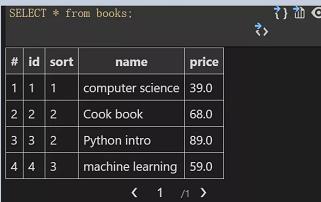

以上十步就是sqlite3写入数据库的主要步骤，作为Flask系列的第二篇，为后面的前端讲解打下基础。

#### 3 Flask各层调用关系

这篇介绍Flask和B/S模式，即浏览器/服务器模式，是接下来快速理解Flask代码的关键理论篇：**理解Views、models和渲染模板层的调用关系**。

1) 发出请求

当我们在浏览器地址栏中输入某个地址，按回车后，完成第一步。

2) 视图层 views接收1)步发出的请求，Flask中使用解释器的方式处理这个求情，实例代码如下，它通常涉及到调用models层和模板文件层

```python
@main_blue.route('/', methods=['GET', 'POST'])
def index():
    form = TestForm()
    print('test')
```

3) models层会负责创建数据模型，执行CRUD操作

4) 模板文件层处理html模板

5) 组合后返回html

6) models层和html模板组合后返回给views层

7）最后views层响应并渲染到浏览器页面，我们就能看到请求的页面。

完整过程图如下所示：

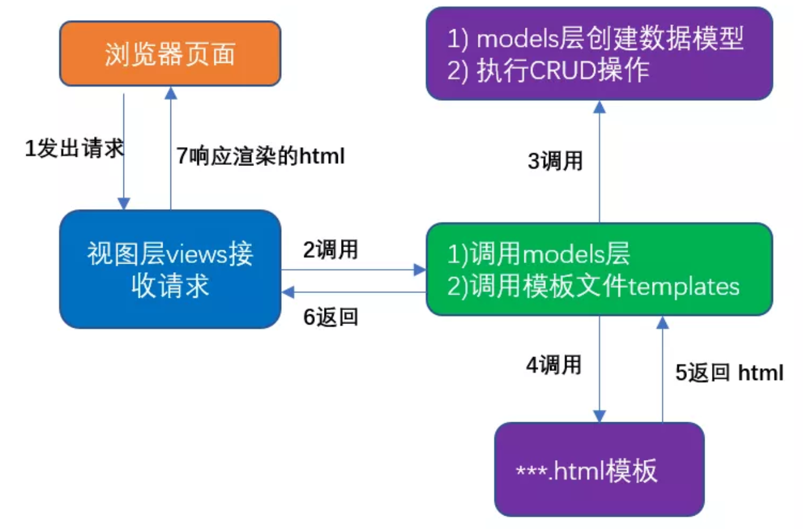

读者朋友们，如果你和例子君一样都是初学Flask编程，需要好好理解上面的过程。理解这些对于接下来的编程会有一定的理论指导，方向性指导价值。


#### 4 Flask之表单操作

**1 开篇**

先说一些关于Flask的基本知识，现在不熟悉它们，并不会影响对本篇的理解和掌握。

Flask是一个基于Python开发，依赖`jinja2`模板和`Werkzeug` WSGI服务的一个微型框架。

`Werkzeug`用来处理Socket服务，其在Flask中被用于接受和处理http请求；`Jinja2`被用来对模板进行处理，将`模板`和`数据`进行渲染，返回给用户的浏览器。

这到这些，对于理解后面调试出现的两个问题会有帮助，不过不熟悉仍然没有关系。

**2 基本表单**

首先导入所需模块：

```python
from wtforms import StringField,PasswordField, BooleanField, SubmitField
from flask_wtf import FlaskForm
```

`wtforms`和`flask_wtf`是flask创建web表单类常用的包。

具体创建表单类的方法如下，登入表单`LoginForm`继承自`FlaskForm`.

分别创建`StringFiled`实例用户名输入框`user_name`，密码框`password`，勾选框`remember_me`和提交按钮`submit`.

```python
class LoginForm(FlaskForm):
    user_name = StringField()
    password = PasswordField()
    remember_me = BooleanField(label='记住我')
    submit = SubmitField('Submit')
```

至此表单类对象创建完毕

**3 html模板**

使用`Bootstrap`. 它是由Twitter推出的一个用于前端开发的开源工具包，给予HTML、CSS、JavaScriot，提供简洁、直观、强悍的前端开发框架，是目前最受环境的前端框架。

`flak_bootstrap`提供使用的接口。方法如下，首先`pip install bootstrap`，然后创建一个实例`bootstrap`.

```python
from flask_bootstrap import Bootstrap
bootstrap = Bootstrap()
```

然后创建`index.html`文件，第一行导入创建的Bootstrap实例`bootstrap`：

```python

```

再创建第2节中创建的`LoginForm`实例`form`，调用渲染模板方法，参数`form`赋值为实例`form`:

```python
from flask import render_template
form = LoginForm()
render_template('index.html', form=form)
```

再在index.html输入以下代码，`{{ wtf.quick_form(form) }}`将实例`form`渲染到html页面中。

```python
<div class="container">
    <h3>系统登入</h3>
    <div class="col-md-4">
        {{ wtf.quick_form(form) }}
    </div>
</div>
```

**4 index页面路由**

`flask_wtf`创建的form，封装方法`validate_on_submit`，具有表单验证功能。

```python
@app.route('/', methods=['GET', 'POST'])
def index():
    form = LoginForm()
    if form.validate_on_submit():
        print(form.data['user_name'])
        return redirect(url_for('print_success'))

    return render_template('index.html', form=form)
```

验证通过跳转到`print_success`方法终端点：

```python
@app.route('/success')
def print_success():
    return"表单验证通过"
```

**5 完整代码**

共有两个文件：一个py，一个html:

```python
from flask import Flask
from flask import render_template, redirect, url_for
from wtforms import StringField,PasswordField, BooleanField, SubmitField
from flask_wtf import FlaskForm
from flask_bootstrap import Bootstrap

bootstrap = Bootstrap()

app = Flask(__name__)
app.config['SECRET_KEY']  = "hard_to_guess_secret_key$$#@"

bootstrap.init_app(app)

@app.route('/', methods=['GET', 'POST'])
def index():
    form = LoginForm()
    if form.validate_on_submit():
        print(form.data['user_name'])
        return redirect(url_for('print_success'))

    return render_template('index.html', form=form)

@app.route('/success')
def print_success():
    return"表单验证通过"


class LoginForm(FlaskForm):
    user_name = StringField()
    password = PasswordField()
    remember_me = BooleanField(label='记住我')
    submit = SubmitField('Submit')

if __name__ == "__main__":
    app.run(debug=True)
```

html代码：

```python

<div class="container">
    <h3>系统登入</h3>
    <div class="col-md-4">
        {{ wtf.quick_form(form) }}
    </div>
</div>
```

启动后，控制台显示如下：


然后网页中输入127.0.0.1:5000,网页显示：


**6 两个错误**

例子君也是Flask新手，在调试过程中，遇到下面两个错误。

**1) CSRF需要配置密码**


遇到这个错误，解决的方法就是配置一个密码。具体对应到第5节完整代码部分中的此行：

```
app.config['SECRET_KEY']  = "hard_to_guess_secret_key$$#@"
```

**2) index.html未找到异常**


出现这个错误的原因不是因为index.html的物理路径有问题，而是我们需要创建一个文件夹并命名为：`templates`，然后把index.html移动到此文件夹下。

#### 5 Flask之Pyecharts绘图

Flask系列已推送4篇，今天结合Flask和Pyecharts，做出一些好玩的东西。

首先，参考官方文档导入所需包：

```python
from flask import Flask
from jinja2 import Markup, Environment, FileSystemLoader
from pyecharts.globals import CurrentConfig
```

配置环境，下面这行代码，告诉`jinja2`我的html模板位于哪个文件目录：

```
# 关于 CurrentConfig，可参考 [基本使用-全局变量]
CurrentConfig.GLOBAL_ENV = Environment(loader=FileSystemLoader("./templates"))
```

如果此处配置的有问题，会弹出下面的异常：

```
jinja2.exceptions.TemplateNotFound: index.html
```

下面两行代码是Flask的常规操作：

```python
app = Flask(__name__, static_folder="templates")
app.config['SECRET_KEY']  = "hard_to_guess_secret_key$$#@"
```

下面该pyecharts登台，还是一顿导包：
```python
from pyecharts.charts import Bar
from pyecharts.faker import Faker
import pyecharts.options as opts
from pyecharts.commons.utils import JsCode
from pyecharts.globals import ThemeType
```

创建一个基本的柱状图：
```python
def bar():
    c = (
        Bar(init_opts=opts.InitOpts(
            animation_opts=opts.AnimationOpts(
                animation_delay=500, animation_easing="cubicOut"
            ),
            theme=ThemeType.MACARONS))
        .add_xaxis(["草莓", "芒果", "葡萄", "雪梨", "西瓜", "柠檬", "车厘子"])
        .add_yaxis("销售量", Faker.values(), category_gap="50%", is_selected=True)
        .set_global_opts(title_opts=opts.TitleOpts(title="Bar-基本参数使用"), toolbox_opts=opts.ToolboxOpts(), datazoom_opts=opts.DataZoomOpts(),)

    )

    return c
```

下面是最重要的部分。pyecharts柱状图和flask的网页组装阶段。

```python
@app.route("/")
def index():
    c = bar()
    return c.render_embed(template_name='index.html')
```
组装的代码相当简单，普通的pyecharts渲染使用`c.render(filename.html)`, 而嵌入到指定网页`index.html`中，使用API:`render_embed`.

具体index.html上如何布局显示，就要写点html代码：
```html


<!DOCTYPE html>
<html>
<head>
    <meta charset="UTF-8">
    <title>{{ chart.page_title }}</title>
    {{ macro.render_chart_dependencies(chart) }}
</head>
<body>
    {{ macro.render_chart_content(chart) }}
</body>
</html>
```
为了让html代码尽可能的复用，Pyecharts开发团队太有心，专门抽象出一个宏文件`macro`. 这部分代码大家就不用修改了，直接copy即可。

为了保证本篇代码可复现，paster这个文件到这里：
```html

    <div id="{{ c.chart_id }}" class="chart-container" style="width:{{ c.width }}; height:{{ c.height }};"></div>
    <script>
        var chart_{{ c.chart_id }} = echarts.init(
            document.getElementById('{{ c.chart_id }}'), '{{ c.theme }}', {renderer: '{{ c.renderer }}'});
        
            {{ js }}
        
        var option_{{ c.chart_id }} = {{ c.json_contents }};
        chart_{{ c.chart_id }}.setOption(option_{{ c.chart_id }});
        
            var bmap = chart_{{ c.chart_id }}.getModel().getComponent('bmap').getBMap();
            
                
                    {{ fn }}
                
            
        
    </script>



    <script>
        require([{{ libraries | join(', ') }}], function(echarts) {
        
            
                var chart_{{ c.chart_id }} = echarts.init(
                    document.getElementById('{{ c.chart_id }}'), '{{ c.theme }}', {renderer: '{{ c.renderer }}'});
                
                    {{ js }}
                
                var option_{{ c.chart_id }} = {{ c.json_contents }};
                chart_{{ c.chart_id }}.setOption(option_{{ c.chart_id }});
                
                    var bmap = chart_{{ c.chart_id }}.getModel().getComponent('bmap').getBMap();
                    bmap.addControl(new BMap.MapTypeControl());
                
            
        
        });
    </script>



    
        <script type="text/javascript" src="{{ dep }}"></script>
    



    
        <link rel="stylesheet"  href="{{ dep }}">
    



    <div class="tab">
        
            <button class="tablinks" onclick="showChart(event, '{{ c.chart_id }}')">{{ c.tab_name }}</button>
        
    </div>



    <script>
        (function() {
            containers = document.getElementsByClassName("chart-container");
            if(containers.length > 0) {
                containers[0].style.display = "block";
            }
        })()

        function showChart(evt, chartID) {
            let containers = document.getElementsByClassName("chart-container");
            for (let i = 0; i < containers.length; i++) {
                containers[i].style.display = "none";
            }

            let tablinks = document.getElementsByClassName("tablinks");
            for (let i = 0; i < tablinks.length; i++) {
                tablinks[i].className = "tablinks";
            }

            document.getElementById(chartID).style.display = "block";
            evt.currentTarget.className += " active";
        }
    </script>



    <style>
        .tab {
            overflow: hidden;
            border: 1px solid #ccc;
            background-color: #f1f1f1;
        }

        .tab button {
            background-color: inherit;
            float: left;
            border: none;
            outline: none;
            cursor: pointer;
            padding: 12px 16px;
            transition: 0.3s;
        }

        .tab button:hover {
            background-color: #ddd;
        }

        .tab button.active {
            background-color: #ccc;
        }

        .chart-container {
            display: none;
            padding: 6px 12px;
            border-top: none;
        }
    </style>



    
        <style>
            .fl-table {
                margin: 20px;
                border-radius: 5px;
                font-size: 12px;
                border: none;
                border-collapse: collapse;
                max-width: 100%;
                white-space: nowrap;
                word-break: keep-all;
            }

            .fl-table th {
                text-align: left;
                font-size: 20px;
            }

            .fl-table tr {
                display: table-row;
                vertical-align: inherit;
                border-color: inherit;
            }

            .fl-table tr:hover td {
                background: #00d1b2;
                color: #F8F8F8;
            }

            .fl-table td, .fl-table th {
                border-style: none;
                border-top: 1px solid #dbdbdb;
                border-left: 1px solid #dbdbdb;
                border-bottom: 3px solid #dbdbdb;
                border-right: 1px solid #dbdbdb;
                padding: .5em .55em;
                font-size: 15px;
            }

            .fl-table td {
                border-style: none;
                font-size: 15px;
                vertical-align: center;
                border-bottom: 1px solid #dbdbdb;
                border-left: 1px solid #dbdbdb;
                border-right: 1px solid #dbdbdb;
                height: 30px;
            }

            .fl-table tr:nth-child(even) {
                background: #F8F8F8;
            }
        </style>
        <div id="{{ chart.chart_id }}" class="chart-container" style="">
            <p class="title" {{ chart.title_opts.title_style }}> {{ chart.title_opts.title }}</p>
            <p class="subtitle" {{ chart.title_opts.subtitle_style }}> {{ chart.title_opts.subtitle }}</p>
            {{ chart.html_content }}
        </div>
    
        <div id="{{ chart.chart_id }}" class="chart-container" style="">
            <p class="title" {{ chart.title_opts.title_style }}> {{ chart.title_opts.title }}</p>
            <p class="subtitle" {{ chart.title_opts.subtitle_style }}> {{ chart.title_opts.subtitle }}</p>
            
        </div>
    


```

记得最后把这个文件名称为`macro`和`index.html`文件都统一放到`templates`文件夹下。

这样就可以调试了：
```python
if __name__ == "__main__":
    app.run(debug=True)
```


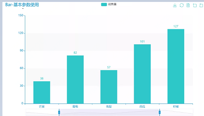

**附加**

再写一个展示页面，路由为`/bar2`:
```python
@app.route("/bar2")
def bar2():
    c = bar_border_radius()
    return c.render_embed(template_name='index.html')
```

函数bar_border_radius定义如下：
```python
def bar_border_radius():
    c = (
        Bar(init_opts=opts.InitOpts(
            animation_opts=opts.AnimationOpts(
                animation_delay=500, animation_easing="cubicOut"
            ),
            theme=ThemeType.MACARONS))
        .add_xaxis(["草莓", "芒果", "葡萄", "雪梨", "西瓜", "柠檬", "车厘子"])
        .add_yaxis("销售量", Faker.values(), category_gap="50%", is_selected=True)
        .set_series_opts(itemstyle_opts={
            "normal": {
                "color": JsCode("""new echarts.graphic.LinearGradient(0, 0, 0, 1, [{
                    offset: 0,
                    color: 'rgba(0, 244, 255, 1)'
                }, {
                    offset: 1,
                    color: 'rgba(0, 77, 167, 1)'
                }], false)"""),
                "barBorderRadius": [6, 6, 6, 6],
                "shadowColor": 'rgb(0, 160, 221)',
            }}, markpoint_opts=opts.MarkPointOpts(
                data=[
                    opts.MarkPointItem(type_="max", name="最大值"),
                    opts.MarkPointItem(type_="min", name="最小值"),
                ]
        ), markline_opts=opts.MarkLineOpts(
                data=[
                    opts.MarkLineItem(type_="min", name="最小值"),
                    opts.MarkLineItem(type_="max", name="最大值")
                ]
        ))
        .set_global_opts(title_opts=opts.TitleOpts(title="Bar-参数使用例子"), toolbox_opts=opts.ToolboxOpts(), yaxis_opts=opts.AxisOpts(position="right", name="Y轴"), datazoom_opts=opts.DataZoomOpts(),)

    )

    return c
```

这样又出现一个页面，演示如下：

