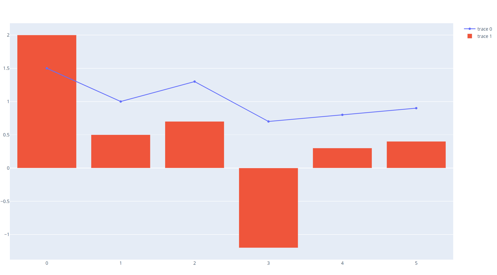

🚀 🚀 告别枯燥，60 秒学会一个 Python 小例子 🔥🔥  

是的，60 秒学会一个 Python 小例子 🔥🔥

当前库已有🍎🍎 **223** 🍎🍎个实用的小例子 

下载本库所有例子 **PDF** 版本，请关注 《Python小例子》官方公众号后回复 **mypy** 🍏 🍏 


如果转载本库小例子，请附上例子来源，链接：https://github.com/jackzhenguo/python-small-examples

### 五、Python绘图

Python常用的绘图工具包括：`matplotlib`, `seaborn`, `plotly`等，以及一些其他专用于绘制某类图如词云图等的包，描绘绘图轨迹的`turtle`包等。本章节将会使用一些例子由易到难的阐述绘图的经典小例子，目前共收录`27`个。

#### 157 turtle绘制奥运五环图

turtle绘图的函数非常好用，基本看到函数名字，就能知道它的含义，下面使用turtle，仅用15行代码来绘制奥运五环图。

1 导入库

```python
import turtle as p
```

2 定义画圆函数

```python
def drawCircle(x,y,c='red'):
    p.pu()# 抬起画笔
    p.goto(x,y) # 绘制圆的起始位置
    p.pd()# 放下画笔
    p.color(c)# 绘制c色圆环
    p.circle(30,360) #绘制圆：半径，角度
```

3 画笔基本设置

```python
p = turtle
p.pensize(3) # 画笔尺寸设置3
```

4 绘制五环图

调用画圆函数

```python
drawCircle(0,0,'blue')
drawCircle(60,0,'black')
drawCircle(120,0,'red')
drawCircle(90,-30,'green')
drawCircle(30,-30,'yellow')    

p.done()
```

结果：


#### 158 turtle绘制漫天雪花


导入模块

导入 `turtle`库和 python的 `random`

```python
import turtle as p
import random
```

绘制雪花

```python
def snow(snow_count):
    p.hideturtle()
    p.speed(500)
    p.pensize(2)
    for i in range(snow_count):
        r = random.random()
        g = random.random()
        b = random.random()
        p.pencolor(r, g, b)
        p.pu()
        p.goto(random.randint(-350, 350), random.randint(1, 270))
        p.pd()
        dens = random.randint(8, 12)
        snowsize = random.randint(10, 14)
        for _ in range(dens):
            p.forward(snowsize)  # 向当前画笔方向移动snowsize像素长度
            p.backward(snowsize)  # 向当前画笔相反方向移动snowsize像素长度
            p.right(360 / dens)  # 顺时针移动360 / dens度

```

绘制地面

```python
def ground(ground_line_count):
    p.hideturtle()
    p.speed(500)
    for i in range(ground_line_count):
        p.pensize(random.randint(5, 10))
        x = random.randint(-400, 350)
        y = random.randint(-280, -1)
        r = -y / 280
        g = -y / 280
        b = -y / 280
        p.pencolor(r, g, b)
        p.penup()  # 抬起画笔
        p.goto(x, y)  # 让画笔移动到此位置
        p.pendown()  # 放下画笔
        p.forward(random.randint(40, 100))  # 眼当前画笔方向向前移动40~100距离

```

主函数

```python
def main():
    p.setup(800, 600, 0, 0)
    # p.tracer(False)
    p.bgcolor("black")
    snow(30)
    ground(30)
    # p.tracer(True)
    p.mainloop()

main()

```


动态图结果展示：


#### 159 wordcloud词云图


```python
import hashlib
import pandas as pd
from wordcloud import WordCloud
geo_data=pd.read_excel(r"../data/geo_data.xlsx")
print(geo_data)
# 0     深圳
# 1     深圳
# 2     深圳
# 3     深圳
# 4     深圳
# 5     深圳
# 6     深圳
# 7     广州
# 8     广州
# 9     广州

words = ','.join(x for x in geo_data['city'] if x != []) #筛选出非空列表值
wc = WordCloud(
    background_color="green", #背景颜色"green"绿色
    max_words=100, #显示最大词数
    font_path='./fonts/simhei.ttf', #显示中文
    min_font_size=5,
    max_font_size=100,
    width=500  #图幅宽度
    )
x = wc.generate(words)
x.to_file('../data/geo_data.png')
```


#### 160 plotly画柱状图和折线图


```python
#柱状图+折线图
import plotly.graph_objects as go
fig = go.Figure()
fig.add_trace(
    go.Scatter(
        x=[0, 1, 2, 3, 4, 5],
        y=[1.5, 1, 1.3, 0.7, 0.8, 0.9]
    ))
fig.add_trace(
    go.Bar(
        x=[0, 1, 2, 3, 4, 5],
        y=[2, 0.5, 0.7, -1.2, 0.3, 0.4]
    ))
fig.show()
```




#### 161 seaborn热力图

```python
# 导入库
import seaborn as sns
import pandas as pd
import numpy as np
import matplotlib.pyplot as plt

# 生成数据集
data = np.random.random((6,6))
np.fill_diagonal(data,np.ones(6))
features = ["prop1","prop2","prop3","prop4","prop5", "prop6"]
data = pd.DataFrame(data, index = features, columns=features)
print(data)
# 绘制热力图
heatmap_plot = sns.heatmap(data, center=0, cmap='gist_rainbow')
plt.show()
```


#### 162 matplotlib折线图

模块名称：example_utils.py，里面包括三个函数，各自功能如下：

```python
import matplotlib.pyplot as plt

# 创建画图fig和axes
def setup_axes():
    fig, axes = plt.subplots(ncols=3, figsize=(6.5,3))
    for ax in fig.axes:
        ax.set(xticks=[], yticks=[])
    fig.subplots_adjust(wspace=0, left=0, right=0.93)
    return fig, axes
# 图片标题
def title(fig, text, y=0.9):
    fig.suptitle(text, size=14, y=y, weight='semibold', x=0.98, ha='right',
                 bbox=dict(boxstyle='round', fc='floralwhite', ec='#8B7E66',
                           lw=2))
# 为数据添加文本注释
def label(ax, text, y=0):
    ax.annotate(text, xy=(0.5, 0.00), xycoords='axes fraction', ha='center',
                style='italic',
                bbox=dict(boxstyle='round', facecolor='floralwhite',
                          ec='#8B7E66'))

```


```python
import numpy as np
import matplotlib.pyplot as plt

import example_utils

x = np.linspace(0, 10, 100)

fig, axes = example_utils.setup_axes()
for ax in axes:
    ax.margins(y=0.10)

# 子图1 默认plot多条线，颜色系统分配
for i in range(1, 6):
    axes[0].plot(x, i * x)

# 子图2 展示线的不同linestyle
for i, ls in enumerate(['-', '--', ':', '-.']):
    axes[1].plot(x, np.cos(x) + i, linestyle=ls)

# 子图3 展示线的不同linestyle和marker
for i, (ls, mk) in enumerate(zip(['', '-', ':'], ['o', '^', 's'])):
    axes[2].plot(x, np.cos(x) + i * x, linestyle=ls, marker=mk, markevery=10)

# 设置标题
# example_utils.title(fig, '"ax.plot(x, y, ...)": Lines and/or markers', y=0.95)
# 保存图片
fig.savefig('plot_example.png', facecolor='none')
# 展示图片
plt.show()
```

#### 163 matplotlib散点图


对应代码：

```python
"""
散点图的基本用法
"""
import numpy as np
import matplotlib.pyplot as plt

import example_utils

# 随机生成数据
np.random.seed(1874)
x, y, z = np.random.normal(0, 1, (3, 100))
t = np.arctan2(y, x)
size = 50 * np.cos(2 * t)**2 + 10

fig, axes = example_utils.setup_axes()

# 子图1
axes[0].scatter(x, y, marker='o',  color='darkblue', facecolor='white', s=80)
example_utils.label(axes[0], 'scatter(x, y)')

# 子图2
axes[1].scatter(x, y, marker='s', color='darkblue', s=size)
example_utils.label(axes[1], 'scatter(x, y, s)')

# 子图3
axes[2].scatter(x, y, s=size, c=z,  cmap='gist_ncar')
example_utils.label(axes[2], 'scatter(x, y, s, c)')

# example_utils.title(fig, '"ax.scatter(...)": Colored/scaled markers',
#                     y=0.95)
fig.savefig('scatter_example.png', facecolor='none')

plt.show()

```

#### 164 matplotlib柱状图


对应代码：

```python
import numpy as np
import matplotlib.pyplot as plt

import example_utils


def main():
    fig, axes = example_utils.setup_axes()

    basic_bar(axes[0])
    tornado(axes[1])
    general(axes[2])

    # example_utils.title(fig, '"ax.bar(...)": Plot rectangles')
    fig.savefig('bar_example.png', facecolor='none')
    plt.show()

# 子图1
def basic_bar(ax):
    y = [1, 3, 4, 5.5, 3, 2]
    err = [0.2, 1, 2.5, 1, 1, 0.5]
    x = np.arange(len(y))
    ax.bar(x, y, yerr=err, color='lightblue', ecolor='black')
    ax.margins(0.05)
    ax.set_ylim(bottom=0)
    example_utils.label(ax, 'bar(x, y, yerr=e)')

# 子图2
def tornado(ax):
    y = np.arange(8)
    x1 = y + np.random.random(8) + 1
    x2 = y + 3 * np.random.random(8) + 1
    ax.barh(y, x1, color='lightblue')
    ax.barh(y, -x2, color='salmon')
    ax.margins(0.15)
    example_utils.label(ax, 'barh(x, y)')

# 子图3
def general(ax):
    num = 10
    left = np.random.randint(0, 10, num)
    bottom = np.random.randint(0, 10, num)
    width = np.random.random(num) + 0.5
    height = np.random.random(num) + 0.5
    ax.bar(left, height, width, bottom, color='salmon')
    ax.margins(0.15)
    example_utils.label(ax, 'bar(l, h, w, b)')


main()
```

#### 165 matplotlib等高线图


对应代码：

```python
import matplotlib.pyplot as plt
import numpy as np
from matplotlib.cbook import get_sample_data

import example_utils

z = np.load(get_sample_data('bivariate_normal.npy'))

fig, axes = example_utils.setup_axes()

axes[0].contour(z, cmap='gist_earth')
example_utils.label(axes[0], 'contour')

axes[1].contourf(z, cmap='gist_earth')
example_utils.label(axes[1], 'contourf')

axes[2].contourf(z, cmap='gist_earth')
cont = axes[2].contour(z, colors='black')
axes[2].clabel(cont, fontsize=6)
example_utils.label(axes[2], 'contourf + contour\n + clabel')

# example_utils.title(fig, '"contour, contourf, clabel": Contour/label 2D data',
#                     y=0.96)
fig.savefig('contour_example.png', facecolor='none')

plt.show()
```

#### 166 imshow图


对应代码：

```python
import matplotlib.pyplot as plt
import numpy as np
from matplotlib.cbook import get_sample_data
from mpl_toolkits import axes_grid1

import example_utils


def main():
    fig, axes = setup_axes()
    plot(axes, *load_data())
    # example_utils.title(fig, '"ax.imshow(data, ...)": Colormapped or RGB arrays')
    fig.savefig('imshow_example.png', facecolor='none')
    plt.show()


def plot(axes, img_data, scalar_data, ny):

    # 默认线性插值
    axes[0].imshow(scalar_data, cmap='gist_earth', extent=[0, ny, ny, 0])

    # 最近邻插值
    axes[1].imshow(scalar_data, cmap='gist_earth', interpolation='nearest',
                   extent=[0, ny, ny, 0])

    # 展示RGB/RGBA数据
    axes[2].imshow(img_data)


def load_data():
    img_data = plt.imread(get_sample_data('5.png'))
    ny, nx, nbands = img_data.shape
    scalar_data = np.load(get_sample_data('bivariate_normal.npy'))
    return img_data, scalar_data, ny


def setup_axes():
    fig = plt.figure(figsize=(6, 3))
    axes = axes_grid1.ImageGrid(fig, [0, 0, .93, 1], (1, 3), axes_pad=0)

    for ax in axes:
        ax.set(xticks=[], yticks=[])
    return fig, axes


main()

```

#### 167 pyecharts绘制仪表盘

使用pip install pyecharts 安装，版本为 v1.6，pyecharts绘制仪表盘，只需要几行代码：

```python
from pyecharts import charts

# 仪表盘
gauge = charts.Gauge()
gauge.add('Python小例子', [('Python机器学习', 30), ('Python基础', 70.),
                        ('Python正则', 90)])
gauge.render(path="./data/仪表盘.html")
print('ok')

```

仪表盘中共展示三项，每项的比例为30%,70%,90%，如下图默认名称显示第一项：Python机器学习，完成比例为30%


#### 168 pyecharts漏斗图

```python
from pyecharts import options as opts
from pyecharts.charts import Funnel, Page
from random import randint

def funnel_base() -> Funnel:
  c = (
    Funnel()
    .add("豪车", [list(z) for z in zip(['宝马', '法拉利', '奔驰', '奥迪', '大众', '丰田', '特斯拉'],
                 [randint(1, 20) for _ in range(7)])])
    .set_global_opts(title_opts=opts.TitleOpts(title="豪车漏斗图"))
  )
  return c
funnel_base().render('./img/car_fnnel.html')

```

以7种车型及某个属性值绘制的漏斗图，属性值大越靠近漏斗的大端。


#### 169 pyecharts日历图

```python
import datetime
import random
from pyecharts import options as opts
from pyecharts.charts import Calendar

def calendar_interval_1() -> Calendar:
    begin = datetime.date(2019, 1, 1)
    end = datetime.date(2019, 12, 27)
    data = [
        [str(begin + datetime.timedelta(days=i)), random.randint(1000, 25000)]
        for i in range(0, (end - begin).days + 1, 2)  # 隔天统计
    ]
    calendar = (
      Calendar(init_opts=opts.InitOpts(width="1200px")).add(
            "", data, calendar_opts=opts.CalendarOpts(range_="2019"))
        .set_global_opts(
            title_opts=opts.TitleOpts(title="Calendar-2019年步数统计"),
            visualmap_opts=opts.VisualMapOpts(
                max_=25000,
                min_=1000,
                orient="horizontal",
                is_piecewise=True,
                pos_top="230px",
                pos_left="100px",
            ),
        )
    )
    return calendar

calendar_interval_1().render('./img/calendar.html')

```

绘制2019年1月1日到12月27日的步行数，官方给出的图形宽度`900px`不够，只能显示到9月份，本例使用`opts.InitOpts(width="1200px")`做出微调，并且`visualmap`显示所有步数，每隔一天显示一次：


#### 170 pyecharts绘制graph图

```python
import json
import os
from pyecharts import options as opts
from pyecharts.charts import Graph, Page

def graph_base() -> Graph:
    nodes = [
        {"name": "cus1", "symbolSize": 10},
        {"name": "cus2", "symbolSize": 30},
        {"name": "cus3", "symbolSize": 20}
    ]
    links = []
    for i in nodes:
        if i.get('name') == 'cus1':
            continue
        for j in nodes:
            if j.get('name') == 'cus1':
                continue
            links.append({"source": i.get("name"), "target": j.get("name")})
    c = (
        Graph()
        .add("", nodes, links, repulsion=8000)
        .set_global_opts(title_opts=opts.TitleOpts(title="customer-influence"))
    )
    return c

```

构建图，其中客户点1与其他两个客户都没有关系(`link`)，也就是不存在有效边：


#### 171 pyecharts水球图

```python
from pyecharts import options as opts
from pyecharts.charts import Liquid, Page
from pyecharts.globals import SymbolType

def liquid() -> Liquid:
    c = (
        Liquid()
        .add("lq", [0.67, 0.30, 0.15])
        .set_global_opts(title_opts=opts.TitleOpts(title="Liquid"))
    )
    return c

liquid().render('./img/liquid.html')

```

水球图的取值`[0.67, 0.30, 0.15]`表示下图中的`三个波浪线`，一般代表三个百分比:


#### 172 pyecharts饼图

```python
from pyecharts import options as opts
from pyecharts.charts import Pie
from random import randint

def pie_base() -> Pie:
    c = (
        Pie()
        .add("", [list(z) for z in zip(['宝马', '法拉利', '奔驰', '奥迪', '大众', '丰田', '特斯拉'],
                                       [randint(1, 20) for _ in range(7)])])
        .set_global_opts(title_opts=opts.TitleOpts(title="Pie-基本示例"))
        .set_series_opts(label_opts=opts.LabelOpts(formatter="{b}: {c}"))
    )
    return c

pie_base().render('./img/pie_pyecharts.html')

```


#### 173 pyecharts极坐标图

```python
import random
from pyecharts import options as opts
from pyecharts.charts import Page, Polar

def polar_scatter0() -> Polar:
    data = [(alpha, random.randint(1, 100)) for alpha in range(101)] # r = random.randint(1, 100)
    print(data)
    c = (
        Polar()
        .add("", data, type_="bar", label_opts=opts.LabelOpts(is_show=False))
        .set_global_opts(title_opts=opts.TitleOpts(title="Polar"))
    )
    return c

polar_scatter0().render('./img/polar.html')

```

极坐标表示为`(夹角,半径)`，如(6,94)表示夹角为6，半径94的点：


#### 174 pyecharts词云图

```python
from pyecharts import options as opts
from pyecharts.charts import Page, WordCloud
from pyecharts.globals import SymbolType

words = [
    ("Python", 100),
    ("C++", 80),
    ("Java", 95),
    ("R", 50),
    ("JavaScript", 79),
    ("C", 65)
]

def wordcloud() -> WordCloud:
    c = (
        WordCloud()
        # word_size_range: 单词字体大小范围
        .add("", words, word_size_range=[20, 100], shape='cardioid')
        .set_global_opts(title_opts=opts.TitleOpts(title="WordCloud"))
    )
    return c

wordcloud().render('./img/wordcloud.html')

```

`("C",65)`表示在本次统计中C语言出现65次


#### 175 pyecharts系列柱状图

```python
from pyecharts import options as opts
from pyecharts.charts import Bar
from random import randint

def bar_series() -> Bar:
    c = (
        Bar()
        .add_xaxis(['宝马', '法拉利', '奔驰', '奥迪', '大众', '丰田', '特斯拉'])
        .add_yaxis("销量", [randint(1, 20) for _ in range(7)])
        .add_yaxis("产量", [randint(1, 20) for _ in range(7)])
        .set_global_opts(title_opts=opts.TitleOpts(title="Bar的主标题", subtitle="Bar的副标题"))
    )
    return c

bar_series().render('./img/bar_series.html')
```


#### 176 pyecharts热力图

```python
import random
from pyecharts import options as opts
from pyecharts.charts import HeatMap

def heatmap_car() -> HeatMap:
    x = ['宝马', '法拉利', '奔驰', '奥迪', '大众', '丰田', '特斯拉']
    y = ['中国','日本','南非','澳大利亚','阿根廷','阿尔及利亚','法国','意大利','加拿大']
    value = [[i, j, random.randint(0, 100)]
             for i in range(len(x)) for j in range(len(y))]
    c = (
        HeatMap()
        .add_xaxis(x)
        .add_yaxis("销量", y, value)
        .set_global_opts(
            title_opts=opts.TitleOpts(title="HeatMap"),
            visualmap_opts=opts.VisualMapOpts(),
        )
    )
    return c

heatmap_car().render('./img/heatmap_pyecharts.html')
```

热力图描述的实际是三维关系，x轴表示车型，y轴表示国家，每个色块的颜色值代表销量，颜色刻度尺显示在左下角，颜色越红表示销量越大。


#### 178 matplotlib绘制动画

`matplotlib`是python中最经典的绘图包，里面`animation`模块能绘制动画。

首先导入小例子使用的模块：

```python
from matplotlib import pyplot as plt
from matplotlib import animation
from random import randint, random

```

生成数据，`frames_count`是帧的个数，`data_count`每个帧的柱子个数

```python
class Data:
    data_count = 32
    frames_count = 2

    def __init__(self, value):
        self.value = value
        self.color = (0.5, random(), random()) #rgb

    # 造数据
    @classmethod
    def create(cls):
        return [[Data(randint(1, cls.data_count)) for _ in range(cls.data_count)]
                for frame_i in range(cls.frames_count)]

```

绘制动画：`animation.FuncAnimation`函数的回调函数的参数`fi`表示第几帧，注意要调用`axs.cla()`清除上一帧。

```python
def draw_chart():
    fig = plt.figure(1, figsize=(16, 9))
    axs = fig.add_subplot(111)
    axs.set_xticks([])
    axs.set_yticks([])

    # 生成数据
    frames = Data.create()

    def animate(fi):
        axs.cla()  # clear last frame
        axs.set_xticks([])
        axs.set_yticks([])
        return axs.bar(list(range(Data.data_count)),        # X
                       [d.value for d in frames[fi]],       # Y
                       1,                                   # width
                       color=[d.color for d in frames[fi]]  # color
                       )
    # 动画展示
    anim = animation.FuncAnimation(fig, animate, frames=len(frames))
    plt.show()


draw_chart()

```

#### 179 pyecharts绘图属性设置方法

昨天一位读者朋友问我`pyecharts`中，y轴如何显示在右侧。先说下如何设置，同时阐述例子君是如何找到找到此属性的。

这是pyecharts中一般的绘图步骤：

```python
from pyecharts.faker import Faker
from pyecharts import options as opts
from pyecharts.charts import Bar
from pyecharts.commons.utils import JsCode

def bar_base() -> Bar:
    c = (
        Bar()
        .add_xaxis(Faker.choose())
        .add_yaxis("商家A", Faker.values())
        .set_global_opts(title_opts=opts.TitleOpts(title="Bar-基本示例", subtitle="我是副标题"))
    )
    return c

bar_base().render('./bar.html')

```

那么，如何设置y轴显示在右侧，添加一行代码：

```python
.set_global_opts(yaxis_opts=opts.AxisOpts(position='right'))

```

也就是：

```python
c = (
        Bar()
        .add_xaxis(Faker.choose())
        .add_yaxis("商家A", Faker.values())
        .set_global_opts(title_opts=opts.TitleOpts(title="Bar-基本示例", subtitle="我是副标题"))
        .set_global_opts(yaxis_opts=opts.AxisOpts(position='right'))
    )

```

如何锁定这个属性，首先应该在set_global_opts函数的参数中找，它一共有以下`11`个设置参数，它们位于模块`charts.py`:

```python
title_opts: types.Title = opts.TitleOpts(),
legend_opts: types.Legend = opts.LegendOpts(),
tooltip_opts: types.Tooltip = None,
toolbox_opts: types.Toolbox = None,
brush_opts: types.Brush = None,
xaxis_opts: types.Axis = None,
yaxis_opts: types.Axis = None,
visualmap_opts: types.VisualMap = None,
datazoom_opts: types.DataZoom = None,
graphic_opts: types.Graphic = None,
axispointer_opts: types.AxisPointer = None,

```

因为是设置y轴显示在右侧，自然想到设置参数`yaxis_opts`，因为其类型为`types.Axis`，所以再进入`types.py`，同时定位到`Axis`：

```python
Axis = Union[opts.AxisOpts, dict, None]

```

Union是pyecharts中可容纳多个类型的并集列表，也就是Axis可能为`opts.AxisOpt`, `dict`, 或`None`三种类型。查看第一个`opts.AxisOpt`类，它共定义以下`25`个参数：

```python
type_: Optional[str] = None,
name: Optional[str] = None,
is_show: bool = True,
is_scale: bool = False,
is_inverse: bool = False,
name_location: str = "end",
name_gap: Numeric = 15,
name_rotate: Optional[Numeric] = None,
interval: Optional[Numeric] = None,
grid_index: Numeric = 0,
position: Optional[str] = None,
offset: Numeric = 0,
split_number: Numeric = 5,
boundary_gap: Union[str, bool, None] = None,
min_: Union[Numeric, str, None] = None,
max_: Union[Numeric, str, None] = None,
min_interval: Numeric = 0,
max_interval: Optional[Numeric] = None,
axisline_opts: Union[AxisLineOpts, dict, None] = None,
axistick_opts: Union[AxisTickOpts, dict, None] = None,
axislabel_opts: Union[LabelOpts, dict, None] = None,
axispointer_opts: Union[AxisPointerOpts, dict, None] = None,
name_textstyle_opts: Union[TextStyleOpts, dict, None] = None,
splitarea_opts: Union[SplitAreaOpts, dict, None] = None,
splitline_opts: Union[SplitLineOpts, dict] = SplitLineOpts(),

```

观察后尝试参数`position`，结合官档：`https://pyecharts.org/#/zh-cn/global_options?id=axisopts%ef%bc%9a%e5%9d%90%e6%a0%87%e8%bd%b4%e9%85%8d%e7%bd%ae%e9%a1%b9`，介绍x轴设置position时有bottom, top, 所以y轴设置很可能就是left,right.

OK！

#### 180 pyecharts绘图属性设置方法(下)


**分步讲解如何配置为上图**

1)柱状图显示效果动画对应控制代码：

```python
animation_opts=opts.AnimationOpts(
                    animation_delay=500, animation_easing="cubicOut"
                )

```

2)柱状图显示主题对应控制代码：

```python
theme=ThemeType.MACARONS

```

3)添加x轴对应的控制代码：

```python
add_xaxis( ["草莓", "芒果", "葡萄", "雪梨", "西瓜", "柠檬", "车厘子"]

```

4)添加y轴对应的控制代码：

```python
add_yaxis("A", Faker.values(),

```

5)修改柱间距对应的控制代码：

```python
category_gap="50%"

```

6)A系列柱子是否显示对应的控制代码：

```python
is_selected=True

```

7)A系列柱子颜色渐变对应的控制代码：

```python
itemstyle_opts={
            "normal": {
                "color": JsCode("""new echarts.graphic.LinearGradient(0, 0, 0, 1, [{
                    offset: 0,
                    color: 'rgba(0, 244, 255, 1)'
                }, {
                    offset: 1,
                    color: 'rgba(0, 77, 167, 1)'
                }], false)"""),
                "barBorderRadius": [6, 6, 6, 6],
                "shadowColor": 'rgb(0, 160, 221)',
            }}

```

8)A系列柱子最大和最小值`标记点`对应的控制代码：

```python
markpoint_opts=opts.MarkPointOpts(
                data=[
                    opts.MarkPointItem(type_="max", name="最大值"),
                    opts.MarkPointItem(type_="min", name="最小值"),
                ]
            )

```

9)A系列柱子最大和最小值`标记线`对应的控制代码：

```python
markline_opts=opts.MarkLineOpts(
                data=[
                    opts.MarkLineItem(type_="min", name="最小值"),
                    opts.MarkLineItem(type_="max", name="最大值")
                ]
            )
```

10)柱状图标题对应的控制代码：

```python
title_opts=opts.TitleOpts(title="Bar-参数使用例子"
```

11)柱状图非常有用的toolbox显示对应的控制代码：

```python
toolbox_opts=opts.ToolboxOpts()
```

12)Y轴显示在右侧对应的控制代码：

```python
yaxis_opts=opts.AxisOpts(position="right")
```

13)Y轴名称对应的控制代码：

```python
yaxis_opts=opts.AxisOpts(,name="Y轴")
```

14)数据轴区域放大缩小设置对应的控制代码：

```python
datazoom_opts=opts.DataZoomOpts()
```

**完整代码**

```python
def bar_border_radius():
    c = (
        Bar(init_opts=opts.InitOpts(
                animation_opts=opts.AnimationOpts(
                    animation_delay=500, animation_easing="cubicOut"
                ),
                theme=ThemeType.MACARONS))
        .add_xaxis( ["草莓", "芒果", "葡萄", "雪梨", "西瓜", "柠檬", "车厘子"])
        .add_yaxis("A", Faker.values(),category_gap="50%",markpoint_opts=opts.MarkPointOpts(),is_selected=True)
        .set_series_opts(itemstyle_opts={
            "normal": {
                "color": JsCode("""new echarts.graphic.LinearGradient(0, 0, 0, 1, [{
                    offset: 0,
                    color: 'rgba(0, 244, 255, 1)'
                }, {
                    offset: 1,
                    color: 'rgba(0, 77, 167, 1)'
                }], false)"""),
                "barBorderRadius": [6, 6, 6, 6],
                "shadowColor": 'rgb(0, 160, 221)',
            }}, markpoint_opts=opts.MarkPointOpts(
                data=[
                    opts.MarkPointItem(type_="max", name="最大值"),
                    opts.MarkPointItem(type_="min", name="最小值"),
                ]
            ),markline_opts=opts.MarkLineOpts(
                data=[
                    opts.MarkLineItem(type_="min", name="最小值"),
                    opts.MarkLineItem(type_="max", name="最大值")
                ]
            ))
        .set_global_opts(title_opts=opts.TitleOpts(title="Bar-参数使用例子"), toolbox_opts=opts.ToolboxOpts(),yaxis_opts=opts.AxisOpts(position="right",name="Y轴"),datazoom_opts=opts.DataZoomOpts(),)
        
    )

    return c

bar_border_radius().render()
```

#### 181 pyecharts原来可以这样快速入门(上)

最近两天，翻看下`pyecharts`的源码，感叹这个框架写的真棒，思路清晰，设计简洁，通俗易懂，推荐读者们有空也阅读下。

bee君是被pyecharts官档介绍-五个特性所吸引：

1)简洁的 API 设计，使用如丝滑般流畅，支持链式调用;

2)囊括了 30+ 种常见图表，应有尽有;

3)支持主流 Notebook 环境，Jupyter Notebook 和 JupyterLab;

4)可轻松集成至 Flask，Django 等主流 Web 框架;

5)高度灵活的配置项，可轻松搭配出精美的图表

pyecharts 确实也如上面五个特性介绍那样，使用起来非常方便。那么，有些读者不禁好奇会问，pyecharts 是如何做到的？

我们不妨从pyecharts官档`5分钟入门pyecharts`章节开始，由表(最高层函数)及里(底层函数也就是所谓的`源码`)，一探究竟。


**官方第一个例子**

不妨从官档给出的第一个例子说起，

```python
from pyecharts.charts import Bar

bar = Bar()
bar.add_xaxis(["衬衫", "羊毛衫", "雪纺衫", "裤子", "高跟鞋", "袜子"])
bar.add_yaxis("商家A", [5, 20, 36, 10, 75, 90])
# render 会生成本地 HTML 文件，默认会在当前目录生成 render.html 文件
# 也可以传入路径参数，如 bar.render("mycharts.html")
bar.render()

```

第一行代码：`from pyecharts.charts import Bar`，先上一张源码中`包的结构图`：


`bar.py`模块中定义了类`Bar(RectChart)`，如下所示：

```python
class Bar(RectChart):
    """
    <<< Bar Chart >>>

    Bar chart presents categorical data with rectangular bars
    with heights or lengths proportional to the values that they represent.
    """

```


这里有读者可能会有以下两个问题：

1)为什么根据图1中的包结构，为什么不这么写：`from pyecharts.charts.basic_charts import Bar`


答：请看图2中`__init__.py`模块，文件内容如下，看到导入`charts`包，而非`charts.basic_charts`

```python
from pyecharts import charts, commons, components, datasets, options, render, scaffold
from pyecharts._version import __author__, __version__

```

2)`Bar(RectChart)`是什么意思

答：RectChart是Bar的子类

下面4行代码，很好理解，没有特殊性。

pyecharts主要两个大版本,0.5基版本和1.0基版本，从1.0基版本开始全面支持`链式调用`，bee君也很喜爱这种链式调用模式，代码看起来更加紧凑：

```python
from pyecharts.charts import Bar

bar = (
    Bar()
    .add_xaxis(["衬衫", "羊毛衫", "雪纺衫", "裤子", "高跟鞋", "袜子"])
    .add_yaxis("商家A", [5, 20, 36, 10, 75, 90])
)
bar.render()

```

实现`链式调用`也没有多难，保证返回类本身`self`即可，如果非要有其他返回对象，那么要提到类内以便被全局共享，

add_xaxis函数返回`self`

```python
    def add_xaxis(self, xaxis_data: Sequence):
        self.options["xAxis"][0].update(data=xaxis_data)
        self._xaxis_data = xaxis_data
        return self

```

add_yaxis函数同样返回`self`.

#### 182 pyecharts原来可以这样快速入门(中)

**一切皆options**

pyecharts用起来很爽的另一个重要原因，`参数配置项`封装的非常nice，通过定义一些列基础的配置组件，比如`global_options.py`模块中定义的配置对象有以下`27`个

```python
    AngleAxisItem,
    AngleAxisOpts,
    AnimationOpts,
    Axis3DOpts,
    AxisLineOpts,
    AxisOpts,
    AxisPointerOpts,
    AxisTickOpts,
    BrushOpts,
    CalendarOpts,
    DataZoomOpts,
    Grid3DOpts,
    GridOpts,
    InitOpts,
    LegendOpts,
    ParallelAxisOpts,
    ParallelOpts,
    PolarOpts,
    RadarIndicatorItem,
    RadiusAxisItem,
    RadiusAxisOpts,
    SingleAxisOpts,
    TitleOpts,
    ToolBoxFeatureOpts,
    ToolboxOpts,
    TooltipOpts,
    VisualMapOpts,
```

#### 183 pyecharts原来可以这样快速入门(下)

**第二个例子**

了解上面的配置对象后，再看官档给出的第二个例子，与第一个例子相比，增加了一行代码：`set_global_opts`函数

```python
from pyecharts.charts import Bar
from pyecharts import options as opts

# V1 版本开始支持链式调用
# 你所看到的格式其实是 `black` 格式化以后的效果
# 可以执行 `pip install black` 下载使用
bar = (
    Bar()
    .add_xaxis(["衬衫", "羊毛衫", "雪纺衫", "裤子", "高跟鞋", "袜子"])
    .add_yaxis("商家A", [5, 20, 36, 10, 75, 90])
    .set_global_opts(title_opts=opts.TitleOpts(title="主标题", subtitle="副标题"))
    
bar.render()
```

`set_global_opts`函数在pyecharts中被高频使用，它定义在底层基础模块`Chart.py`中，它是前面说到的`RectChart`的子类，`Bar`类的孙子类。

浏览下函数的参数：

```python
def set_global_opts(
        self,
        title_opts: types.Title = opts.TitleOpts(),
        legend_opts: types.Legend = opts.LegendOpts(),
        tooltip_opts: types.Tooltip = None,
        toolbox_opts: types.Toolbox = None,
        brush_opts: types.Brush = None,
        xaxis_opts: types.Axis = None,
        yaxis_opts: types.Axis = None,
        visualmap_opts: types.VisualMap = None,
        datazoom_opts: types.DataZoom = None,
        graphic_opts: types.Graphic = None,
        axispointer_opts: types.AxisPointer = None,
    ):
```

以第二个参数`title_opts`为例，说明`pyecharts`中参数赋值的风格。

首先，`title_opts`是`默认参数`，默认值为`opts.TitleOpts()`，这个对象在上一节中，我们提到过，是`global_options.py`模块中定义的`27`个配置对象种的一个。

其次，pyecharts中为了增强代码可读性，参数的类型都显示的给出。此处它的类型为：`types.Title`. 这是什么类型？它的类型不是`TitleOpts`吗？不急，看看Title这个类型的定义：

```python
Title = Union[opts.TitleOpts, dict]
```

原来`Title`可能是`opts.TitleOpts`, 也可能是python原生的`dict`. 通过`Union`实现的就是这种`类型效果`。所以这就解释了官档中为什么说也可以使用字典配置参数的问题，如下官档：

```python
  # 或者直接使用字典参数
    # .set_global_opts(title_opts={"text": "主标题", "subtext": "副标题"})
)
```

最后，真正的关于图表的标题相关的属性都被封装到TitleOpts类中，比如`title`,`subtitle`属性，查看源码，TitleOpts对象还有更多属性：

```python
class TitleOpts(BasicOpts):
    def __init__(
        self,
        title: Optional[str] = None,
        title_link: Optional[str] = None,
        title_target: Optional[str] = None,
        subtitle: Optional[str] = None,
        subtitle_link: Optional[str] = None,
        subtitle_target: Optional[str] = None,
        pos_left: Optional[str] = None,
        pos_right: Optional[str] = None,
        pos_top: Optional[str] = None,
        pos_bottom: Optional[str] = None,
        padding: Union[Sequence, Numeric] = 5,
        item_gap: Numeric = 10,
        title_textstyle_opts: Union[TextStyleOpts, dict, None] = None,
        subtitle_textstyle_opts: Union[TextStyleOpts, dict, None] = None,
    ):
```

OK. 到此跟随5分钟入门的官档，结合两个例子实现的背后源码，探讨了：

1)与包结构组织相关的`__init__.py`；

2)类的继承关系:Bar->RectChart->Chart；

3)链式调用；

4)重要的参数配置包`options`，以TitleOpts类为例，`set_global_opts`将它装载到Bar类中实现属性自定义。

#### 184 1 分钟学会画 pairplot 图

seaborn 绘图库，基于 matplotlib 开发，提供更高层绘图接口。

学习使用 seaborn 绘制 `pairplot` 图

`pairplot` 图能直观的反映出两两特征间的关系，帮助我们对数据集建立初步印象，更好的完成分类和聚类任务。

使用 skearn 导入经典的 Iris 数据集，共有 150 条记录，4 个特征，target 有三种不同值。如下所示：

```markdown
     sepal_length  sepal_width  petal_length  petal_width    species
0             5.1          3.5           1.4          0.2     setosa
1             4.9          3.0           1.4          0.2     setosa
2             4.7          3.2           1.3          0.2     setosa
3             4.6          3.1           1.5          0.2     setosa
4             5.0          3.6           1.4          0.2     setosa
..            ...          ...           ...          ...        ...
145           6.7          3.0           5.2          2.3  virginica
146           6.3          2.5           5.0          1.9  virginica
147           6.5          3.0           5.2          2.0  virginica
148           6.2          3.4           5.4          2.3  virginica
149           5.9          3.0           5.1          1.8  virginica
```

使用 seaborn 绘制 `sepal_length`, `petal_length` 两个特征间的关系矩阵：

```python
from sklearn.datasets import load_iris
import matplotlib.pyplot as plt
import seaborn as sns
from sklearn import tree

sns.set(style="ticks")

df02 = df.iloc[:,[0,2,4]] # 选择一对特征
sns.pairplot(df02)
plt.show()
```


设置颜色多显：

```
sns.pairplot(df02, hue="species")
plt.show()
```


绘制所有特征散点矩阵：

```
sns.pairplot(df, hue="species")
plt.show()
```


