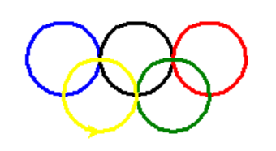

.. _header-n2102:

1 turtle绘制奥运五环图
----------------------

turtle绘图的函数非常好用，基本看到函数名字，就能知道它的含义，下面使用turtle，仅用15行代码来绘制奥运五环图。

1 导入库

.. code:: python

   import turtle as p

2 定义画圆函数

.. code:: python

   def drawCircle(x,y,c='red'):
       p.pu()# 抬起画笔
       p.goto(x,y) # 绘制圆的起始位置
       p.pd()# 放下画笔
       p.color(c)# 绘制c色圆环
       p.circle(30,360) #绘制圆：半径，角度

3 画笔基本设置

.. code:: python

   p = turtle
   p.pensize(3) # 画笔尺寸设置3

4 绘制五环图

调用画圆函数

.. code:: python

   drawCircle(0,0,'blue')
   drawCircle(60,0,'black')
   drawCircle(120,0,'red')
   drawCircle(90,-30,'green')
   drawCircle(30,-30,'yellow')    

   p.done()

结果：

.. _header-n2115:
