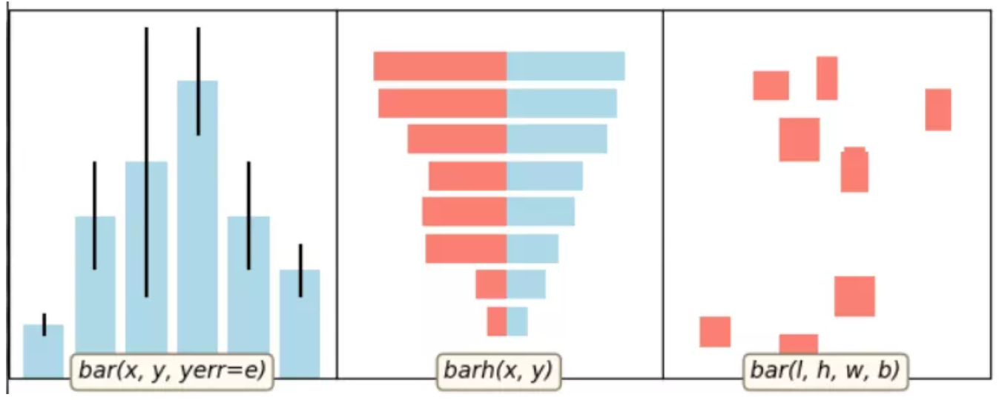

8 matplotlib柱状图
------------------

对应代码：

.. code:: python

   import numpy as np
   import matplotlib.pyplot as plt

   import example_utils

   def main():
       fig, axes = example_utils.setup_axes()

       basic_bar(axes[0])
       tornado(axes[1])
       general(axes[2])

       # example_utils.title(fig, '"ax.bar(...)": Plot rectangles')
       fig.savefig('bar_example.png', facecolor='none')
       plt.show()

   # 子图1
   def basic_bar(ax):
       y = [1, 3, 4, 5.5, 3, 2]
       err = [0.2, 1, 2.5, 1, 1, 0.5]
       x = np.arange(len(y))
       ax.bar(x, y, yerr=err, color='lightblue', ecolor='black')
       ax.margins(0.05)
       ax.set_ylim(bottom=0)
       example_utils.label(ax, 'bar(x, y, yerr=e)')

   # 子图2
   def tornado(ax):
       y = np.arange(8)
       x1 = y + np.random.random(8) + 1
       x2 = y + 3 * np.random.random(8) + 1
       ax.barh(y, x1, color='lightblue')
       ax.barh(y, -x2, color='salmon')
       ax.margins(0.15)
       example_utils.label(ax, 'barh(x, y)')

   # 子图3
   def general(ax):
       num = 10
       left = np.random.randint(0, 10, num)
       bottom = np.random.randint(0, 10, num)
       width = np.random.random(num) + 0.5
       height = np.random.random(num) + 0.5
       ax.bar(left, height, width, bottom, color='salmon')
       ax.margins(0.15)
       example_utils.label(ax, 'bar(l, h, w, b)')

   main()

.. _header-n2154:

