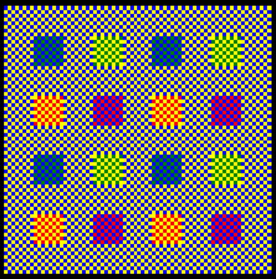

======
7.100不同颜色的色块
======

|image0| ### 背景介绍
在上面这幅背景为灰色的图片中（使用turtle绘制），我们看到了4种不同颜色的色块。它们的颜色真的不同吗？

答案是否定的。

这里的灰色实际上是很小的蓝色和黄色像素的混合产物。由于这些像素太小，混合在一起不会引发拮抗过程，也就无法形成对比。

彩色电视机之所以能够利用颜色差异很小的像素呈现不同色彩就是这个原理。

(感兴趣的读者可以用放大镜亲自验证一下)绿松石色和淡黄绿色色块实际上分别由很小的绿色像素与蓝色背景像素混合和与黄色背景像素混合而来。红色像素与背景中的黄色像素混合形成橙色，与背景中的蓝色像素混合则成紫色。

导入模块
~~~~~~~~

::

    import turtle
    import random
    import time

自定义绘图类 MyTurtle
~~~~~~~~~~~~~~~~~~~~~

::

    class MyTurtle(turtle.Turtle):
        def get_color(self):
            rgb = []
            for i in range(3):
                rgb.append(random.randint(0, 255))
            return rgb

        def set_pen_color(self):
            '''
            ## 设置画笔的颜色
            + ### colormode(cmode) 
            >- cmode 为1 或者 255， 
            >- 随后rgb三元组的值必须在0~comde之间
            + ### pencolor(color=None) 
            > 设置画笔颜色
            '''
            self.screen.colormode(255)
            self.pencolor(self.get_color())

        def move(self, x: int, y: int) -> None:
            self.penup()
            self.goto(x, y)
            self.pendown()

        def draw_shape(self, sides: int, length: int) -> None:
            _angle = 360.0/sides
            for side in range(sides):
                self.forward(length)
                self.left(_angle)

        def draw_square(self, length: int) -> None:
            self.draw_shape(4, length)

        def draw_triangle(self, length: int) -> None:
            self.draw_shape(3, length)

        def draw_circle(self, length: int) -> None:
            self.draw_shape(360, length)

        def fill_color_shape(self, shape: str, length: int, fill_color: str) -> None:
            _command = f'self.{shape}(length)'
            self.begin_fill()
            self.color(fill_color)
            eval(_command)
            self.end_fill()

定义函数
~~~~~~~~

根据 star 列表（通常为[x, y]起始坐标）， end 坐标最大值，step
步长，来计算出所有坐标。 返回坐标列表（[[x,y], [x, y1], [x1, y], [x1,
y1], …]）

::

    def diff_color_square_address(star: list, end: int, step: int) -> list:
        x = list(range(star[0], end+1, step))
        y = list(range(star[1], end+1, step))
        res_array = []
        for xi in x:
            for yi in y:
                res_array.append([xi, yi])
        return res_array

画图主函数：

::

    def draw_main(b_val: int, s_len: int) -> None:
        '''
        + ### bgcolor(color) 
        > 设置屏幕颜色，方式同 color()
        + ### speed(s=None) 
        > s为0-10的整数或者速度字符串
            - None：返回当前速度
            - "fastest"：0
            - "fast"：10
            - "normal"：6
            - "slow"：3
            - "slowest"：1
        '''
        star_time = time.time()
        t = MyTurtle()

        t.screen.bgcolor("black")  # white
        t.speed(100)

        tem_b = b_val + 1
        tem_s = b_val - tem_b % 2  # 取单数数量
        sx = list(x1 for x1 in range(1, tem_s))  # 小方格基本坐标
        sy = list(y1 for y1 in range(1, tem_s))
        bx = list(x1 for x1 in range(1, tem_b))  # 大方格基本坐标
        by = list(y1 for y1 in range(1, tem_b))

        b_len = len(sx)  # 大方格边长
        different_colors_square_list = [
            diff_color_square_address([2, 2], b_val, 4),  # 混合橙色坐标
            diff_color_square_address([4, 4], b_val, 4),  # 混合淡绿色坐标
            diff_color_square_address([4, 2], b_val, 4),  # 混合紫色坐标
            diff_color_square_address([2, 4], b_val, 4)  # 混合绿松石色坐标
        ]

        color_list = [
            ['red', 'yellow'],  # 混合橙色
            ['green', 'yellow'],  # 混合淡绿色
            ['red', 'blue'],    # 混合紫色
            ['green', 'blue'],  # 混合绿松石色
            ['yellow', 'blue'],  # 混合灰色
        ]

        offset = (s_len * b_len * (b_val + 2) + s_len) / 2
        print(
            f's_len: {s_len}, b_len: {b_len}, offset: {offset}, turtle: {t._screen.screensize()}')
        turtle.tracer(False)  # 如果想看看程序的画图过程设成True
        for x3 in bx:
            for y3 in by:
                for x4 in sx:
                    for y4 in sy:
                        x = x3 * s_len * b_len + x4 * s_len - offset
                        y = y3 * s_len * b_len + y4 * s_len - offset
                        t.move(int(x), int(y))
                        # 判断坐标是否在特定颜色组坐标中，是选用对应颜色组
                        if [x3, y3] in different_colors_square_list[0]:
                            colors = color_list[0]
                        elif [x3, y3] in different_colors_square_list[1]:
                            colors = color_list[1]
                        elif [x3, y3] in different_colors_square_list[2]:
                            colors = color_list[2]
                        elif [x3, y3] in different_colors_square_list[3]:
                            colors = color_list[3]
                        else:
                            colors = color_list[4]

                        if ((x4 + y4) % 2) == 0:
                            color = colors[0]
                        else:
                            color = colors[1]
                        t.fill_color_shape('draw_square', s_len, color)
        t.move(800, 800)
        turtle.update()
        end_time = time.time() - star_time
        # print_time = time.strftime("%b %d %Y %H:%M:%S", end_time)
        print(end_time)
        t.screen.mainloop()

调用函数绘图
~~~~~~~~~~~~

::

    if __name__ == '__main__':
        big_input = 9
        big_value = 9 if big_input == '' or int(big_input) <= 0 else int(big_input)
        small_input = 5
        small_len = 5 if small_input == '' or int(
            small_input) <= 0 else int(small_input)
        print('big_value:', big_value, type(big_value),
              '\n', 'small_len:', small_len, type(small_len))
        draw_main(big_value, small_len)

