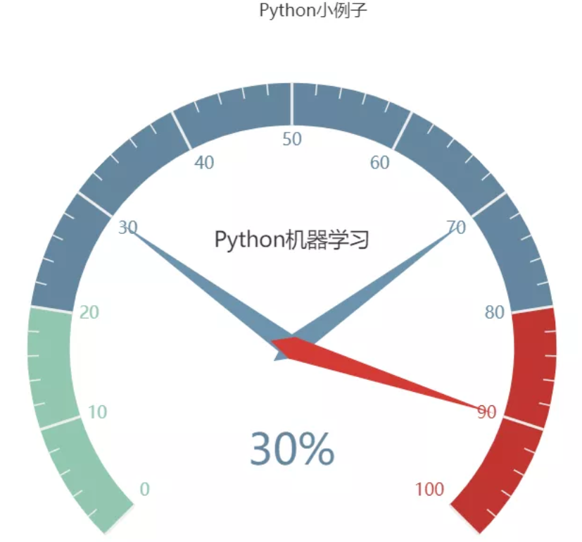

11 pyecharts绘制仪表盘
----------------------

使用pip install pyecharts 安装，版本为
v1.6，pyecharts绘制仪表盘，只需要几行代码：

.. code:: python

   from pyecharts import charts

   # 仪表盘
   gauge = charts.Gauge()
   gauge.add('Python小例子', [('Python机器学习', 30), ('Python基础', 70.),
                           ('Python正则', 90)])
   gauge.render(path="./data/仪表盘.html")
   print('ok')

仪表盘中共展示三项，每项的比例为30%,70%,90%，如下图默认名称显示第一项：Python机器学习，完成比例为30%

.. _header-n2167:

