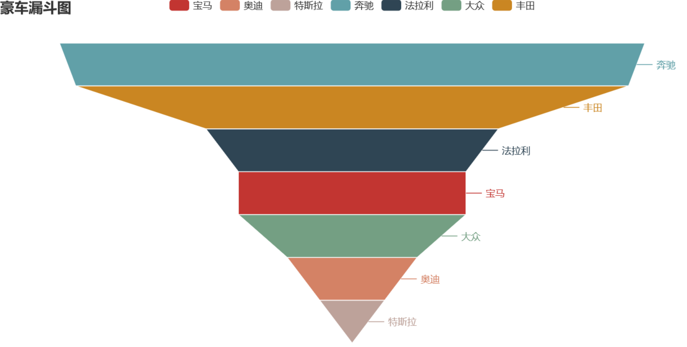

12 pyecharts漏斗图
------------------

.. code:: python

   from pyecharts import options as opts
   from pyecharts.charts import Funnel, Page
   from random import randint

   def funnel_base() -> Funnel:
     c = (
       Funnel()
       .add("豪车", [list(z) for z in zip(['宝马', '法拉利', '奔驰', '奥迪', '大众', '丰田', '特斯拉'],
                    [randint(1, 20) for _ in range(7)])])
       .set_global_opts(title_opts=opts.TitleOpts(title="豪车漏斗图"))
     )
     return c
   funnel_base().render('./img/car_fnnel.html')

以7种车型及某个属性值绘制的漏斗图，属性值大越靠近漏斗的大端。

.. _header-n2171:

