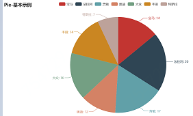

16 pyecharts饼图
----------------

.. code:: python

   from pyecharts import options as opts
   from pyecharts.charts import Pie
   from random import randint

   def pie_base() -> Pie:
       c = (
           Pie()
           .add("", [list(z) for z in zip(['宝马', '法拉利', '奔驰', '奥迪', '大众', '丰田', '特斯拉'],
                                          [randint(1, 20) for _ in range(7)])])
           .set_global_opts(title_opts=opts.TitleOpts(title="Pie-基本示例"))
           .set_series_opts(label_opts=opts.LabelOpts(formatter="{b}: {c}"))
       )
       return c

   pie_base().render('../../img/pie_pyecharts.html')

.. _header-n2186:

