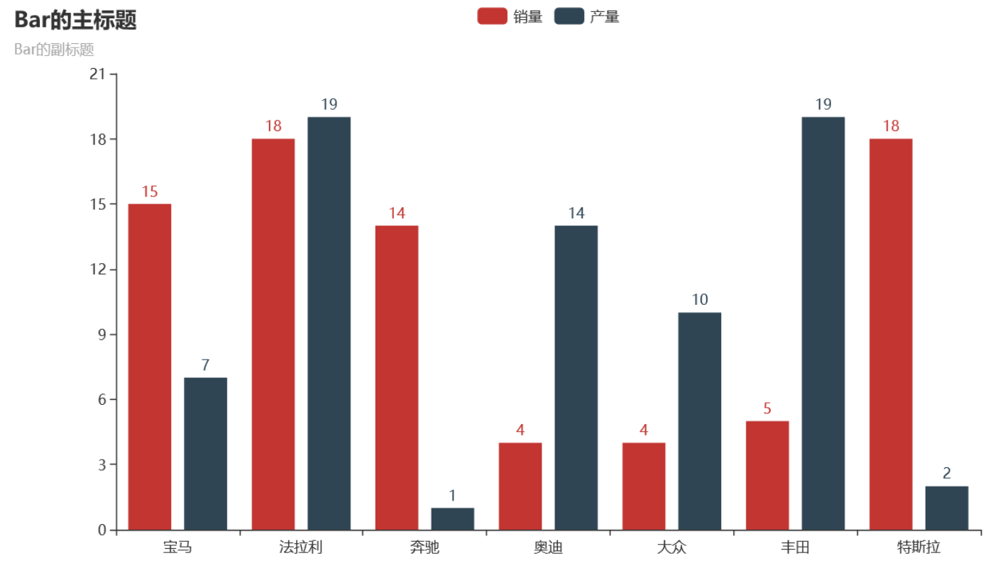

19 pyecharts系列柱状图
----------------------

.. code:: python

   from pyecharts import options as opts
   from pyecharts.charts import Bar
   from random import randint

   def bar_series() -> Bar:
       c = (
           Bar()
           .add_xaxis(['宝马', '法拉利', '奔驰', '奥迪', '大众', '丰田', '特斯拉'])
           .add_yaxis("销量", [randint(1, 20) for _ in range(7)])
           .add_yaxis("产量", [randint(1, 20) for _ in range(7)])
           .set_global_opts(title_opts=opts.TitleOpts(title="Bar的主标题", subtitle="Bar的副标题"))
       )
       return c

   bar_series().render('./img/bar_series.html')

.. _header-n2197:

