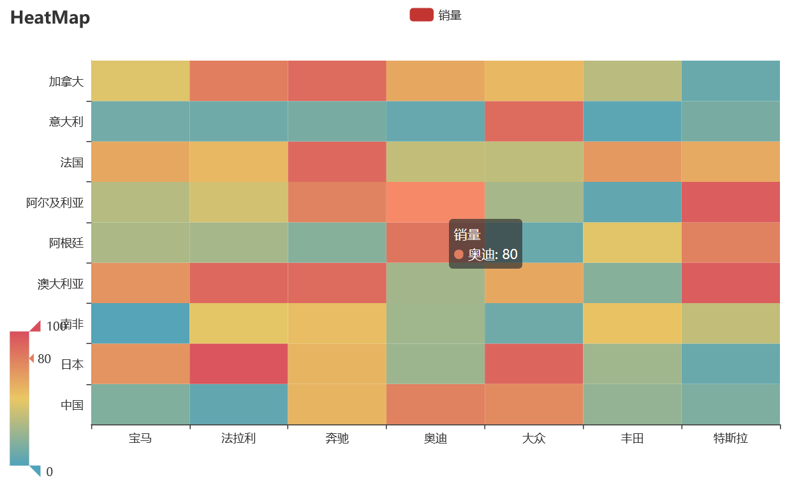

20 pyecharts热力图
------------------

.. code:: python

   import random
   from pyecharts import options as opts
   from pyecharts.charts import HeatMap

   def heatmap_car() -> HeatMap:
       x = ['宝马', '法拉利', '奔驰', '奥迪', '大众', '丰田', '特斯拉']
       y = ['中国','日本','南非','澳大利亚','阿根廷','阿尔及利亚','法国','意大利','加拿大']
       value = [[i, j, random.randint(0, 100)]
                for i in range(len(x)) for j in range(len(y))]
       c = (
           HeatMap()
           .add_xaxis(x)
           .add_yaxis("销量", y, value)
           .set_global_opts(
               title_opts=opts.TitleOpts(title="HeatMap"),
               visualmap_opts=opts.VisualMapOpts(),
           )
       )
       return c

   heatmap_car().render('./img/heatmap_pyecharts.html')

热力图描述的实际是三维关系，x轴表示车型，y轴表示国家，每个色块的颜色值代表销量，颜色刻度尺显示在左下角，颜色越红表示销量越大。

.. _header-n2201: