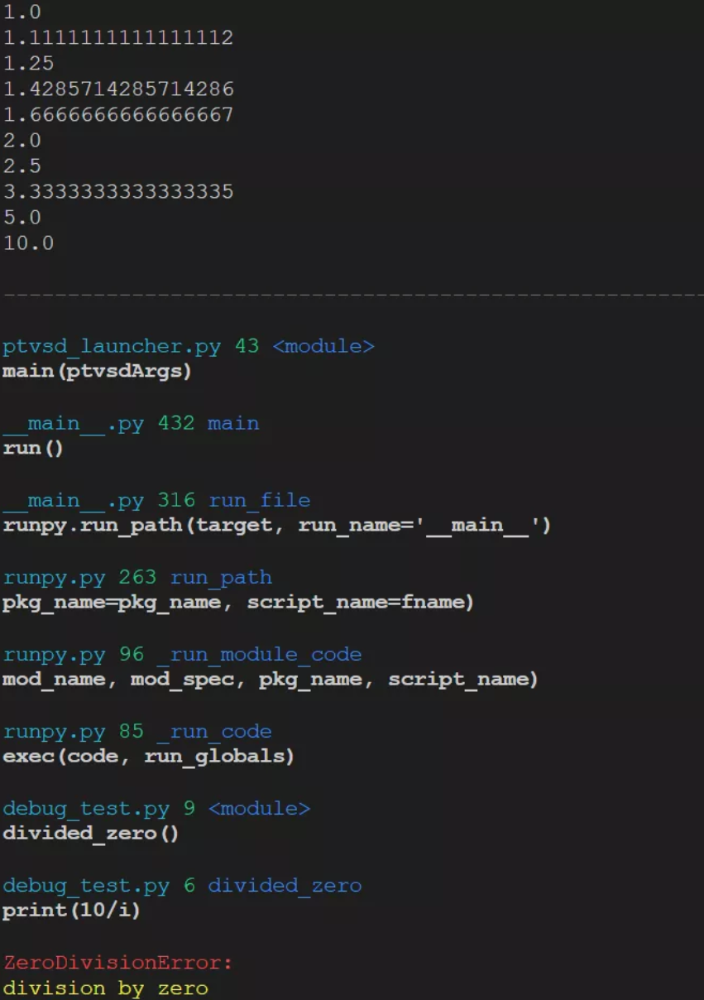

.. _header-n2210:

1 一行代码优化输出的异常信息
----------------------------

.. code:: python

   pip install pretty-errors

写一个函数测试：

.. code:: python

   def divided_zero():
       for i in range(10, -1, -1):
           print(10/i)

   divided_zero()

在没有import这个\ ``pretty-errors``\ 前，输出的错误信息有些冗余：

.. code:: python

   Traceback (most recent call last):
     File "c:\Users\HUAWEI\.vscode\extensions\ms-python.python-2019.11.50794\pythonFiles\ptvsd_launcher.py", line 43, in <module>
       main(ptvsdArgs)
     File "c:\Users\HUAWEI\.vscode\extensions\ms-python.python-2019.11.50794\pythonFiles\lib\python\old_ptvsd\ptvsd\__main__.py",
   line 432, in main
       run()
     File "c:\Users\HUAWEI\.vscode\extensions\ms-python.python-2019.11.50794\pythonFiles\lib\python\old_ptvsd\ptvsd\__main__.py",
   line 316, in run_file
       runpy.run_path(target, run_name='__main__')
     File "D:\anaconda3\lib\runpy.py", line 263, in run_path
       pkg_name=pkg_name, script_name=fname)
     File "D:\anaconda3\lib\runpy.py", line 96, in _run_module_code
       mod_name, mod_spec, pkg_name, script_name)
     File "D:\anaconda3\lib\runpy.py", line 85, in _run_code
       exec(code, run_globals)
     File "d:\source\sorting-visualizer-master\sorting\debug_test.py", line 6, in <module>
       divided_zero()
     File "d:\source\sorting-visualizer-master\sorting\debug_test.py", line 3, in divided_zero
       print(10/i)
   ZeroDivisionError: division by zero

我们使用刚安装的\ ``pretty_errors``\ ，\ ``import``\ 下:

.. code:: python

   import pretty_errors

   def divided_zero():
       for i in range(10, -1, -1):
           print(10/i)

   divided_zero()

此时看看输出的错误信息，非常精简只有2行，去那些冗余信息：

.. code:: python

   ZeroDivisionError:
   division by zero

完整的输出信息如下图片所示：

.. _header-n2223:

