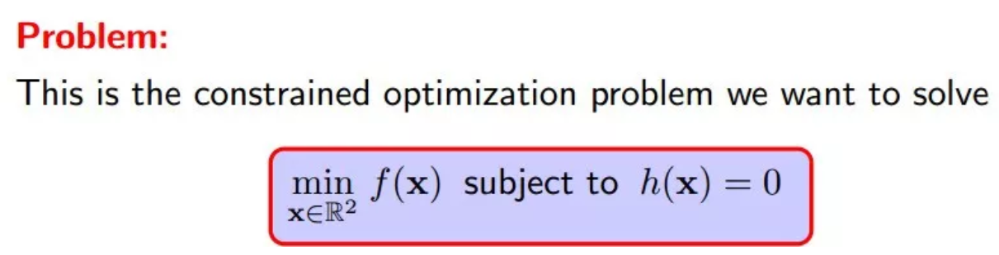
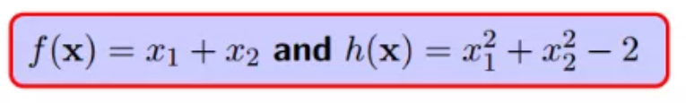
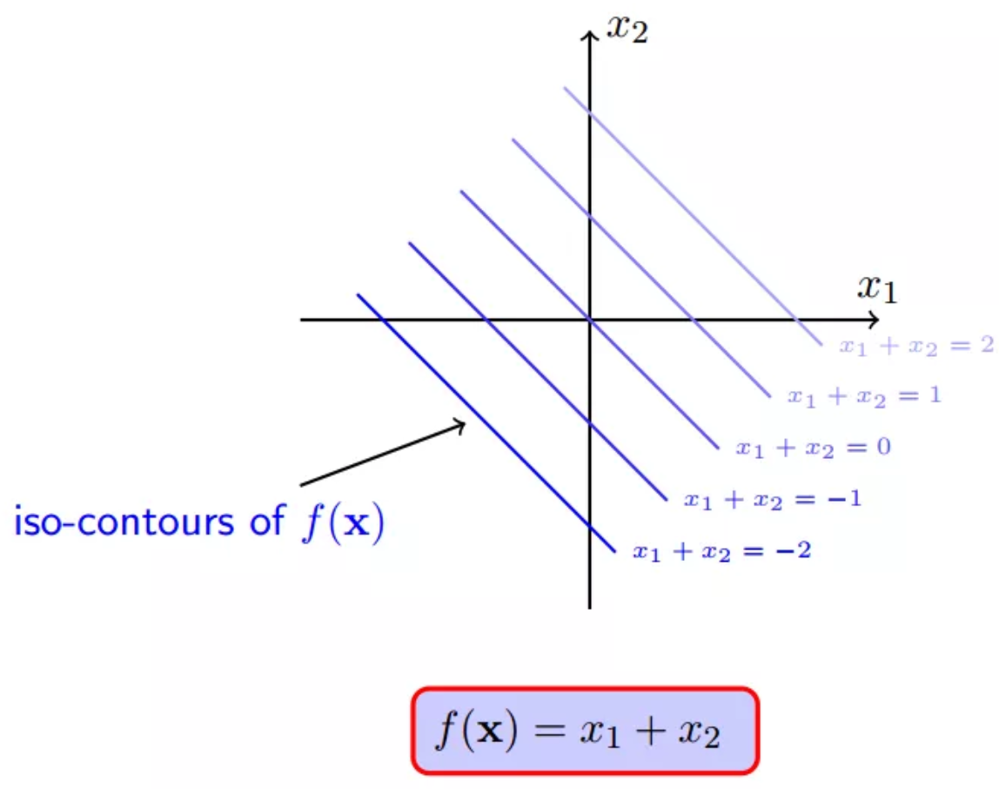
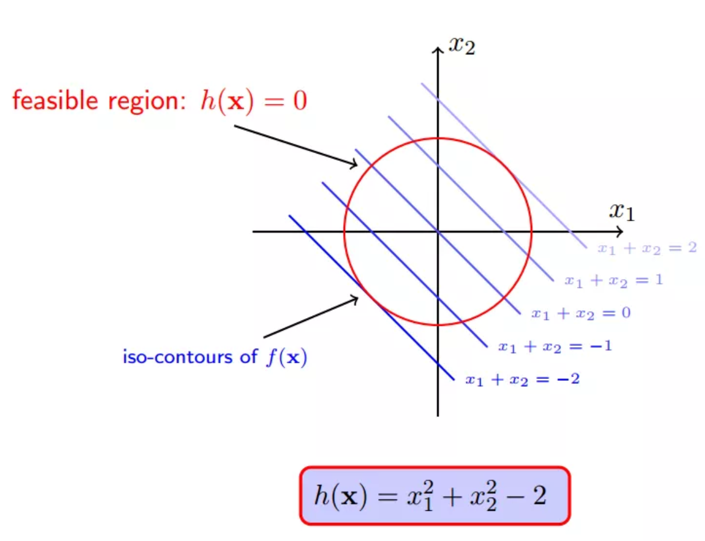

10 找找感觉
-----------

大家时间都有限，只列出最核心的逻辑，找找sense,
如有兴趣可回去下载PPT仔细体会。

此解释中对此类问题的定义：

为了更好的阐述，给定一个具体例子，锁定：

所以，f(x)的一系列取值包括0,1,100,10000等任意实数：

但是，约束条件\ ``h(x)``\ 注定会约束\ ``f(x)``\ 不会等于100，不会等于10000...

一个可行点：

.. figure:: ./img/1578812432196.png
   :alt: 

