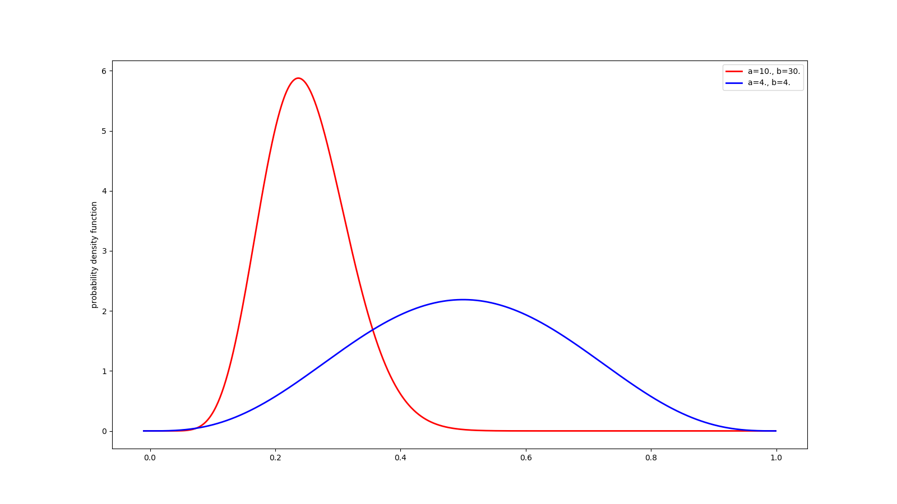

18 beta分布
-----------

beta分布的期望值如下，可从下面的两条曲线中加以验证：

.. figure:: ./img\image-20200105205845965.png
   :alt: 

.. code:: python

    # beta 分布
    @my_plot(label0='a=10., b=30.', label1='a=4., b=4.', fn='beta.png')
    def bet():
        x = np.arange(-0.01, 1, 0.001)
        y = beta.pdf(x, a=10., b=30.)
        y1 = beta.pdf(x, a=4., b=4.)
        return x, y, y1

