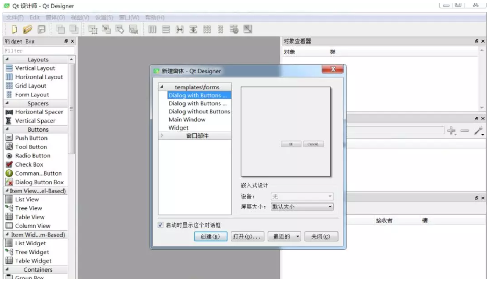
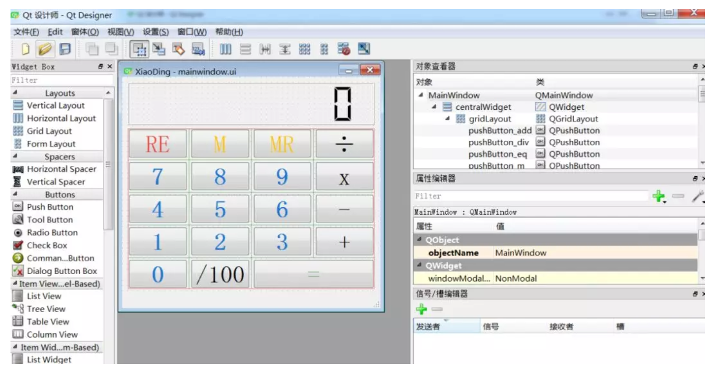
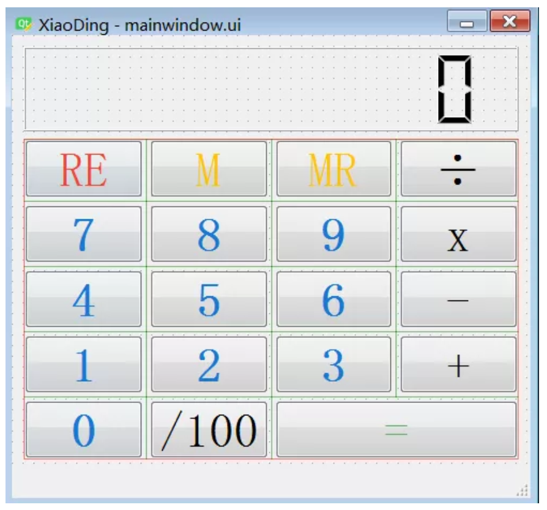
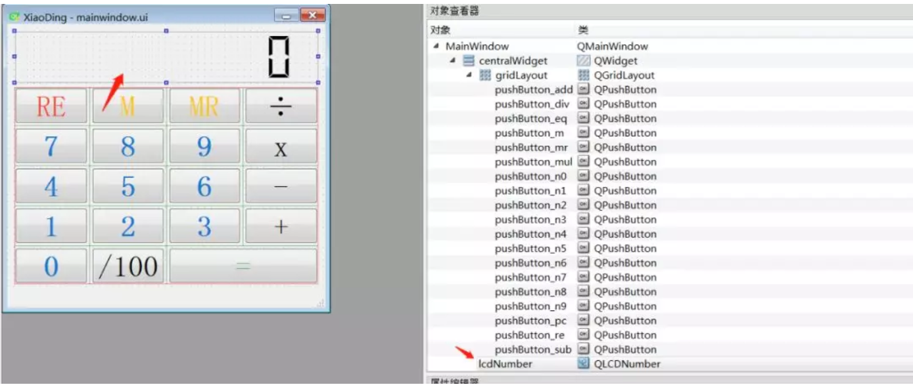
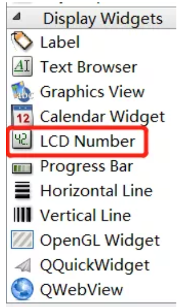

5 制作小而美的计算器
--------------------

1) ui设计

使用\ ``qt designer`` ，按装anaconda后，在如下路径找到：

    conda3.05\\Library\\bin

``designer.exe``\ 文件，双击启动：

创建窗体，命名为\ ``XiaoDing``\ ，整个的界面如下所示：

``qt 设计器``\ 提供的常用控件基本都能满足开发需求，通过拖动左侧的控件，很便捷的就能搭建出如下的UI界面，比传统的手写控件代码要方便很多。

最终设计的计算器\ ``XiaoDing``\ 界面如下，

比如，其中一个用于计算器显示的对象：\ ``lcdNumber``\ ，对象的类型为：\ ``LCD Number``\ 。右侧为计算器中用到的所有对象。

2) 转py文件

使用如下命令，将设计好的\ ``ui``\ 文件转为\ ``py``\ 文件：

.. code:: python

    pyuic5 -o ./calculator/MainWindow.py ./calculator/mainwindow.ui

3) 计算器实现逻辑

导入库：

.. code:: python

    from PyQt5.QtGui import *
    from PyQt5.QtWidgets import *
    from PyQt5.QtCore import *

    import operator

    from MainWindow import Ui_MainWindow

主题代码逻辑很精简：

.. code:: python

    # Calculator state.
    READY = 0
    INPUT = 1

    class MainWindow(QMainWindow, Ui_MainWindow):
        def __init__(self, *args, **kwargs):
            super(MainWindow, self).__init__(*args, **kwargs)
            self.setupUi(self)

            # Setup numbers.
            for n in range(0, 10):
                getattr(self, 'pushButton_n%s' % n).pressed.connect(lambda v=n: self.input_number(v))

            # Setup operations.
            self.pushButton_add.pressed.connect(lambda: self.operation(operator.add))
            self.pushButton_sub.pressed.connect(lambda: self.operation(operator.sub))
            self.pushButton_mul.pressed.connect(lambda: self.operation(operator.mul))
            self.pushButton_div.pressed.connect(lambda: self.operation(operator.truediv))  # operator.div for Python2.7

            self.pushButton_pc.pressed.connect(self.operation_pc)
            self.pushButton_eq.pressed.connect(self.equals)

            # Setup actions
            self.actionReset.triggered.connect(self.reset)
            self.pushButton_ac.pressed.connect(self.reset)

            self.actionExit.triggered.connect(self.close)

            self.pushButton_m.pressed.connect(self.memory_store)
            self.pushButton_mr.pressed.connect(self.memory_recall)

            self.memory = 0
            self.reset()

            self.show()

基础方法：

.. code:: python

        def input_number(self, v):
            if self.state == READY:
                self.state = INPUT
                self.stack[-1] = v
            else:
                self.stack[-1] = self.stack[-1] * 10 + v

            self.display()

        def display(self):
            self.lcdNumber.display(self.stack[-1])

按钮\ ``RE``,\ ``M``, ``RE``\ 对应的实现逻辑：

.. code:: python

        def reset(self):
            self.state = READY
            self.stack = [0]
            self.last_operation = None
            self.current_op = None
            self.display()

        def memory_store(self):
            self.memory = self.lcdNumber.value()

        def memory_recall(self):
            self.state = INPUT
            self.stack[-1] = self.memory
            self.display()

``+``,\ ``-``,\ ``x``,\ ``/``,\ ``/100``\ 对应实现方法：

.. code:: python

    def operation(self, op):
            if self.current_op:  # Complete the current operation
                self.equals()

            self.stack.append(0)
            self.state = INPUT
            self.current_op = op

        def operation_pc(self):
            self.state = INPUT
            self.stack[-1] *= 0.01
            self.display()

``=``\ 号对应的方法实现：

.. code:: python

     def equals(self):
            if self.state == READY and self.last_operation:
                s, self.current_op = self.last_operation
                self.stack.append(s)

            if self.current_op:
                self.last_operation = self.stack[-1], self.current_op

                try:
                    self.stack = [self.current_op(*self.stack)]
                except Exception:
                    self.lcdNumber.display('Err')
                    self.stack = [0]
                else:
                    self.current_op = None
                    self.state = READY
                    self.display()

main函数：

.. code:: python

    if __name__ == '__main__':
        app = QApplication([])
        app.setApplicationName("XiaoDing")

        window = MainWindow()
        app.exec_()

.. figure:: ../../img/1578812059285.png
   :alt:
