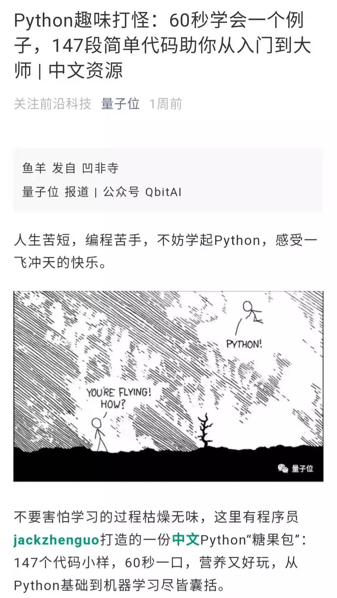

==============================
前言
==============================

告别枯燥，60秒学会一个小例子，系统学习Python，从入门到大师。\ **Python之路**\ 已有\ ``200``\ 个例子：

感受Python之美 \| 一、Python基础
\|二、Python字符串和正则\|三、Python文件、日期和多线程\|四、Python三大利器\|五、Python绘图\|六、Python之坑\|七、Python第三方包\|八、机器学习和深度学必知算法\|九、Python、机器学习和深度学习实战

后续章节包括：PyQt制作GUI; Flask前端开发; Python数据分析

目前超过\ ``200个``\ 小例子。

我会一直每天更新一个小例子，欢迎star.

https://github.com/jackzhenguo/python-small-examples

很荣幸，这个库被AI权威媒体《量子位》报道，下面是报道截图：

